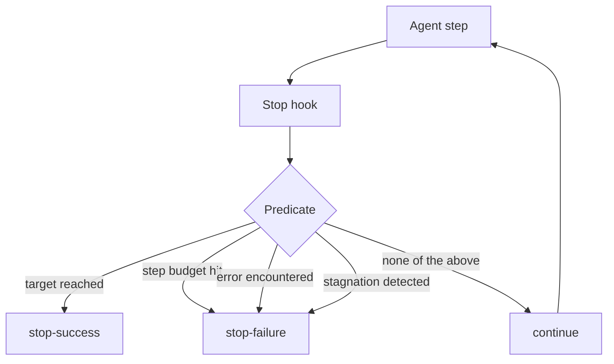

# Stop Hook

**Also known as:** Termination Predicate, Halt Condition, Stop Condition, Done Predicate, Exit Condition, Loop Termination Rule

**Category:** Safety & Control  
**Status in practice:** mature

## Intent

Define an explicit programmatic predicate that decides when the agent's loop should terminate.

## Context

A team is operating an agent loop where the agent repeatedly thinks, acts, observes, and decides whether to keep going. The loop needs an explicit stop condition that does not rely on the model itself declaring 'done', because in practice the model's own sense of completion is unreliable — it either stops too early on hard tasks or refuses to stop on easy ones.

## Problem

When termination is left implicit, with the loop ending only when the model says it is finished, the agent stalls in two opposite ways. On uncertain tasks the model will not commit to 'done' and keeps generating one more step indefinitely; on stuck tasks the model will keep trying variations of the same broken approach. Both burn budget and produce poor results. The team needs an explicit programmatic predicate — a stop hook — that decides termination from outside the model, based on observable signals such as goal completion, step count, repeated outputs, or detected errors.

## Forces

- Predicate complexity trades correctness for performance.
- Stop too early loses work; stop too late wastes calls.
- Coverage: which conditions warrant a stop?

## Applicability

**Use when**

- Agent loops need an explicit termination predicate beyond model self-declaration.
- Conditions like budget hit, error, or stagnation can be detected programmatically.
- Costs of an unbounded loop are unacceptable.

**Do not use when**

- The model reliably declares 'done' and termination already works.
- No programmatic stop condition can be defined for the task.
- The loop is naturally bounded by an external trigger.

## Therefore

Therefore: run a programmatic stop predicate after every step that returns continue, stop-success, or stop-failure on explicit conditions (target, budget, error, stagnation), so that termination is a tested decision rather than the model's opinion.

## Solution

Implement a stop hook function that runs after each step. It returns one of: continue, stop-success, stop-failure. Conditions include: target reached, step budget hit, error encountered, stagnation detected (no progress in last N steps).

## Example scenario

An agent's loop terminates when 'the model says it is done', which fails when the model is uncertain or stuck and the loop runs to budget. The team adds an explicit stop-hook predicate that runs after each step and returns continue, stop-success, or stop-failure based on target reached, step budget, error class, or stagnation detection. Termination becomes a programmatic decision rather than a wish, and unbounded loops become impossible by construction.

## Diagram

## Consequences

**Benefits**

- Explicit, testable termination logic.
- Independent from the model's self-assessment.

**Liabilities**

- More code to maintain than 'while not done'.
- Predicate bugs cause hangs or premature stops.

## What this pattern constrains

The loop terminates exactly when the stop hook says so; no other code path may exit the loop.

## Known uses

- **Avramovic's catalog (Reliability & Control)** — *Available*

## Related patterns

- *specialises* → [step-budget](step-budget.md)
- *alternative-to* → [unbounded-loop](unbounded-loop.md)
- *alternative-to* → [infinite-debate](infinite-debate.md)
- *complements* → [kill-switch](kill-switch.md)
- *used-by* → [chat-chain](chat-chain.md)

## References

- (repo) *zeljkoavramovic/agentic-design-patterns*, <https://github.com/zeljkoavramovic/agentic-design-patterns>

**Tags:** safety, termination, loop
