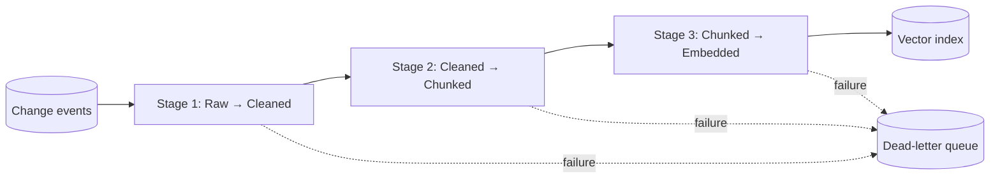

# Streaming Feature Pipeline

**Also known as:** Real-Time RAG Feature Pipeline, Bytewax-Style RAG Ingest

**Category:** Retrieval & RAG  
**Status in practice:** emerging

## Intent

Process raw documents into RAG features as a continuous stream rather than a batch job, with typed models pinning each stage.

## Context

An LLM application's vector index must stay close to the live state of an evolving corpus. Batch rebuilds run every N hours and lag the source. The team wants the pipeline to consume change events as they happen and update the index immediately.

## Problem

Batch ingestion lags the source by the rebuild cadence and wastes compute re-processing unchanged documents. Ad-hoc streaming code without a stage-pinning discipline (raw → cleaned → chunked → embedded) accumulates implicit data shape transitions that break silently as the pipeline evolves. Without a typed stream pipeline, real-time RAG ingestion becomes a debug nightmare on every schema or chunking change.

## Forces

- Lag between source change and vector update should be seconds, not hours.
- Each stage (clean, chunk, embed) has different cost and parallelism profile.
- Typed data at each stage catches shape drift early.
- Failure of one event should not poison the stream.

## Applicability

**Use when**

- Real-time RAG ingest is needed and batch lag is unacceptable.
- Source events can be modelled as a stream (CDC, webhook, queue).
- Engineering capacity to operate a streaming framework exists.

**Do not use when**

- Corpus changes rarely — batch rebuilds are cheaper and simpler.
- Team has no streaming-framework operational experience.
- End-to-end lag requirement is hours, not seconds.

## Therefore

Therefore: build the feature pipeline as a streaming dataflow with one typed model per stage (raw, cleaned, chunked, embedded), so events flow continuously, shape is pinned at each transition, and failures isolate to single events.

## Solution

Use a streaming framework (Bytewax, Flink, Kafka Streams) to consume change events. Define a Pydantic (or equivalent) model per stage: RawDocument → CleanedDocument → ChunkedDocument → EmbeddedDocument. Each stage is a map operation that takes one model and emits the next; type errors surface at the stage boundary. Failed events go to a dead-letter queue for inspection rather than blocking the stream. Upserts to the vector index happen as the embedded model flows out of the last stage.

## Example scenario

A documentation platform's RAG index must stay current as engineers edit pages. A Bytewax pipeline consumes a Kafka topic of page-change events. Each event flows through RawPage → CleanedPage → ChunkedPage → EmbeddedPage stages; the embedded output upserts into Qdrant. A bad page (binary content masquerading as HTML) goes to the DLQ; the stream keeps moving. Engineers see edited pages in RAG within seconds.

## Diagram

## Consequences

**Benefits**

- Vector index lag bounded by stream throughput, not batch cadence.
- Typed stage transitions surface shape drift immediately.
- Failed events isolate to DLQ; the stream continues.

**Liabilities**

- Streaming framework to operate (Bytewax, Flink, etc.).
- Per-stage type models add boilerplate.
- Backfill of historical corpus needs a separate pipeline or replay strategy.

## What this pattern constrains

Real-time RAG/feature ingestion must not use implicit data shapes across pipeline stages; a typed model is pinned at each stage transition.

## Known uses

- **LLM Engineer's Handbook (Iusztin, Labonne) — Bytewax streaming feature pipeline (LLM Twin lesson 4)** — *Available* — <https://www.comet.com/site/blog/streaming-pipelines-for-fine-tuning-llms/>
- **Production RAG systems using Flink or Kafka Streams for real-time ingest** — *Available*

## Related patterns

- *composes-with* → [cdc-vector-sync](cdc-vector-sync.md)
- *composes-with* → [fti-llm-pipeline-split](fti-llm-pipeline-split.md)
- *complements* → [event-driven-agent](event-driven-agent.md)
- *uses* → [vector-memory](vector-memory.md)
- *complements* → [naive-rag](naive-rag.md)

## References

- (book) *LLM Engineer's Handbook*, Paul Iusztin, Maxime Labonne, 2024, <https://www.packtpub.com/en-us/product/llm-engineers-handbook-9781836200079>
- (blog) *SOTA Python Streaming Pipelines for Fine-tuning LLMs and RAG*, <https://www.comet.com/site/blog/streaming-pipelines-for-fine-tuning-llms/>

**Tags:** retrieval, rag, streaming
