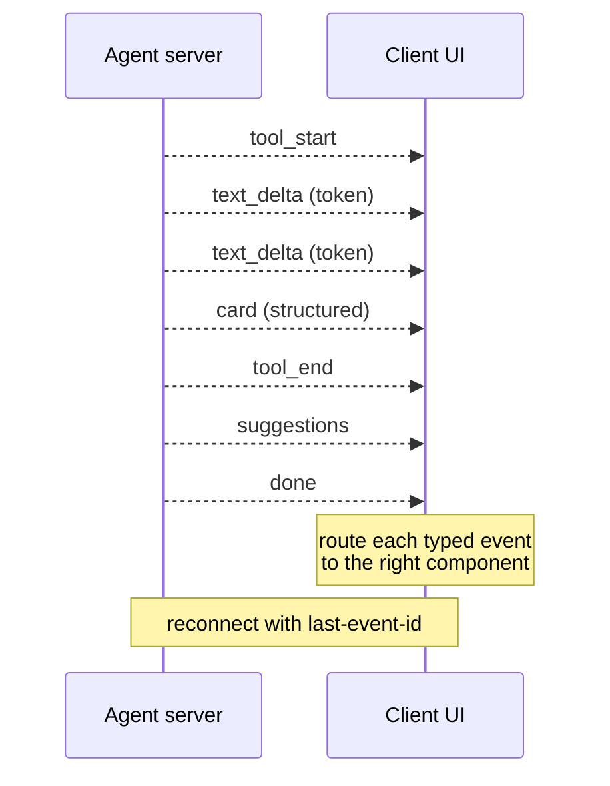

# Streaming Typed Events

**Also known as:** SSE Streaming, Typed Event Stream, Token Stream + Cards

**Category:** Streaming & UX  
**Status in practice:** mature

## Intent

Push partial results to the client as typed events as they become available, rather than waiting for the full response.

## Context

User-facing agents where time-to-first-token (TTFT) is user-perceived latency; UIs that show cards, suggestions, or progressive disclosure.

## Problem

Waiting for the complete answer feels slow; a single text stream loses the structure the UI needs.

## Forces

- Browser/network limits on long-lived connections.
- Event ordering and reconnection semantics.
- Backpressure when the client is slow.

## Applicability

**Use when**

- User-facing agents where time-to-first-token is perceived latency.
- The UI shows cards, suggestions, or progressive disclosure that need typed events.
- A transport (SSE, WebSocket) supports event streams with reconnection.

**Do not use when**

- Outputs are short enough that batching the full response is fine.
- The client cannot consume streams or has no progressive UI.
- A typed event vocabulary cannot be agreed across producer and consumer.

## Therefore

Therefore: split the stream into a typed event vocabulary (text_delta, card, tool_start, done, error) over SSE or WebSocket, so that each event routes to the right UI component as soon as it lands.

## Solution

Use Server-Sent Events (or WebSocket) with a typed event vocabulary: text_delta (token), card (structured), suggestions, tool_start, tool_end, done, error. The client routes each event to the right UI component. Reconnect with last-event-id resumption.

## Variants

- **SSE typed events** — Server-Sent Events with a typed event vocabulary (`text_delta`, `card`, `tool_start`, `done`, `error`) — the dominant production shape.
- **WebSocket typed events** — Bidirectional WebSocket carrying the same typed vocabulary; needed when the client also pushes events mid-stream.
- **HTTP chunked + frame protocol** — Plain chunked HTTP carrying length-prefixed JSON frames; used where SSE/WebSocket are blocked by middleboxes.

## Example scenario

A chat product streams a single text channel; the UI cannot tell apart token text, structured cards, suggestions, and tool progress until everything is rendered. The team switches to typed events over SSE: `text_delta`, `card`, `suggestions`, `tool_start`, `tool_end`, `done`, `error`. The client routes each event to the right widget as it arrives; perceived latency drops, structured content renders early, and the UI gains progress indicators.

## Diagram

## Consequences

**Benefits**

- Perceived latency drops dramatically.
- Rich UIs with structured streaming components.

**Liabilities**

- Connection management complexity.
- Partial state on the client must be reconcilable.

## What this pattern constrains

Events are typed; clients cannot consume payloads outside the declared event vocabulary.

## Known uses

- **Bobbin (Stash2Go)** — *Available*. SSE typed events: text_delta, card, suggestions, tool_start, done, error.
- **OpenAI Assistants streaming** — *Available*
- **Anthropic Messages streaming** — *Available*

## Related patterns

- *complements* → [structured-output](structured-output.md)
- *generalises* → [citation-streaming](citation-streaming.md)
- *complements* → [bidirectional-impulse-channel](bidirectional-impulse-channel.md)
- *complements* → [salience-triggered-output](salience-triggered-output.md)
- *complements* → [stop-cancel](stop-cancel.md)
- *used-by* → [multilingual-voice-agent](multilingual-voice-agent.md)

## References

- (doc) *MDN: Server-Sent Events*, <https://developer.mozilla.org/en-US/docs/Web/API/Server-sent_events>

**Tags:** streaming, sse, ux
