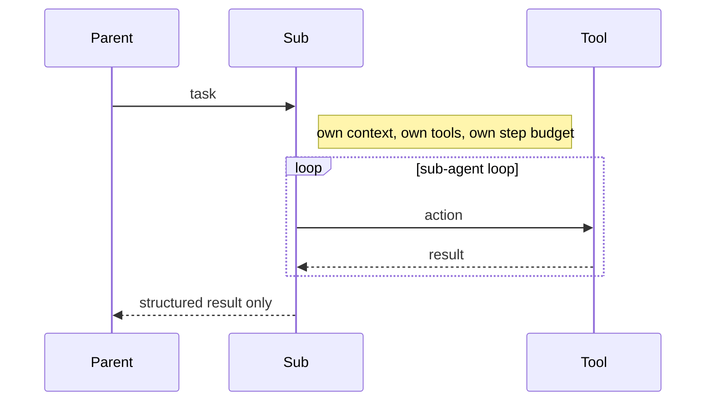

# Subagent Isolation

**Also known as:** Worktree Subagent, Parallel Subagent, Isolated Worker

**Category:** Multi-Agent  
**Status in practice:** emerging

## Intent

Run subagents in isolated workspaces so their writes do not collide and parallelism is safe.

## Context

Coding agents that delegate to multiple subagents for parallel work; without isolation, subagents fight over the same files.

## Problem

Subagents writing to the same workspace race each other; one's edits are clobbered by another's.

## Forces

- Isolation has setup cost (new worktree, branch, container).
- Reconciling work back to the main workspace is its own problem.
- Excessive isolation prevents subagents from seeing each other's progress when that would help.

## Therefore

Therefore: give each subagent its own workspace (git worktree, branch, container, sandbox) and reconcile results back through the supervisor, so that parallel work runs without write collisions and failures leave inspectable evidence.

## Solution

Each subagent runs in its own workspace (git worktree, container, branch, sandbox). The supervisor reconciles results back to the main workspace on completion (merge, cherry-pick, replay). Only one workspace can land changes at a time.

## Applicability

**Use when**

- A bounded sub-task has its own tool palette, prompt, or model.
- The parent's context should not bloat with the sub-agent's intermediate turns.
- Sub-agents can run in parallel and their failures must be containable.

**Do not use when**

- The parent must observe the sub's intermediate state for debugging.
- The sub is a single-shot operation; Tool Use suffices without an agent loop.
- Recursive nesting depth is unbounded; cost will spiral.

## Example scenario

A research agent is asked to write a market report. Instead of doing every sub-task in its main loop, it spawns three sub-agents in parallel: one to research competitors, one to pull pricing data, one to summarise news. Each sub-agent has its own tool set and step budget. The main agent only sees the three structured results that come back, not the dozens of intermediate web searches each sub-agent ran.

## Diagram

## Consequences

**Benefits**

- True parallelism without write collisions.
- Failed subagents leave their workspace as evidence.

**Liabilities**

- Setup latency.
- Reconciliation conflicts.

## What this pattern constrains

Subagents may only write to their own isolated workspace; cross-workspace writes are forbidden.

## Known uses

- **Claude Code subagent + git worktree** — *Available*
- **Devin sessions** — *Available*
- **Cursor parallel agents** — *Available*
- **OpenHands** — *Available*

## Related patterns

- *specialises* → [orchestrator-workers](orchestrator-workers.md)
- *composes-with* → [sandbox-isolation](sandbox-isolation.md)
- *composes-with* → [llm-compiler](llm-compiler.md)
- *complements* → [agent-as-tool-embedding](agent-as-tool-embedding.md)

## References

- (blog) *Mastering Git Worktrees with Claude Code*, 2025, <https://medium.com/@dtunai/mastering-git-worktrees-with-claude-code-for-parallel-development-workflow-41dc91e645fe>

**Tags:** multi-agent, isolation, parallel
