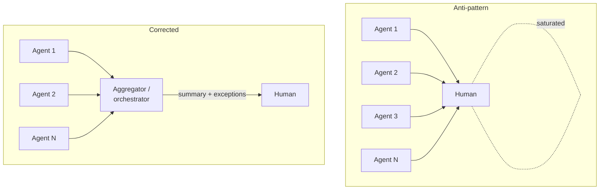

# Supervisor Cognitive Overload

**Also known as:** Human-Supervisor Bottleneck, Parallel-Agent Attention Saturation, 認知負荷オーバーロード

**Category:** Anti-Patterns  
**Status in practice:** emerging

## Intent

Name the failure where a human must converse with and steer every parallel sub-agent individually, so oversight saturates the supervisor and the human becomes the bottleneck the multi-agent design meant to remove.

## Context

A team adopts a multi-agent setup to parallelise work — several sub-agents each handling a slice of a larger task. To keep them on track, the design routes every sub-agent's questions, clarifications, and approvals back to one human. As the number of concurrent agents grows, that human is expected to hold context on all of them at once and reply to each.

## Problem

Parallel agents multiply the supervision surface faster than a human can absorb it. Each agent needs context-setting, mid-task clarification, and review; when all of that lands on one person simultaneously, the supervisor thrashes between agents, loses track of which said what, and either rubber-stamps to keep up or becomes the slowest part of the system. The parallelism that was supposed to speed things up is throttled by a single human's working memory.

## Forces

- More concurrent agents mean more parallel demands on one supervisor's attention.
- Human working memory and context-switching capacity are fixed and small.
- Sub-agents still need steering, so oversight cannot simply be removed.
- Rubber-stamping to keep pace defeats the purpose of having a human in the loop.
- Aggregating agent state for the human costs design effort that is easy to skip.

## Therefore

Therefore (avoidance): do not route every sub-agent's interaction to one human; aggregate, summarise, and escalate selectively so the supervisor sees a manageable, prioritised surface rather than N live conversations.

## Solution

Recognise the anti-pattern and redesign the oversight surface. Insert an aggregation layer between the agents and the human: batch and summarise sub-agent status, surface only the decisions that genuinely need a human, and let a lead agent or orchestrator absorb routine clarifications. Cap the number of agents one person supervises, or move from per-agent conversation to a single dashboard with prioritised exceptions. The corrective patterns are selective escalation and a coordinating layer, not more human bandwidth. Japanese practitioner reports flag this directly: when the human must talk to every agent, cognitive load becomes the limiting factor.

## Structure

```
Anti-pattern: N agents -> N live conversations -> 1 human (saturated). Corrected: N agents -> aggregator/orchestrator -> summarised status + prioritised exceptions -> 1 human (bounded surface).
```

## Diagram



*Routing every agent to one human saturates the supervisor; an aggregation layer restores a bounded oversight surface.*

## Example scenario

A developer runs a spec-driven setup that spawns five sub-agents, each pinging them for clarification on its slice of the build. Within an hour they are switching between five chat threads, losing track of which agent was told what, and approving diffs they have not really read just to keep all five moving. The five-way parallelism that promised speed has collapsed into one exhausted human serialising everything through their own attention.

## Consequences

**Liabilities**

- Oversight quality collapses as the supervisor thrashes between agents.
- Rubber-stamping creeps in to keep pace, nullifying the human check.
- The human becomes the throughput bottleneck, erasing the parallelism gain.
- Errors slip through because no one holds full context on any single agent.
- Supervisor fatigue and burnout make the arrangement unsustainable.

## What this pattern constrains

The system must not require a human to hold live context on, and individually converse with, every concurrent sub-agent; supervision has to be aggregated and selectively escalated so the human's attention surface stays bounded as the agent count grows.

## Applicability

**Use when**

- You are reviewing a multi-agent design where every agent reports to one human.
- Supervisors report thrashing or falling behind as agent count grows.
- Approvals are being rubber-stamped to keep pace.
- You are deciding how many agents one person can realistically oversee.

**Do not use when**

- Only one or two agents run and the human comfortably tracks both.
- An aggregation and selective-escalation layer already bounds the human's surface.
- Agents are fully autonomous and no per-agent human steering is required.
- Supervision is already distributed across multiple people or a lead agent.

## Known uses

- **[AIエージェント時代、正直しんどい話 (Zenn)](https://zenn.dev/ryo369/articles/d02561ddaacc62)** — *Available* — Reports that spec-driven sub-agent delegation forces the human to converse with all the agents, and identifies the resulting cognitive load as the limiting problem.
- **[Anthropic — Effective context engineering for AI agents](https://www.anthropic.com/engineering/effective-context-engineering-for-ai-agents)** — *Available* — Motivates orchestrator/sub-agent layering and selective surfacing so a human is not in the loop on every parallel agent's full context.

## Related patterns

- *complements* → [orchestrator-as-bottleneck](orchestrator-as-bottleneck.md) — Orchestrator-as-bottleneck saturates a coordinating agent; supervisor cognitive overload saturates the coordinating human. Same shape, different node.
- *complements* → [unbounded-subagent-spawn](unbounded-subagent-spawn.md) — Unbounded spawning is a common trigger: the more sub-agents created, the heavier the human supervision surface becomes.
- *complements* → [role-typed-subagents](role-typed-subagents.md) — Role-typed sub-agents without an aggregation layer push their individual interactions straight onto one overloaded supervisor.

## References

- (blog) ryo369 (Zenn), *AIエージェント時代、正直しんどい話*, 2026, <https://zenn.dev/ryo369/articles/d02561ddaacc62>
- (blog) Anthropic, *Effective context engineering for AI agents*, 2025, <https://www.anthropic.com/engineering/effective-context-engineering-for-ai-agents>

**Tags:** anti-patterns, multi-agent, human-in-the-loop, oversight, cognitive-load
