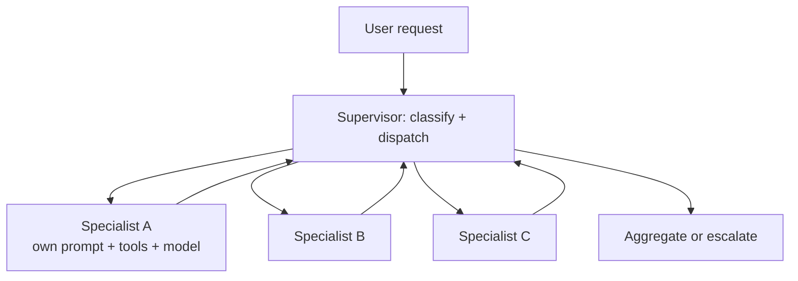

# Supervisor

**Also known as:** Multi-Agent Supervisor, Lane Supervisor

**Category:** Multi-Agent  
**Status in practice:** mature

## Intent

Place a coordinating agent above a set of specialised agents and route work to them.

## Context

A team is handling a mix of request types — billing questions, technical support, sales enquiries — and each type benefits from its own system prompt, its own tool palette, and possibly its own model. Each type is itself a multi-step interaction, not a single response, so routing alone is too coarse: the lanes want their own inner agent loop. This is distinct from orchestrator-workers, which dynamically decomposes a task into ad-hoc sub-tasks per request; supervisor routes work to a fixed set of pre-existing specialist agents.

## Problem

A single agent trying to handle every request type has either too few tools — which limits what it can actually do — or too many, in which case the model gets confused about which tool fits which request, the prompt balloons, and recall drops. The team cannot tune the agent for billing without making it worse at sales. A flat router that just dispatches to a one-shot specialist does not give each lane the multi-step loop it needs. Some coordinating layer above the specialists has to own dispatch and aggregation.

## Forces

- Adding a supervisor layer adds a model call.
- Inter-agent communication needs a protocol.
- Specialisation reduces transfer learning across requests.

## Applicability

**Use when**

- Different request types want their own loop, prompt, tools, and possibly model.
- A flat router would be too coarse because lanes need their own multi-step behaviour.
- A coordinating layer can dispatch and decide whether to escalate.

**Do not use when**

- A single agent already handles the workload without confusion.
- Routing alone (no inner loop per lane) suffices.
- Supervisor coordination cost outweighs the specialisation benefit.

## Therefore

Therefore: put a coordinating agent above a set of specialised lanes that each own their prompt, tools, and possibly model, and route requests by classification, so that capability grows by adding lanes rather than by enlarging one prompt.

## Solution

A supervisor classifies requests and dispatches them to a specialised agent. Each specialist has its own prompt, tools, and possibly its own model. The supervisor may receive results back and decide whether to escalate or respond.

## Diagram

## Example scenario

A customer-service platform routes incoming chats. A supervisor agent classifies each request: billing, technical, or sales. It dispatches each to the matching specialist agent, which has its own prompt, tool set, and ticket-system access. The supervisor doesn't try to be good at all three roles — it just routes and aggregates.

## Consequences

**Benefits**

- Each lane can be tuned and tested in isolation.
- Capability grows by adding lanes, not by enlarging one prompt.

**Liabilities**

- Multi-agent before simpler patterns are running is decoration.
- Coordination failures are often invisible until production.

## What this pattern constrains

Specialists may only act within their declared scope; the supervisor owns dispatch and aggregation.

## Known uses

- **Bobbin (Stash2Go)** — *Available*. agent_v2.py + supervisor.py implement the lane-supervisor pattern.
- **LangGraph Supervisor** — *Available*
- **[Sparrot](https://marco-nissen.com/sparrot/)** — *Available* — A dispatcher routes requests to specialised internal lanes (chat, tick, MCP, voice) and coordinates across them, acting as the central traffic controller that the agent loop itself does not see.

## Related patterns

- *uses* → [routing](routing.md)
- *alternative-to* → [orchestrator-workers](orchestrator-workers.md)
- *specialises* → [hierarchical-agents](hierarchical-agents.md)
- *alternative-to* → [blackboard](blackboard.md)
- *generalises* → [lead-researcher](lead-researcher.md)
- *complements* → [inter-agent-communication](inter-agent-communication.md)
- *complements* → [role-assignment](role-assignment.md)
- *alternative-to* → [swarm](swarm.md)
- *alternative-to* → [hero-agent](hero-agent.md)
- *alternative-to* → [handoff](handoff.md)
- *complements* → [mixture-of-experts-routing](mixture-of-experts-routing.md)
- *alternative-to* → [autogen-conversational](autogen-conversational.md)
- *complements* → [sop-encoded-multi-agent](sop-encoded-multi-agent.md)
- *alternative-to* → [chat-chain](chat-chain.md)
- *complements* → [dynamic-expert-recruitment](dynamic-expert-recruitment.md)
- *complements* → [outer-inner-agent-loop](outer-inner-agent-loop.md)
- *used-by* → [cross-domain-agent-network](cross-domain-agent-network.md)

## References

- (doc) *LangGraph Multi-Agent Supervisor*, <https://langchain-ai.github.io/langgraph/tutorials/multi_agent/agent_supervisor/>

**Tags:** multi-agent, supervisor
