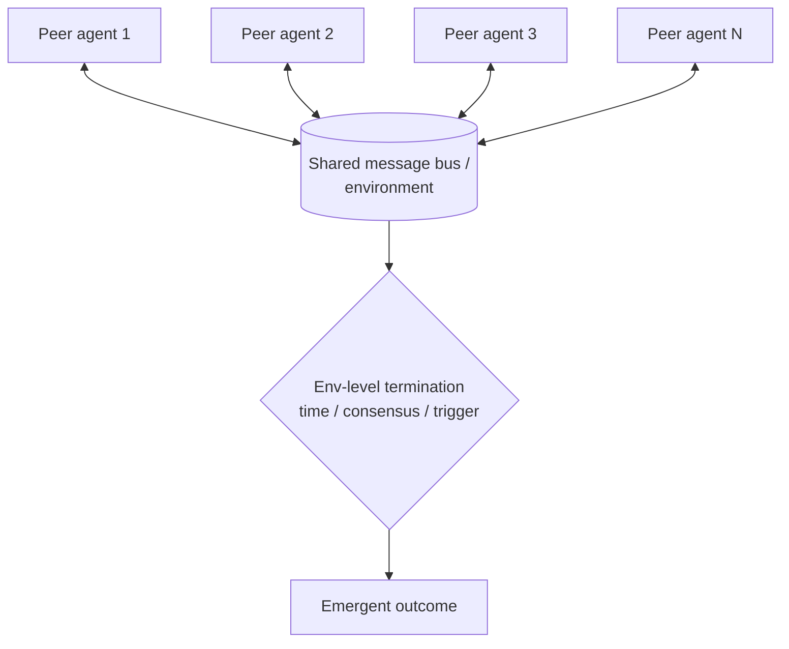

# Swarm

**Also known as:** Society of Mind, Peer Agents, Decentralised Multi-Agent

**Category:** Multi-Agent  
**Status in practice:** experimental

## Intent

Run many peer agents that interact directly without a central supervisor, achieving emergent coordination.

## Context

A team is working on a task where many independent attempts or interactions matter more than a single coordinated plan — a negotiation simulation with many parties, a market simulation, an exploration of a large state space, a generative-agents experiment populating a small world. Centralised coordination would either bottleneck the system or impose a single policy on agents that need to behave differently from each other.

## Problem

A central supervisor scales poorly to dozens or hundreds of agents: it becomes the bottleneck, and forcing every interaction through it removes the agent-to-agent dynamics that the task actually depends on. A negotiation in which every party speaks only through the chair is not a negotiation. At the same time, dropping the supervisor entirely raises new problems: how do agents find each other, how does the system terminate, and how does anyone debug emergent behaviour when nobody is in charge.

## Forces

- Emergent behaviour can surprise designers; debugging is hard.
- Communication topology (broadcast? gossip? pub/sub?) is a design choice.
- Termination is non-trivial without a supervisor.

## Applicability

**Use when**

- Centralised coordination is a bottleneck or the task benefits from many independent attempts.
- Agents can interact through a shared bus or environment.
- Termination conditions can be defined at the environment level.

**Do not use when**

- Tasks need deterministic ordering or strict accountability per step.
- Convergence cannot be guaranteed and runaway interaction is too costly.
- A supervisor pattern already handles the workload predictably.

## Therefore

Therefore: run many peer agents over a shared message bus or environment with no central coordinator, and define termination at the environment level, so that coordination emerges from interaction instead of bottlenecking on a supervisor.

## Solution

Agents interact via a shared message bus, chat, or environment. Each agent has its own goals and policies. No central coordinator; convergence is emergent. Termination conditions are environment-level (time budget, consensus threshold, external trigger).

## Example scenario

A team simulates negotiation strategies among many parties; a centralised supervisor would bottleneck and would also impose a single policy on all parties. They run many peer agents on a shared message bus, each with its own goals and policies, no central coordinator, and environment-level termination conditions. Coordination emerges from interaction rather than instruction; the simulation produces patterns the team did not pre-script.

## Diagram

## Consequences

**Benefits**

- Scales horizontally.
- Suits negotiation, market simulation, exploration.

**Liabilities**

- Hard to debug; emergent failures are global.
- Cost can balloon without supervision.

## What this pattern constrains

Agents communicate only via the shared channel; out-of-band coordination is forbidden.

## Known uses

- **OpenAI Swarm (deprecated; succeeded by OpenAI Agents SDK)**
- **Stanford Generative Agents simulation** — *Available*

## Related patterns

- *specialises* → [debate](debate.md)
- *alternative-to* → [supervisor](supervisor.md)
- *complements* → [blackboard](blackboard.md)

## References

- (repo) *openai/swarm*, <https://github.com/openai/swarm>

**Tags:** multi-agent, swarm, emergent
