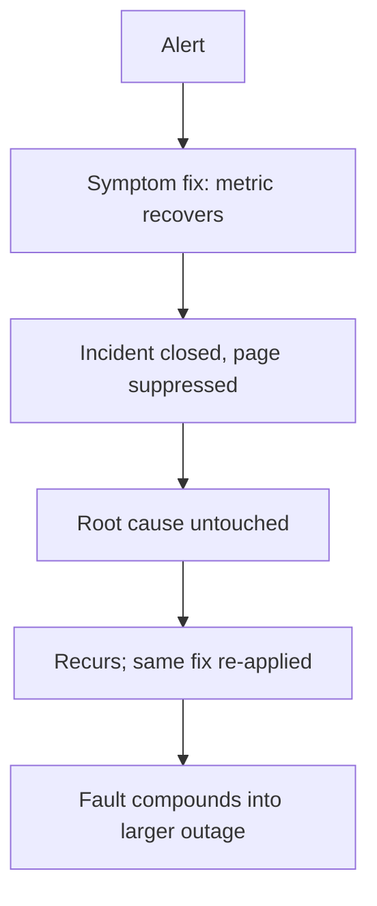

# Symptom-Remediation Thrashing

**Also known as:** Masking-Fix Loop, Root-Cause-Suppressing Remediation

**Category:** Anti-Patterns  
**Status in practice:** emerging

## Intent

Anti-pattern: a stateless auto-remediation agent repeatedly applies symptom-level fixes that hit the target metric while masking the root cause and suppressing the page, so the underlying fault compounds across incidents into a larger outage.

## Context

An auto-remediation agent watches production and responds to alerts by running fixes — restart the pod, scale out, re-roll the deployment — to bring a metric back into range. Each fix is evaluated by whether the metric recovers, and a recovered metric closes the incident. The agent is stateless across incidents: it does not carry what it did last time into the next alert.

## Problem

A symptom-level fix can bring the metric back while leaving the real cause untouched — scaling a service masks a noisy neighbour, restarting a pod clears a leak that refills. Because the metric recovers, the incident closes and no page reaches the team that owns the root cause, so the fix both hides the problem and suppresses the signal that would get it fixed. With no memory across incidents and no cap on repeated remediation, the agent keeps applying the same masking fix while the underlying fault grows, until it fails harder and takes down more than the original symptom.

## Forces

- A fix that returns the metric to range looks successful, even when it only masks the cause.
- Closing the incident on a recovered metric suppresses the page that would route the root cause to the right team.
- A stateless agent cannot see that it has fixed the same symptom before, so it cannot tell masking from resolution.
- Auto-remediation is valued for speed, and adding a cross-incident check or an escalate-after-N cap slows it.

## Therefore

Therefore: do not let a recovered metric stand in for a resolved cause; give remediation memory across incidents, escalate to a human after repeated fixes on the same symptom, and distinguish a fix that masks from one that resolves before closing the incident.

## Solution

Treat a recovered metric as mitigation, not resolution, and design remediation to detect its own masking. Carry state across incidents so the agent can see it has applied the same fix to the same symptom before, and cap repeated remediation with an escalate-after-N-attempts rule that routes a recurring symptom to a human instead of re-applying the mask. Keep the page alive when a fix is a known mask rather than a root-cause resolution, so the owning team is still notified. Distinguish masking from resolution — for example by checking whether the underlying signal, not just the target metric, returned to health — before declaring the incident closed. The control is cross-incident memory plus an escalation cap, not a faster symptom fix.

## Structure

```
Alert -> symptom fix (metric recovers) -> incident closed, page suppressed -> root cause untouched -> recurs -> same fix re-applied -> fault compounds into larger outage (BROKEN) ; Corrected: cross-incident memory + escalate-after-N + mask-vs-resolve check
```

## Diagram



*Each symptom fix recovers the metric and closes the incident, suppressing the page, so the untouched cause recurs and compounds.*

## Example scenario

An auto-remediation agent gets a CPU alert on an API pod and scales the service out; the metric recovers and the incident closes. The real cause is a noisy neighbour on the node, which keeps thrashing unseen because no page reached the platform team. The agent scales out again on the next alert, and the one after, until two days later the node fails outright and takes three services down at once.

## Consequences

**Liabilities**

- The underlying fault grows under repeated masking until it fails harder and takes down more services at once.
- The team that owns the root cause is never paged, because each symptom fix closed the incident.
- Mean-time-to-resolve looks healthy while mean-time-to-actually-fix is unbounded.
- A recurring symptom consumes remediation cycles indefinitely with no progress toward the cause.

## Failure modes

- Masking fix — a remediation returns the metric to range while leaving the cause in place.
- Page suppression — closing the incident on the recovered metric stops the root cause reaching its owner.
- Statelessness — the agent re-applies the same fix because it cannot see it has done so before.
- No escalation cap — repeated remediation on one symptom never trips a hand-off to a human.

## What this pattern constrains

A recovered target metric must not by itself close an incident as resolved; remediation carries state across incidents, repeated fixes on the same symptom escalate to a human after a bounded number of attempts rather than looping, and a masking fix may not suppress the page to the root-cause owner.

## Applicability

**Use when**

- Recognising this failure when an auto-remediation agent repeatedly applies a fix that recovers a metric without resolving the cause.
- Reviewing remediation that is stateless across incidents and closes on a recovered metric.
- Diagnosing a recurring incident that auto-remediation keeps clearing while the underlying fault grows.

**Do not use when**

- Remediation carries cross-incident memory and escalates a recurring symptom to a human after a bounded number of attempts.
- The fix genuinely resolves the root cause rather than masking it.
- Each incident is independent and one-off, so there is no recurring symptom to thrash on.

## Components

- Auto-remediation agent — applies the symptom-level fixes that recover the metric
- Target metric — the signal whose recovery wrongly stands in for resolution
- Missing cross-incident memory — the absent state that would reveal the same fix recurring
- Missing escalation cap — the absent escalate-after-N rule that would hand a recurring symptom to a human
- Suppressed page — the alert to the root-cause owner that each closed incident silences

## Tools

- Remediation runbook or action set — the fixes the agent applies to recover the metric
- Incident store — the corrective cross-incident memory of what was fixed before
- Escalation policy — the corrective escalate-after-N hand-off to a human

## Evaluation metrics

- Recurrence rate per symptom — how often the same symptom is re-remediated rather than resolved
- Mask-vs-resolve ratio — share of closed incidents whose root cause remained unaddressed
- Escalation latency — number of repeated fixes before a recurring symptom reaches a human
- Compounded-outage incidents — larger failures traced to a long-masked underlying fault

## Known uses

- **[AIOps auto-remediation post-mortem](https://rubixkube.ai/blog/aiops-auto-remediation-memory-failure)** _available_ — A noisy neighbour masked by scaling the API kept thrashing; two days later the node failed harder and three services went down, with the remediation having hit the metric while preventing the right team from being paged.
- **[Autonomous SRE agent escalate-after-N](https://www.jeeva.ai/blog/24-7-autonomous-devops-ai-sre-agent-implementation-plan)** _available_ — Implements the defensive mirror: if a remediation script has run twice for the same incident and the issue persists, it escalates to a human rather than looping.

## Related patterns

- _complements_ **Naive Retry Without Backoff** — Naive retry re-fires a failed call; symptom remediation re-fires a succeeding fix that masks the root cause while the metric recovers.
- _complements_ **Unbounded Loop** — Unbounded-loop is the agent's own reasoning loop with no step budget; symptom thrashing is a cross-incident remediation-to-production loop with no escalate-after-N cap.
- _alternative-to_ **Circuit Breaker** — A circuit breaker that trips after repeated failures is the corrective that stops a masking fix from re-firing indefinitely; thrashing is what happens without one.
- _complements_ **Composable Termination Conditions** — An explicit escalate-after-N-attempts termination is the corrective; thrashing lacks any stop-or-escalate condition on repeated remediation.
- _complements_ **Phantom Action Completion** — Phantom completion narrates a fix that never ran; symptom thrashing runs a fix that genuinely hits the metric yet masks the real problem.

## References

- [Why Auto-Remediation Without Memory Fails](https://rubixkube.ai/blog/aiops-auto-remediation-memory-failure) — 2026
- [Autonomous SRE Agent: AI-Driven DevOps Implementation Guide](https://www.jeeva.ai/blog/24-7-autonomous-devops-ai-sre-agent-implementation-plan) — 2026
- [Model-Driven Engineering of Self-Adaptive Software with EUREMA](https://arxiv.org/abs/1805.07353) — 2018
- [Alarm Reduction and Root Cause Inference Based on Association Mining in Communication Network](https://www.frontiersin.org/journals/computer-science/articles/10.3389/fcomp.2023.1211739/full) — 2023
