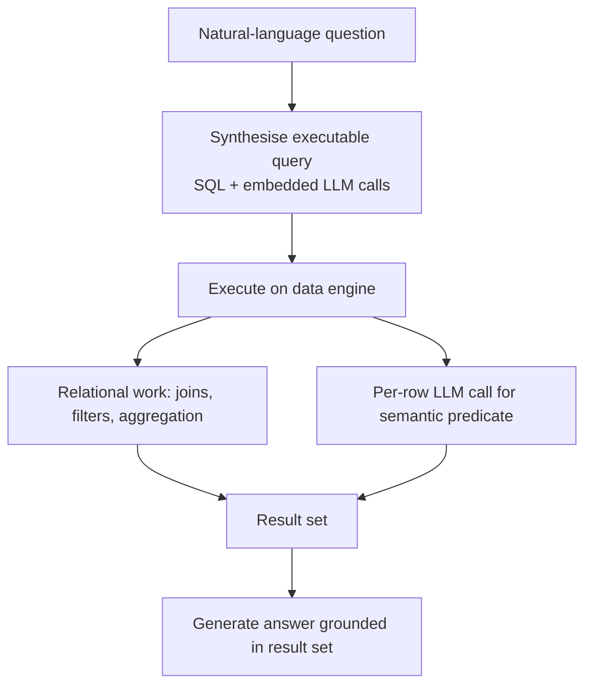

# Table-Augmented Generation

**Also known as:** TAG, Query-Synthesis-Execute-Generate, LLM-in-SQL Querying

**Category:** Retrieval & RAG  
**Status in practice:** experimental

## Intent

Answer a natural-language question over a database in three stages — synthesise an executable query, run it against the data layer with model calls embedded in execution, then generate the answer from the result.

## Context

An analyst asks a question of structured data that neither plain Text2SQL nor document retrieval can satisfy alone. Text2SQL handles only questions expressible in relational algebra, and retrieval over chunks handles only point lookups of a few records. Many real questions need both the scalable computation of the data system and the world knowledge and semantic judgement of a language model applied to the rows themselves — for example ranking suppliers by a quality the schema never recorded.

## Problem

A question such as 'which of last quarter's outage incidents were caused by a vendor misconfiguration' cannot be expressed as pure relational algebra, because deciding whether a free-text postmortem describes a vendor misconfiguration is a semantic judgement, not a column comparison. Pushing the whole table into a prompt does not scale, and a single SQL query cannot reason over the prose. The system needs to combine exact, scalable computation over the rows with per-row semantic reasoning, without loading the table into context or flattening the question into a lookup.

## Forces

- Relational engines compute exactly and scale to large tables, but cannot answer questions whose predicates require world knowledge or judgement over free text.
- A language model can judge and reason over a row's content, but reasoning over every row in context does not scale and is costly.
- Embedding the model inside query execution unlocks semantic predicates and aggregations, yet each embedded call adds latency, cost, and a new failure surface to the query plan.
- Treating Text2SQL and retrieval as the only options leaves a large class of real questions unanswerable; a unified paradigm covers them but is harder to implement and evaluate.

## Therefore

Therefore: route the question through a synthesis step that emits an executable query, an execution step where the data engine runs that query and calls the model for the semantic predicates relational algebra cannot express, and a generation step that turns the computed result into the final answer.

## Solution

Decompose answering into three stages over a database. In query synthesis the model translates the natural-language question into an executable query — typically SQL extended with calls back to a language model, exposed as user-defined functions or semantic operators — so a clause like a relevance filter or a free-text classification becomes part of the plan rather than something done afterward in a prompt. In query execution the data engine runs that query: exact relational work (joins, filters, aggregation) stays in the engine where it scales, and the embedded model calls are evaluated per row or per group only where semantic judgement is required, so reasoning is pushed into the data layer instead of pulling the table into context. In answer generation the model reads the compact, computed result set and produces the response grounded in those rows. Text2SQL is the special case where synthesis emits pure relational algebra and execution needs no model calls; retrieval is the special case where the query is a point lookup of a few records — both fall out of the same paradigm.

## Structure

```
Question --synthesise--> Executable query (SQL + LLM calls) --execute--> Data engine runs joins/filters + per-row model calls --result set--> Generate grounded answer
```

## Diagram



*Three stages — synthesise, execute (relational work plus per-row model calls), generate — over a database.*

## Example scenario

A support lead asks 'which of last quarter's outage incidents were caused by a vendor misconfiguration?'. The system writes a query that filters incidents to last quarter in the database, then calls the model on each incident's free-text postmortem to decide whether it describes a vendor misconfiguration, and finally reads the short list of matching incidents back to write the answer. The exact date filtering runs in the engine; the model only judges the prose of the rows that survive the filter.

## Consequences

**Benefits**

- Questions that need semantic reasoning over rows — not just relational algebra or point lookups — become answerable within one paradigm.
- Exact, scalable computation stays in the data engine while the model is invoked only on the rows where judgement is needed, avoiding loading the full table into context.
- Text2SQL and retrieval become special cases, so a single system covers a wider span of questions instead of switching architectures per question type.

**Liabilities**

- Model calls embedded in query execution add latency and cost that grow with the number of rows the semantic predicate touches.
- A non-deterministic call inside a query plan makes results harder to reproduce and the plan harder to optimise than pure SQL.
- Few engines natively support model calls inside execution, so the paradigm often requires a custom runtime or extension layer.
- Standard methods answer a small fraction of such questions correctly, so the synthesis and execution steps need careful evaluation before being trusted.

## Failure modes

- Synthesis miscompilation — the question is translated into a query whose semantics do not match the intent, returning a confidently wrong result.
- Predicate explosion — the synthesised plan invokes the model on far more rows than necessary, blowing latency and cost budgets.
- Ungrounded generation — the final answer drifts from the computed result set instead of staying anchored to the returned rows.
- Silent partial execution — an embedded model call errors on some rows and the engine returns an incomplete result without surfacing it.

## What this pattern constrains

The final answer must be grounded only in the result set the data engine returns; the model may not bypass query execution and answer from the table dumped into context, and the full table is never loaded into the prompt.

## Applicability

**Use when**

- Questions over structured data need semantic judgement on the rows that relational algebra cannot express, such as classifying or ranking by free-text content.
- The table is too large to dump into context, so exact computation must stay in the data engine and the model must be invoked only where judgement is required.
- An execution layer is available that can embed model calls into query execution (semantic operators or user-defined functions).

**Do not use when**

- The question is fully expressible in relational algebra, where plain Text2SQL is simpler and deterministic.
- The answer is a point lookup of one or a few records, where document retrieval suffices.
- Per-row model calls would make latency or cost unacceptable and no cheaper predicate can replace them.

## Components

- Query synthesiser — translates the natural-language question into an executable query extended with model calls
- Data engine — runs the query, performing exact relational work (joins, filters, aggregation) at scale
- Semantic operator layer — evaluates the embedded model calls per row or per group where judgement is required
- Result set — the compact rows the engine returns after execution
- Answer generator — reads the result set and produces the final response grounded in those rows

## Tools

- SQL engine or query runtime — executes the synthesised plan over the database
- Semantic-operator / UDF framework (for example LOTUS) — embeds model calls into query execution
- Tool-calling LLM — synthesises the query, evaluates semantic predicates, and generates the answer
- Database with schema metadata — provides the tables and column descriptions the synthesiser plans against

## Evaluation metrics

- Answer accuracy on questions that need semantic reasoning over rows (for example TAG-Bench) vs Text2SQL and retrieval baselines
- Model calls per query — how many per-row invocations the execution stage triggers
- End-to-end latency and cost per query as a function of rows touched by the semantic predicate
- Synthesis correctness — fraction of questions compiled into a query whose semantics match the intent

## Known uses

- **[TAG (Table-Augmented Generation)](https://arxiv.org/abs/2408.14717)** _pure-future_ — UC Berkeley / Stanford paper introducing the synthesis-execute-generate paradigm; reports that standard methods (Text2SQL, RAG) answer no more than 20% of such questions correctly on the TAG-Bench benchmark.
- **[TAG-Bench](https://github.com/TAG-Research/TAG-Bench)** _available_ — Open benchmark and reference hand-written TAG pipelines from the same group, measuring questions that need semantic reasoning over rows beyond pure Text2SQL or retrieval.
- **[LOTUS](https://github.com/lotus-data/lotus)** _available_ — Query engine with semantic operators that embed model calls (semantic filter, join, aggregate, rank) into relational-style execution over tables — a concrete substrate for the execution stage.
- **[Databricks AI Functions (ai_query)](https://docs.databricks.com/aws/en/sql/language-manual/functions/ai_query)** _available_ — Built-in SQL function that invokes a model-serving endpoint per row inside query execution, so a semantic predicate (classify, extract, summarise free text) runs as part of the SQL plan — the concrete TAG execution substrate where model calls are embedded in execution rather than done afterward.
- **[Databricks AI/BI Genie](https://docs.databricks.com/aws/en/genie/)** _available_ — Natural-language analytics space that synthesises read-only SQL from a question and returns the result table; implements the Text2SQL special case of TAG and pairs with ai_query when a semantic predicate must run inside execution.
- **[Vanna](https://github.com/vanna-ai/vanna)** _available_ — Open-source RAG framework that trains on schema/docs/queries, synthesises SQL from a question, and runs it against the database — the Text2SQL special case where execution needs no embedded model calls.

## Related patterns

- _generalises_ **Naive RAG** — TAG positions retrieval as the special case where the synthesised query is a point lookup of a few records; TAG generalises it to arbitrary computation plus per-row model calls.
- _complements_ **Vectorless Reasoning-Based Retrieval** — Both push reasoning into retrieval rather than ranking embeddings; vectorless walks a document tree, while TAG reasons over database rows through an executable query.
- _alternative-to_ **Agentic RAG** — Agentic RAG loops an agent over retrievers as tools; TAG instead compiles the question into one executable query whose execution layer itself invokes the model.
- _complements_ **Canonical-Entity Grounding** — Grounding resolves the identifiers a TAG query filters and joins on, so synthesis builds plans over authoritative ids rather than model-emitted ones.
- _alternative-to_ **Semantic-Layer Query Guardrail** — TAG keeps the model authoring an executable query and embeds model calls inside its execution for semantic predicates; this pattern removes the model's authority to author SQL entirely, routing the question through pre-defined metrics the layer compiles deterministically.

## References

- [Text2SQL is Not Enough: Unifying AI and Databases with TAG](https://arxiv.org/abs/2408.14717) — Biswal, Patel, Jha, Kamsetty, Liu, Gonzalez, Guestrin, Zaharia, 2024
- [TAG-Bench: benchmark and reference pipelines for Table-Augmented Generation](https://github.com/TAG-Research/TAG-Bench) — 2024
- [LOTUS: a query engine with semantic operators over tables](https://github.com/lotus-data/lotus) — 2024
- [Text2SQL 不夠：以 TAG 統一 AI 與資料庫，讓 SQL 語法擴充呼叫 LLM](https://medium.com/@bohachu/text2sql%E4%B8%8D%E5%A4%A0-%E4%BB%A5tag%E7%B5%B1%E4%B8%80ai%E8%88%87%E8%B3%87%E6%96%99%E5%BA%AB-%E8%AE%93sql%E8%AA%9E%E6%B3%95%E6%93%B4%E5%85%85%E5%91%BC%E5%8F%ABllm-ec0fad6478af) — 2024
- [Semantic Operators: A Declarative Model for Rich, AI-based Data Processing](https://arxiv.org/abs/2407.11418) — Patel, Jha, Pan, Gupta, Asawa, Guestrin, Zaharia, 2024
- [ai_query function — Databricks SQL](https://docs.databricks.com/aws/en/sql/language-manual/functions/ai_query) — 2025
