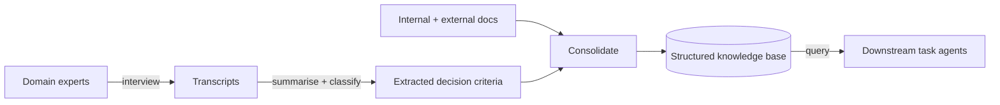

# Tacit-Knowledge Elicitation Agent

**Also known as:** Expert Knowledge Externalisation Agent, SECI Externalisation Agent

**Category:** Retrieval & RAG  
**Status in practice:** emerging

## Intent

Run a front-loaded phase in which an agent interviews domain experts and converts their undocumented know-how into a structured, queryable knowledge base before downstream task agents read from it.

## Context

A team wants to automate work that veterans perform from experience — judging which supplier substitution is safe, reading a machine's vibration, sensing when a deal is about to fall through. The decisive knowledge was never written down. It lives as habit and intuition in a few people's heads, and the manuals, tickets, and wikis the retrieval layer can index capture only the surface procedure, not the judgement criteria. When those people retire or move on, the criteria leave with them.

## Problem

Tacit knowledge is, by definition, not in the corpus, so a retrieval layer pointed only at documents returns the documented procedure and silently omits the expert judgement that actually decides outcomes. The expert cannot simply be asked to write it down, because much of what they know is unconscious and surfaces only when a concrete situation is interrogated. Without a deliberate elicitation step, every downstream agent inherits a knowledge base that looks complete but is missing the load-bearing decision criteria, and its answers are confidently shallow.

## Forces

- The most valuable knowledge is the least documented, so the corpus the retrieval layer indexes is exactly where the gap is widest.
- Experts cannot reliably introspect and write down criteria they apply unconsciously; the knowledge surfaces only when probed against concrete cases.
- Interview output is unstructured, redundant, and contradictory, while downstream agents need clean, queryable, de-duplicated criteria.
- Elicitation is expensive senior time spent up front, paying off only later when many task agents read from the resulting base.

## Therefore

Therefore: stand up a dedicated elicitation phase that interviews the experts, transcribes and classifies what they say, distils the decision criteria, and consolidates them into a structured knowledge base — so automation reads from externalised judgement, not just from manuals.

## Solution

Treat externalisation as an explicit pipeline phase that runs before the task agents are switched on. An interviewing agent works through veteran staff with open-ended, case-anchored questions, capturing transcripts of how each concrete decision was actually made. A processing step transcribes the sessions, then automatically summarises and classifies the content, extracting the decision criteria and rules of thumb that distinguish an expert's call from a novice's. A consolidation step merges these with existing internal and external documents and writes them into a structured knowledge base — schema-tagged criteria, worked cases, and the conditions under which each applies — that downstream retrieval and task agents query. The phase maps onto the SECI externalisation move: turn what was tacit and individual into explicit, organisational knowledge that can be reused and reproduced.

## Structure

```
Experts --interview--> Transcripts --summarise+classify--> Extracted criteria --consolidate with docs--> Structured KB --query--> Downstream task agents
```

## Diagram



*Interview experts, distil decision criteria, consolidate with documents into a queryable base the task agents read from.*

## Example scenario

An accounting team wants an agent to flag invoices that need senior review. The documented rules catch the obvious cases, but the veteran reviewer catches subtle ones the manual never mentions. Before building the agent, an elicitation phase interviews the reviewer about specific past invoices, extracts the criteria she actually applies, and writes them into a structured knowledge base. The review agent then queries that base, so it reasons with her judgement rather than only the written policy.

## Consequences

**Benefits**

- Downstream agents retrieve the actual decision criteria, not just the documented procedure, so their judgement on hard cases improves.
- Knowledge survives the expert's departure: criteria captured before retirement remain queryable afterwards.
- Reduces single-person dependency by making one veteran's know-how available to the whole organisation.

**Liabilities**

- Elicitation costs scarce senior time up front, and the payoff is deferred to whenever downstream agents are used.
- An expert's stated reasons can diverge from what they actually do, so captured criteria may be post-hoc rationalisation rather than the real rule.
- A consolidated base ossifies a snapshot of practice; if the domain shifts, stale criteria mislead until re-elicited.

## Failure modes

- Rationalisation capture — the expert reports a tidy reason that is not the criterion they actually apply, and the base encodes the wrong rule.
- Surface-only elicitation — generic questions elicit the documented procedure again, missing the tacit judgement the phase exists to capture.
- Consolidation collision — contradictory criteria from different experts are merged without reconciliation, leaving the base internally inconsistent.
- Staleness — the base is never re-elicited, so downstream agents keep applying criteria that the field has since moved past.

## What this pattern constrains

Downstream task agents may not invent decision criteria from parametric memory; they answer judgement questions only from criteria present in the elicited knowledge base, and surface a gap when the base lacks an applicable criterion.

## Applicability

**Use when**

- The decisive knowledge for a task lives in a few experts' heads and is largely absent from the documents a retrieval layer can index.
- Those experts are at risk of leaving, retiring, or being unavailable, so the know-how must be captured before it is lost.
- Downstream agents will repeatedly query the captured knowledge, so a one-time elicitation cost is amortised across many uses.

**Do not use when**

- The relevant knowledge is already well documented and the retrieval layer can index it directly.
- The domain shifts faster than the base can be re-elicited, so captured criteria would be stale before they are used.
- No domain expert is available or willing to be interviewed, leaving nothing tacit to externalise.

## Components

- Interviewing agent — questions experts with case-anchored, open-ended prompts to surface unconscious decision criteria
- Transcription step — turns interview sessions into searchable text
- Summariser-classifier — auto-summarises and classifies transcripts to extract criteria and rules of thumb
- Consolidator — merges extracted criteria with internal and external documents, reconciling overlaps and contradictions
- Structured knowledge base — schema-tagged criteria, worked cases, and applicability conditions that downstream agents query

## Tools

- Speech-to-text transcription — converts recorded interviews into text for processing
- LLM summariser and classifier — extracts and categorises decision criteria from transcripts
- Structured store or knowledge graph — holds the consolidated, queryable criteria for downstream retrieval

## Evaluation metrics

- Criteria coverage — fraction of an expert's hard-case decisions whose deciding criterion is present in the base
- Downstream judgement accuracy — task-agent accuracy on expert-judgement cases with the elicited base vs documents only
- Tacit recall — share of criteria absent from the original documents that the elicitation phase newly captured
- Base freshness — age of criteria relative to the latest re-elicitation, tracking staleness risk

## Known uses

- **[KPMG Japan — Tacit-to-explicit knowledge agent](https://kpmg.com/jp/ja/media/press-releases/2026/01/aiagent.html)** _available_ — Orchestrated AI service that elicits veteran staff know-how via interviews, integrates internal and external information into a knowledge database, and reconstructs the experts' judgement to combat work that is locked to single individuals.
- **[ABKSS — AI tacit-knowledge externalisation method](https://www.abkss.jp/blog/172)** _available_ — Describes auto-summarising and classifying interview and conversation content to extract an expert's specific decision criteria and know-how, framed around the SECI model.

## Related patterns

- _complements_ **GraphRAG** — GraphRAG indexes documented knowledge into an entity-relation graph; elicitation front-loads the undocumented criteria so there is expert knowledge for that graph to capture in the first place.
- _uses_ **Socratic Questioning Agent** — The interview phase drives the expert with strategic open-ended questions to surface latent, unwritten know-how rather than asking them to summarise it directly.
- _complements_ **Knowledge Graph Memory** — Once externalised, the extracted criteria and cases can be persisted as entities and relations so downstream agents run symbolic queries over them.
- _alternative-to_ **Dynamic Expert Recruitment** — Expert recruitment spins up synthetic agent personas at run time; elicitation extracts real human experts' tacit knowledge into a reusable base ahead of time.

## References

- [KPMGジャパン、AIオーケストレーションを活用した「暗黙知の形式知化エージェント」の提供を開始](https://kpmg.com/jp/ja/media/press-releases/2026/01/aiagent.html) — KPMG Japan, 2026
- [AIで暗黙知を形式知化し活用する方法｜熟練者のノウハウを継承するには](https://www.abkss.jp/blog/172) — 株式会社エービーケーエスエス, 2025
