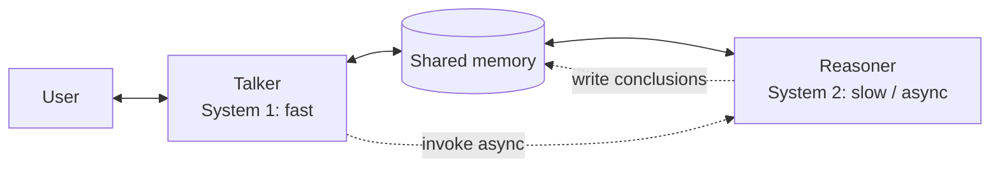

# Talker-Reasoner

**Also known as:** Fast-Slow Agent, System-1 / System-2 Agent Split, 快思考与慢思考Agent

**Category:** Multi-Agent  
**Status in practice:** emerging

## Intent

Split an interactive agent into a fast Talker for conversational responses and a slow Reasoner for deliberative planning and tool use, so the conversational loop never blocks on reasoning.

## Context

A conversational agent has two responsibilities that have different latency profiles. It must keep the user engaged with timely, fluent replies (sub-second), and it must make correct decisions on problems that need multi-step reasoning, tool use, and planning (multi-second to multi-minute). A single agent doing both either feels slow (because every reply waits for the reasoning chain) or feels shallow (because reasoning is truncated to meet the latency budget).

## Problem

When one agent loop serves both conversation and deliberation, the system inherits the worse of two latencies. Conversational turns wait for any tool call or reasoning step the agent is doing, so the user perceives the agent as slow even on trivial replies. Compressing the reasoning to fit a chat latency budget gives shallow answers on the queries that actually needed deliberation. The two responsibilities pull the loop in incompatible directions and there is no clean way to honour both.

## Forces

- Conversational latency budget is sub-second; deliberation budget is multi-second to minutes.
- Truncating deliberation to fit chat latency loses answer quality on hard queries.
- Coupling the loops means every chat turn pays the deliberation cost.
- Two loops need a shared memory or hand-off contract so the Talker can reflect the Reasoner's progress.

## Therefore

Therefore: run a Talker agent on the live conversational loop for fast intuitive replies, and a Reasoner agent asynchronously on the deliberation loop for planning and tool use, with shared memory so the Talker can surface the Reasoner's progress without blocking on it.

## Solution

Stand up two sub-agents that share memory. The Talker (System 1) handles every user turn with low-latency intuitive replies grounded in the current shared state — including 'let me think about this' acknowledgements when the Reasoner is mid-flight. The Reasoner (System 2) runs asynchronously, invoked when the Talker recognises a query requires deliberation, and writes its conclusions (plans, tool-call results, evidence) back to shared memory for the Talker to consume on the next turn. The Talker decides what to surface and when; the Reasoner is non-blocking.

## Diagram

*Talker handles every user turn from shared memory; Reasoner runs asynchronously and writes back conclusions for the Talker to surface.*

## Example scenario

A sleep-coaching agent gets the message 'I've been waking up at 3am for two weeks.' The Talker replies immediately with an empathetic acknowledgement and asks one clarifying question, while invoking the Reasoner with the case state. Over the next 30 seconds, the Reasoner plans a multi-week intervention (consult sleep-hygiene tools, check the user's history, design a protocol) and writes its conclusions to shared memory. On the user's next turn, the Talker fluently surfaces the protocol without the user ever having waited synchronously for it.

## Consequences

**Benefits**

- Conversational latency stays low — no chat turn blocks on reasoning.
- Deliberation budget is decoupled from chat budget; long planning is allowed.
- Cost optimisation: Talker can be a cheap fast model, Reasoner an expensive slow one.
- Failure isolation: a stuck Reasoner does not freeze the conversation.

**Liabilities**

- Two agents to operate, deploy, and observe instead of one.
- Shared-memory protocol becomes load-bearing; staleness or write conflicts cause incoherence.
- Talker may speak before the Reasoner has confirmed; commits before deliberation create rework.
- User confusion if the Talker promises results the Reasoner has not yet produced.

## What this pattern constrains

The Talker cannot block on the Reasoner; conversational turns must complete from current shared state regardless of Reasoner progress, and the Reasoner cannot speak directly to the user.

## Applicability

**Use when**

- The agent serves an interactive conversational channel with a sub-second latency expectation.
- Some queries need multi-step deliberation that does not fit the conversational budget.
- Acknowledging 'I'm thinking' and surfacing partial progress is acceptable UX.
- Cost split between cheap fast and expensive slow models is meaningful.

**Do not use when**

- All queries fit one latency budget; the dual loop is overhead without payoff.
- Synchronous correctness is required (e.g. financial transaction confirmation) — the Talker cannot pre-commit.
- Operating two agents and a shared memory exceeds team capacity.
- The product cannot tolerate the Talker speaking before the Reasoner confirms.

## Components

- Talker — fast intuitive agent on the user-facing conversational loop, optimised for latency
- Reasoner — slow deliberative agent that runs asynchronously, optimised for correctness on multi-step tasks
- Shared memory — typed store the Talker reads on every turn and the Reasoner writes when it concludes
- Reasoner invoker — the contract by which the Talker hands a problem to the Reasoner (without blocking)
- Progress surfacer — the protocol the Talker uses to express 'thinking', 'partial result available', 'done' to the user

## Tools

- Fast LLM for the Talker (Haiku-class or smaller, optimised for tokens-per-second)
- Strong LLM with extended thinking or tool use for the Reasoner (Opus-class or larger)
- Shared store with versioning — Redis, durable key-value, or in-memory with persistence
- Async job runner for Reasoner invocations — Temporal, Celery, or in-house scheduler

## Evaluation metrics

- Talker p95 turn latency vs. single-agent baseline
- Reasoner task quality (accuracy, plan validity) vs. forced-in-chat-budget baseline
- Premature-commit rate — fraction of Talker turns the Reasoner later contradicts
- Shared-memory staleness — turns served from an outdated Reasoner conclusion
- Cost split — Talker cost vs. Reasoner cost per session, against single-agent total

## Known uses

- **[Google DeepMind Talker-Reasoner sleep-coaching agent (Christakopoulou et al., 2024)](https://arxiv.org/abs/2410.08328)** _available_
- **Production assistants splitting fast-response and tool-using agents (e.g. some voice assistants)** _available_
- **[xAI grok-voice-think-fast-1.0](https://www.marktechpost.com/2026/04/25/xai-launches-grok-voice-think-fast-1-0-topping-%CF%84-voice-bench-at-67-3-outperforming-gemini-gpt-realtime-and-more/)** _available_ — Shipping voice model that runs a background reasoner alongside a low-latency talker, thinking through queries in real time with no impact on response latency.

## Related patterns

- _alternative-to_ **Dual-System GUI Agent**
- _specialises_ **Augmented LLM**
- _composes-with_ **Extended Thinking**
- _composes-with_ **Handoff**
- _alternative-to_ **Two-Rate Cloud-Brain / Edge-Controller Split** — Talker-Reasoner splits a conversational agent so the chat turn never blocks on deliberation; this split is for an embodied body where the fast loop is a fixed-rate motor controller, not a dialogue turn.

## References

- [Agents Thinking Fast and Slow: A Talker-Reasoner Architecture](https://arxiv.org/abs/2410.08328) — Christakopoulou, Mourad, Mataric, 2024
- [快思考与慢思考 Agent 的结合](https://www.53ai.com/news/LargeLanguageModel/2024102229680.html)
