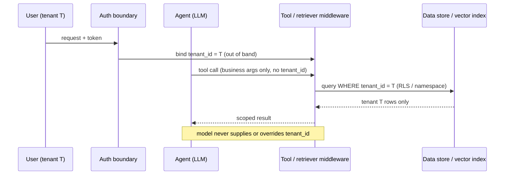

# Tenant-Scoped Tool Binding

**Also known as:** Out-of-Band Tenant Isolation, Tenant Binding Below the Prompt, Programmatic Tenant Scoping

**Category:** Safety & Control
**Status in practice:** emerging

## Intent

Bind every tool call and retrieval to the active tenant in code at the execution layer, so a multi-tenant agent can never be talked into reading or writing another tenant's data.

## Context

A business runs one agent over a multi-tenant SaaS or business platform where every customer organisation sees only its own records. The same model, prompt, tools, and vector store serve all tenants; the only thing that differs between two requests is which organisation the caller belongs to. Tool calls — database reads, API writes, document retrieval — must be confined to the calling tenant's slice of the data, and the cost of getting that wrong is one customer reading another customer's records.

## Problem

If the tenant boundary is expressed only as an instruction in the system prompt — telling the model to act for organisation 42 and refuse anything else — the boundary depends on the model continuing to honour that instruction under adversarial input. A retrieved document, a tool result, or a crafted user message can pull the model into emitting a tool argument scoped to a different organisation, and the model will sometimes comply. Prompt-level scoping also leaves no enforceable contract at the data layer: a single missing filter in one tool silently exposes every tenant's rows. The boundary that matters most for trust is the one the model is least reliable at holding.

## Forces

- The model is convenient for routing a request but is not a trustworthy place to enforce an authorization boundary, because its output is shaped by untrusted retrieved content and user text.
- Carrying the tenant id as a tool argument the model fills in means the model can fill in the wrong one; carrying it out of band means the tool layer must thread it through every call.
- A shared vector store and shared database make pooling cheap, but pooling is exactly what makes a single missing tenant filter catastrophic.
- Per-tenant physical isolation — a database or index per customer — is the safest option but the most expensive to operate at scale.
- Tenant scope must be enforced on every retrieval and every tool call, yet developers add new tools faster than they remember to re-apply the filter.

## Therefore

Therefore: resolve the tenant from the authenticated request context and enforce it in the tool and retrieval layer — as a query filter, a row-level-security predicate, or a per-tenant namespace bound from the caller's token — so the model never supplies, and can never override, which tenant's data a call touches.

## Solution

Derive the tenant identifier from the authenticated session or token at the trust boundary, not from anything the model produces. Pass it out of band into the tool-execution layer through a request-scoped context, closure, or middleware, and have every tool and retriever apply it as a mandatory predicate: a WHERE tenant_id = ? filter, a Postgres row-level-security policy keyed on the connection's tenant, or a vector-store namespace selected from the token rather than from a model argument. Tools accept business arguments only; the tenant scope is injected beneath them and is not part of the model's action schema. Retrieval requests carry the tenant id before they reach the index, so a query can only ever match the calling tenant's partition. Make the scoped accessor the only path to tenant data, so a newly added tool inherits the boundary by construction instead of by the author remembering to add a filter.

## Structure

```
Auth boundary --(verified tenant_id)--> request-scoped context --> tool/retriever middleware --(mandatory tenant predicate)--> data store. Model --(business args only, no tenant_id)--> tool. Vector store partitioned by tenant namespace selected from the token, not from model output.
```

## Diagram



*Tenant scope is bound from the authenticated request in the tool layer; the model supplies business arguments only and cannot change which tenant a call reads.*

## Example scenario

A B2B analytics SaaS gives every customer an in-app assistant that answers questions over that customer's data. Early on the tenant is named in the system prompt — the assistant is told it serves Acme Corp — until a pasted support email containing instructions about a different account makes it fetch and summarise the wrong customer's invoices. The team moves the tenant id out of the prompt: it is read from the signed session token, threaded into a request-scoped context, and applied as a row-level-security predicate on every query and as the vector-store namespace for every retrieval. The assistant's tools now accept only business arguments, and no prompt or pasted text can change which organisation a call reads.

## Consequences

**Benefits**

- A compromised or misled model cannot widen its data scope, because the scope is not in its hands.
- The tenant boundary is enforced in one place per data store and inherited by every tool, rather than re-implemented per tool.
- Audits and tests can assert the predicate is always applied, independent of model behaviour.
- Pooled storage stays cheap because isolation is logical and enforced, not bought through per-tenant infrastructure.

**Liabilities**

- Threading a request-scoped tenant id through every tool and data path adds plumbing and discipline a prototype may not have.
- Row-level security and per-tenant namespaces must be configured correctly once; a misconfigured policy fails open as silently as a missing filter.
- Cross-tenant features such as admin views or benchmarking need an explicit, separately-audited escape from the default scope.
- Logs, caches, and embeddings derived from tenant data inherit the same isolation requirement and are easy to overlook.

## What this pattern constrains

The model must not be the authority for which tenant a tool call or retrieval targets: the tenant scope is bound from the authenticated request context in code, is not exposed as a model-supplied tool argument, and a tool with no resolvable tenant scope must refuse to execute rather than fall back to an unscoped query.

## Guardrails

- Default-deny accessor — a tool with no resolvable tenant scope refuses rather than running unscoped
- Isolation tests in CI — automated assertions that every data path applies the tenant predicate

## Applicability

**Use when**

- One agent serves many customer organisations over shared storage and the data must stay strictly per-tenant.
- Untrusted content (retrieved documents, user messages, tool results) can reach the model and could influence a tool argument.
- A data leak across tenants is a serious commercial or regulatory event.
- New tools and data paths are added often and must inherit the boundary automatically.

**Do not use when**

- The deployment is single-tenant, so there is no other tenant to leak to.
- Every tenant already has fully isolated infrastructure and no code path is shared.
- The agent only reads data the caller could see anyway, with no cross-customer surface.

## Components

- Auth boundary — verifies the caller and extracts the tenant id from the session or token
- Request-scoped tenant context — carries the verified tenant id out of band to every tool and retriever
- Tool/retriever middleware — applies the tenant id as a mandatory query predicate or namespace before any data access
- Scoped data accessor — the only path to tenant data, so new tools inherit the boundary by construction
- Cross-tenant escape — an explicit, separately-audited accessor for admin or aggregate views

## Tools

- Row-level security (Postgres RLS or equivalent) — database-enforced per-tenant row filtering
- Vector store with per-tenant namespaces — retrieval partitioned so a query matches only the caller's tenant
- Identity provider / JWT — supplies the authenticated tenant claim used to bind scope

## Evaluation metrics

- Cross-tenant access rate — requests that returned another tenant's data; the target is zero
- Unscoped-query escape rate — fraction of tool calls reaching a data store without the tenant predicate applied
- Red-team isolation pass-rate — share of prompt-injection attempts that fail to widen tenant scope
- New-tool coverage — share of tools reaching tenant data exclusively through the scoped accessor

## Known uses

- **[Amazon Bedrock AgentCore](https://aws.amazon.com/blogs/machine-learning/building-multi-tenant-agents-with-amazon-bedrock-agentcore/)** — *Available* — Multi-tenant agent deployments isolate each tenant's data and resources below the agent rather than via the prompt.
- **[Azure Architecture Center — Secure Multitenant RAG](https://learn.microsoft.com/en-us/azure/architecture/ai-ml/guide/secure-multitenant-rag)** — *Available* — Reference architecture enforcing tenant isolation at the retrieval and vector layer, treating model-level access control as insufficient.
- **[Scalekit](https://www.scalekit.com/blog/access-control-multi-tenant-ai-agents)** — *Available* — Identity and isolation layer for multi-tenant agents that scopes tool access by the authenticated tenant.

## Related patterns

- *complements* → [session-isolation](session-isolation.md) — Session isolation separates one conversation's state from another's; tenant binding separates one customer's data from another's. Both isolate, on different axes.
- *complements* → [tool-over-broad-scope](tool-over-broad-scope.md) — Over-broad tool scope is the failure this pattern narrows: the tenant predicate bounds what an otherwise broad tool can reach.
- *complements* → [policy-as-code-gate](policy-as-code-gate.md) — A policy gate decides whether an action is allowed; tenant binding decides which tenant's data it may touch. The two stack.
- *complements* → [agentic-rag](agentic-rag.md) — Retrieval must carry the tenant id before it reaches the index so a query can only match the caller's partition.
- *complements* → [delegated-agent-authorization](delegated-agent-authorization.md) — Delegated authorization scopes what the agent may do on a principal's behalf; tenant binding scopes which tenant's records it sees.
- *complements* → [canonical-entity-grounding](canonical-entity-grounding.md) — The resolver that grounds identifiers must itself be tenant-scoped, or it leaks the existence of other tenants' entities.

## References

- (blog) *マルチテナントSaaSにAIエージェントを組み込むとき、テナント分離をどう設計するか*, 2026, <https://zenn.dev/geekplus/articles/e9ea7d8e183eb5>
- (doc) *Enforcing tenant isolation — AWS Prescriptive Guidance (Agentic AI multitenant)*, 2026, <https://docs.aws.amazon.com/prescriptive-guidance/latest/agentic-ai-multitenant/enforcing-tenant-isolation.html>
- (doc) *Design a Secure Multitenant RAG Inferencing Solution — Azure Architecture Center*, 2026, <https://learn.microsoft.com/en-us/azure/architecture/ai-ml/guide/secure-multitenant-rag>
- (blog) AWS Machine Learning Blog, *Multi-tenant RAG implementation with Amazon Bedrock and Amazon OpenSearch Service for SaaS using JWT*, 2026, <https://aws.amazon.com/blogs/machine-learning/multi-tenant-rag-implementation-with-amazon-bedrock-and-amazon-opensearch-service-for-saas-using-jwt/>

**Tags:** multi-tenancy, tenant-isolation, safety-control, access-control, saas, row-level-security, rag
