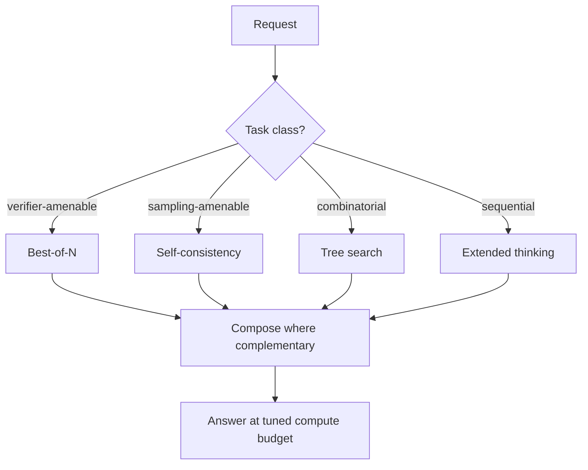

# Test-Time Compute Scaling

**Also known as:** Inference-Time Scaling, Compute-Time Trade-Off

**Category:** Reasoning  
**Status in practice:** mature

## Intent

Allocate more inference-time compute (samples, search, deeper thinking) instead of scaling parameters to improve quality.

## Context

A team is at a quality ceiling on a hard workload — math benchmarks, code reasoning, complex planning — and the obvious move of waiting for the next generation of a larger model is either unavailable or too expensive. They have inference budget they could spend, and they have noticed that some classes of problem respond well to spending more compute at answer-time rather than at training-time.

## Problem

A single-pass call to even a strong model under-uses the compute available at inference time. The team knows several inference-time techniques exist — drawing many samples and picking the best, voting across many samples, searching over reasoning trees, allocating more internal reasoning tokens — but each technique shines on a different kind of task. Without a deliberate policy for how to spend inference budget per task class, the team leaves easy quality gains on the floor and pays too much on the items that would not have benefited.

## Forces

- Wall-clock latency rises with compute.
- Cost rises linearly or worse with sample count.
- Best technique (samples / search / deeper thinking) is task-dependent.

## Applicability

**Use when**

- Parameter scaling has saturated and inference-time techniques deliver further lift.
- The task is amenable to a known technique (best-of-N, self-consistency, tree search, extended thinking).
- Compute budget at inference time is available and worth spending for quality.

**Do not use when**

- Latency or cost budgets cannot absorb extra inference-time compute.
- The task does not benefit from any of the inference-time techniques.
- A larger or better model is cheaper than scaling test-time compute.

## Therefore

Therefore: spend more compute at inference (samples, search, deeper thinking) instead of more parameters, so that quality lifts on hard tasks without retraining.

## Solution

Pick the inference-time technique that fits: best-of-N for verifier-amenable tasks, self-consistency for sampling-amenable tasks, tree search for combinatorial tasks, extended thinking for sequential reasoning. Compose techniques where complementary. Tune the compute budget per task class.

## Variants

- **Parallel sampling (best-of-N)** — Draw N independent samples and pick the best by a verifier or majority vote.
- **Sequential revision** — One sample is iteratively revised by the same model conditioned on its previous attempt.
- **Tree / beam search** — Explore a branching search tree with a value model pruning low-promise branches (ToT, LATS, MCTS-style).
- **Compute-optimal routing** — Pick parallel vs sequential vs deeper-thinking per question based on difficulty estimate (Snell et al. 2024).

## Example scenario

A team has a hard math benchmark where their current model underperforms; the obvious move is to wait for a larger model. Instead they apply test-time compute scaling: best-of-N sampling with a verifier for verifier-amenable items, self-consistency for sampling-amenable items, tree search for combinatorial items, extended thinking for sequential reasoning. Per-item cost rises but accuracy on the benchmark beats the next-tier model at lower total cost.

## Diagram

## Consequences

**Benefits**

- Quality lifts without retraining.
- Compute budget becomes a per-request control.

**Liabilities**

- Latency-sensitive use cases cannot afford much.
- Token cost can dominate.

## What this pattern constrains

Each request specifies its compute budget; over-budget requests are cut off.

## Known uses

- **OpenAI o-series scaling-with-effort** — *Available*
- **DeepMind AlphaCode/AlphaProof scaling** — *Available*

## Related patterns

- *generalises* → [extended-thinking](extended-thinking.md)
- *generalises* → [best-of-n](best-of-n.md)
- *generalises* → [self-consistency](self-consistency.md)
- *generalises* → [lats](lats.md)
- *generalises* → [process-reward-model](process-reward-model.md)

## References

- (paper) Snell, Lee, Xu, Kumar, *Scaling LLM Test-Time Compute Optimally Can Be More Effective Than Scaling Model Parameters*, 2024, <https://arxiv.org/abs/2408.03314>
- (paper) Brown, Juravsky, Ehrlich, Clark, Le, Ré, Mirhoseini, *Large Language Monkeys: Scaling Inference Compute with Repeated Sampling*, 2024, <https://arxiv.org/abs/2407.21787>

**Tags:** reasoning, scaling, compute
