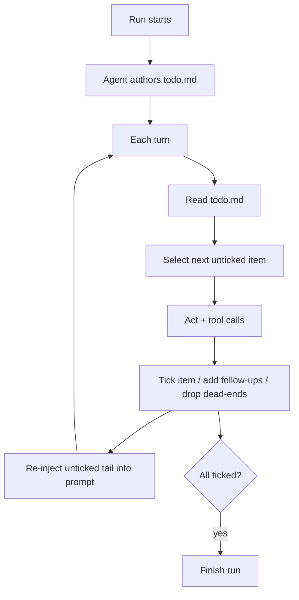

# Todo-List-Driven Autonomous Agent

**Also known as:** todo.md Agent, Persistent Markdown Plan, Externalised Plan File

**Category:** Planning & Control Flow  
**Status in practice:** emerging

## Intent

Have the autonomous agent author a writeable plan file (e.g. todo.md) early in the run, tick items as it completes them, and re-inject the remaining plan into the end of the context window; the file is the durable plan and the model's working memory.

## Context

A long-horizon autonomous task in a sandboxed VM with file-system access; the run may span hundreds of tool calls and exceed any usable in-context plan.

## Problem

In-context plans drift to the middle of the window where the model attends least; without a durable plan artefact, paused or context-truncated runs cannot recover; the agent forgets which sub-tasks are done.

## Forces

- Models attend most strongly to the end (and start) of the context window.
- File-system memory is durable; in-context memory is volatile.
- Re-injecting the full plan every turn is repetitive but combats attention drift.
- Markdown is human- and model-readable, supports easy ticking.


## Applicability

**Use when**

- A long-horizon autonomous task may span hundreds of tool calls and exceed in-context plans.
- The sandbox provides filesystem access for a durable plan artefact.
- Runs may be paused, truncated, or resumed and need a reload-friendly plan.

**Do not use when**

- Tasks are short and an in-context plan suffices.
- There is no filesystem to write a durable plan file.
- The plan would never be re-injected and the file would just be write-only noise.

## Solution

Early in the run, the agent writes its plan as a checklist file (todo.md) in its sandbox. Each turn: read the file, work the next unticked item, update the file (tick the item, add follow-ups, drop dead-ends). Re-inject the unticked tail of the file into the prompt before the model's next turn. The file outlives any single context window. Paired with a sandboxed VM that gives the agent persistent storage and basic tools (browser, shell, file editor).

## Example scenario

A long autonomous coding run gets context-truncated halfway through and the agent forgets which sub-tasks are done. The team gives it a `todo.md` it must author early in the run as a checklist; each turn it reads the file, works the next unticked item, updates the file, and re-injects the remaining plan into context. Now a context truncation or a process restart can resume cleanly because durable plan and working memory live on disk, not in the window.

## Structure

```
Sandbox VM (browser, shell, files) + agent loop: read(todo.md) -> select next item -> act -> update(todo.md) -> repeat.
```


## Diagram



## Consequences

**Benefits**

- Plan survives context truncation and pause/resume.
- Re-injecting unticked items keeps the model focused on what's left.
- Human-readable trail for debugging and review.

**Liabilities**

- Re-injection costs tokens every turn.
- The agent may rewrite the file capriciously; needs guardrails on plan mutations.
- Sandboxed VM cost (one VM per task) is non-trivial.

## What this pattern constrains

The agent may not advance past an unticked item without recording the action in the plan file; arbitrary in-context-only plans are forbidden.

## Known uses

- **[Manus (Monica.im)](https://manus.im)** — *Available*. Plan persisted as todo.md inside a per-task sandbox VM; remaining items re-injected each turn.
- **OpenManus** — *Available*. Open-source replica of Manus's loop.

## Related patterns

- *specialises* → [scratchpad](scratchpad.md) — Scratchpad for the plan specifically.
- *alternative-to* → [spec-first-agent](spec-first-agent.md) — Spec-first uses a human-authored spec; this is agent-authored.
- *complements* → [agent-resumption](agent-resumption.md)
- *uses* → [context-window-packing](context-window-packing.md)
- *uses* → [sandbox-isolation](sandbox-isolation.md)
- *complements* → [append-only-thought-stream](append-only-thought-stream.md)

## References

- (paper) *From Mind to Machine: The Rise of Manus AI as a Fully Autonomous Digital Agent*, 2025, <https://arxiv.org/abs/2505.02024>
- (blog) *How Manus Uses E2B to Provide Agents With Virtual Computers*, <https://e2b.dev/blog/how-manus-uses-e2b-to-provide-agents-with-virtual-computers>

**Tags:** planning, memory, china-origin, manus
