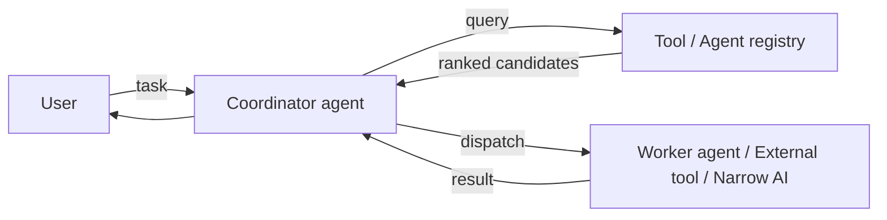

# Tool/Agent Registry

**Also known as:** Capability Catalogue, Agent Marketplace, Tool and Agent Directory

**Category:** Tool Use & Environment  
**Status in practice:** emerging

## Intent

Maintain a single queryable catalogue of both available tools and available agents, with metadata (capability, cost, latency, quality) the agent can use to pick the right one for a task.

## Context

An agent (or coordinator) must compose work across many tools and many specialist agents, all of which evolve independently and may be supplied by third parties. Distinct from tool-discovery: tool-agent-registry adds agent entries alongside tools and selection metadata (cost, quality, capability) so the caller can rank candidates, not just list them.

## Problem

Hardcoding tool palettes or agent endpoints couples the agent to specific implementations; treating tools and agents as different registries leads to duplicate selection logic and inconsistent metadata.

## Forces

- Discoverability: tools and agents are diverse and hard to enumerate manually.
- Efficiency: selection must happen within the request's latency budget.
- Tool appropriateness: the right pick depends on capability, price, context window, and quality.
- Centralisation: a central registry is a vendor-lock-in and single-point-of-failure risk.

## Applicability

**Use when**

- Many tools and/or agents are available and selection is non-trivial.
- A central catalogue (internal or external marketplace) can be maintained.
- Selection metadata (cost, quality, context window) actually changes the pick.

**Do not use when**

- Tool palette is small and stable — hardcoding is simpler.
- Centralised registry adds unacceptable single-point-of-failure risk and a federated discovery surface fits better.

## Therefore

Therefore: publish tools and agents under one registry with uniform capability/cost/quality metadata, and have the agent query that registry at task time, so selection is data-driven and the underlying implementations can change without touching the agent.

## Solution

Provide a registry that exposes a queryable catalogue of (1) tools — typed inputs/outputs, cost, latency, allowed contexts — and (2) agents — capability descriptions, supported tasks, model and provider, price. The agent queries the registry per task, ranks candidates by suitability, and dispatches. The registry can be backed by a coordinator agent with a curated knowledge base, a blockchain smart contract, or extended into a marketplace; metadata stays small (descriptions and attributes), not full schemas, to keep the registry lightweight.

## Example scenario

A coordinator agent receives a task: "transcribe a customer call and summarise the action items". It queries the tool/agent registry, which returns three speech-to-text tools (ranked by per-minute cost and latency for English audio) and two summariser agents (ranked by quality on call-centre data). The coordinator picks the cheapest speech-to-text that meets latency and the highest-quality summariser, dispatches both, and assembles the result.

## Diagram

*A single registry catalogues both tools and agents with selection metadata.*

## Consequences

**Benefits**

- Discoverability: one place to find capabilities.
- Efficiency: ranking by attributes (price, performance, context window) saves time.
- Tool appropriateness: the right pick per task, not the same hardcoded set every time.
- Scalability: lightweight metadata scales to many entries.

**Liabilities**

- Centralisation: registry becomes a vendor lock-in and single point of failure.
- Overhead: maintaining accurate metadata costs effort.
- Trust: registry entries may misrepresent capability — selection must validate.

## What this pattern constrains

The agent cannot use off-registry tools or agents at runtime; selection is bound to the catalogue.

## Known uses

- **GPTStore** — *Deprecated*. Cited by Liu et al. (2025) §4.16 — catalogue for searching ChatGPT-based agents. GPTStore site (gptstore.ai) no longer resolves; the GPT Store marketplace lives on within ChatGPT itself.
- **TPTU (Ruan et al. 2023)** — *Available*. Incorporates a toolset to broaden the capabilities of AI agents.
- **VOYAGER (Wang et al. 2023c)** — *Available*. Stores action programs and incrementally builds a skill library for reusability.
- **OpenAgents (Xie et al. 2023)** — *Available*. Manages API invocation of plugins.

## Related patterns

- *specialises* → [tool-discovery](tool-discovery.md)
- *uses* → [mcp](mcp.md)
- *composes-with* → [inter-agent-communication](inter-agent-communication.md)
- *complements* → [skill-library](skill-library.md)
- *complements* → [mixture-of-experts-routing](mixture-of-experts-routing.md)
- *used-by* → [voting-based-cooperation](voting-based-cooperation.md)

## References

- (paper) Yue Liu, Sin Kit Lo, Qinghua Lu, Liming Zhu, Dehai Zhao, Xiwei Xu, Stefan Harrer, Jon Whittle, *Agent design pattern catalogue: A collection of architectural patterns for foundation model based agents* (2025) — https://doi.org/10.1016/j.jss.2024.112278

**Tags:** registry, tool-use, multi-agent, marketplace, liu-2025
