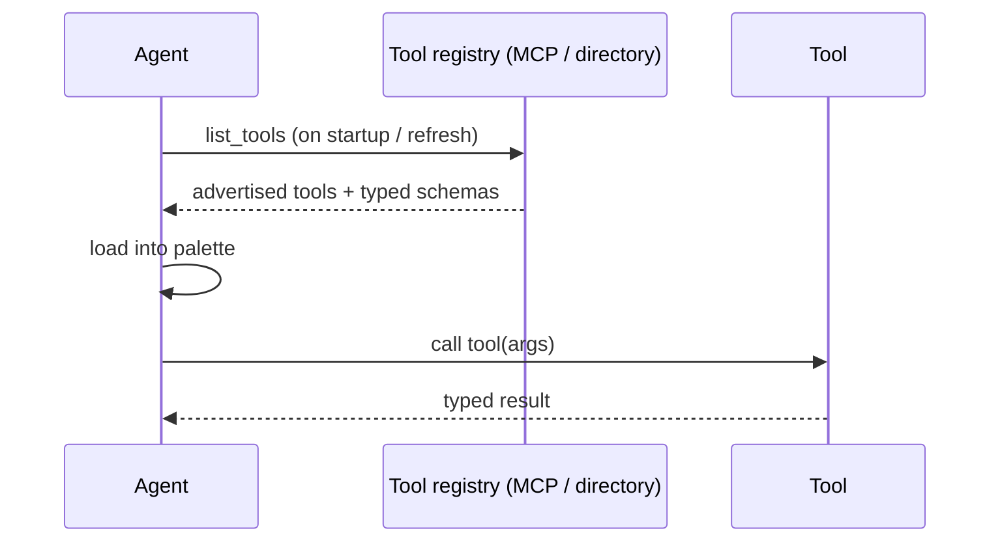

# Tool Discovery

**Also known as:** Capability Advertisement, Dynamic Tool Loading

**Category:** Tool Use & Environment  
**Status in practice:** emerging

## Intent

Let the agent discover available tools at runtime rather than hardcoding the tool list at agent build time.

## Context

Tool palettes evolve; new tools land without redeploying the agent. MCP and similar protocols make discovery feasible. Distinct from tool-agent-registry: tool-discovery is the general mechanism ("agent fetches its tool palette at runtime"); tool-agent-registry is a specialisation that also catalogues agents and exposes selection metadata (cost, quality, capability) for ranking.

## Problem

Hardcoded tool palettes force a redeploy for every new capability; dynamic environments need dynamic palettes.

## Forces

- Discovery latency adds to every cold start.
- Tool quality varies; not every advertised tool should be exposed.
- Versioning of advertised tools.

## Applicability

**Use when**

- Tool palettes evolve and redeploys per new capability are a drag.
- A registry (MCP server, internal directory) advertises tools with typed schemas.
- The agent can refresh its palette safely at runtime.

**Do not use when**

- The tool set is fixed and small enough to hardcode.
- Dynamic discovery introduces unacceptable latency or trust risk.
- No registry exists and building one is more cost than benefit.

## Therefore

Therefore: query a tool registry at startup (or on refresh) instead of hardcoding the palette, so that new tools become available without redeploying the agent.

## Solution

On startup (or periodically), the agent queries a tool registry (MCP server, internal directory). The registry returns advertised tools with typed schemas. The agent loads them into its palette. Optionally cached and refreshed.

## Example scenario

An agent's tool palette is hardcoded at build time and every new internal capability needs a redeploy of the agent. The team moves to runtime tool discovery: on startup the agent queries an internal MCP-style registry, loads advertised tools with typed schemas, and refreshes periodically. New capabilities ship by registering a tool, no agent redeploy, and the schema-typed advertisement protects against drift between agent and tool.

## Diagram

## Consequences

**Benefits**

- Capability expansion without agent redeploy.
- Multiple agents can share an evolving tool layer.

**Liabilities**

- Discovery failure modes (registry down).
- Trust: should the agent use any advertised tool?

## What this pattern constrains

The agent's tool palette at any moment is exactly the discovered set; off-registry tools are forbidden.

## Known uses

- **MCP server discovery** — *Available*
- **OpenAI plugin manifests (deprecated)** — *Available*

## Related patterns

- *uses* → [mcp](mcp.md)
- *specialises* → [tool-use](tool-use.md)
- *complements* → [awareness](awareness.md)
- *alternative-to* → [toolformer](toolformer.md)
- *complements* → [tool-loadout](tool-loadout.md)
- *generalises* → [app-exploration-phase](app-exploration-phase.md)
- *complements* → [wasm-skill-runtime](wasm-skill-runtime.md)

## References

- (doc) *Model Context Protocol Specification*, <https://modelcontextprotocol.io/specification>
- (paper) Yue Liu, Sin Kit Lo, Qinghua Lu, Liming Zhu, Dehai Zhao, Xiwei Xu, Stefan Harrer, Jon Whittle, *Agent design pattern catalogue: A collection of architectural patterns for foundation model based agents* (2025) — https://doi.org/10.1016/j.jss.2024.112278

**Tags:** discovery, tool-use, registry
