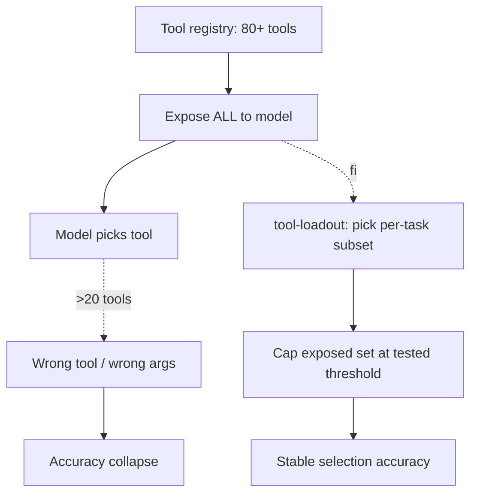

# Tool Explosion

**Also known as:** Bloated Tool Registry, 100-Tool Agent, Too Many Tools, Tool Registry Bloat, Function-Calling Accuracy Collapse

**Category:** Anti-Patterns  
**Status in practice:** deprecated

## Intent

Anti-pattern: expose every available tool in every request and watch function-calling accuracy collapse.

## Context

MCP and plugin ecosystems make hundreds of tools easy to register; teams expose them all.

## Problem

Past about 20 tools, model selection accuracy drops sharply; the agent picks wrong tools or invents wrong arguments.

## Forces

- Adding tools feels free; selecting subsets feels like extra engineering.
- Discovery is push-style; filter is pull-style.
- Frontier models tolerate larger palettes; the threshold drifts.

## Applicability

**Use when**

- Never use this; past about 20 tools, function-calling accuracy drops sharply.
- Use tool-loadout to select per-task subsets and cap exposed tools.
- Measure function-calling accuracy as a release gate.

**Do not use when**

- More than ~20 tools must be exposed and accuracy matters.
- Tool selection accuracy is on the release-gate dashboard.
- A tool-loadout or routing layer is available to filter per request.

## Therefore

Therefore: select a per-task tool subset via a loadout step, cap the exposed palette at a tested threshold around twenty, and gate releases on function-calling accuracy, so that the model is never asked to choose from a registry it cannot navigate reliably.

## Solution

Don't. Use tool-loadout to select per-task subsets. Cap exposed tools at a tested threshold. Measure function-calling accuracy as a release gate.

## Example scenario

A team exposes all 80 tools to the agent on every request, expecting the model to pick the right one. Function-calling accuracy collapses past 20 tools and the agent picks wrong tools or invents wrong arguments. They stop doing this and add a tool-loadout step that selects a small task-relevant subset per request, cap the exposed set at a tested threshold, and add function-calling accuracy as a release gate.

## Diagram

## Consequences

**Liabilities**

- Selection accuracy degradation.
- Token cost from large tool definitions in every prompt.
- Latency from prompt-caching cache-misses on tool changes.

## What this pattern constrains

By definition, this anti-pattern imposes no useful constraint; the missing constraint is the failure mode.

## Known uses

- **Common in early MCP integrations 2025** — *Available*

## Related patterns

- *conflicts-with* → [tool-loadout](tool-loadout.md)
- *complements* → [hero-agent](hero-agent.md) — Two flavours of the same problem: too much in one prompt.

## References

- (paper) Patil, Zhang, Wang, Gonzalez, *Gorilla: Large Language Model Connected with Massive APIs (Berkeley Function-Calling Leaderboard)*, 2023, <https://arxiv.org/abs/2305.15334>
- (blog) *Drew Breunig: How Long Contexts Fail / How to Fix Your Context*, 2025, <https://www.dbreunig.com>

**Tags:** anti-pattern, tool-use
