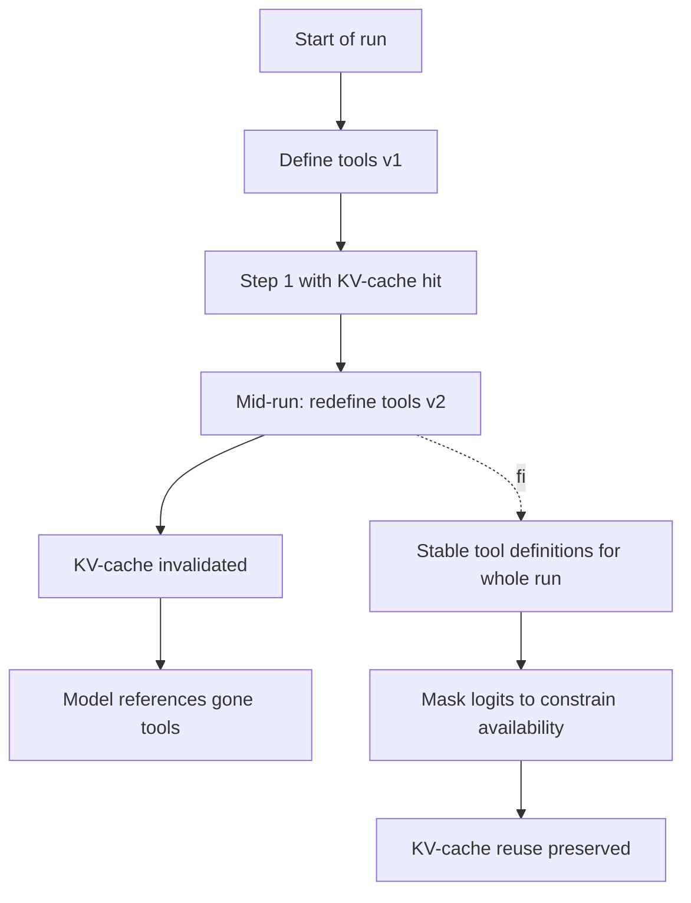

# Tool Loadout Hot-Swap

**Also known as:** Mid-Run Tool Set Mutation, Dynamic Tool Definitions Mid-Iteration, Reshuffling Tools During a Task

**Category:** Anti-Patterns  
**Status in practice:** deprecated

## Intent

Anti-pattern: add or remove tool definitions during a running task so the tool set the model sees changes from turn to turn.

## Context

A team is using an agent framework that grows or shrinks its tool palette dynamically during a run — exposing new MCP (Model Context Protocol) servers as the task moves into new territory, removing tools as conditions change, or swapping the registry between iterations of the loop. From the framework's perspective this looks like good hygiene against tool-explosion: only show the agent the tools it currently needs.

## Problem

Mutating tool definitions in the middle of a running task invalidates the prefix key-value cache for everything in the conversation that came after the change, because the model conditions on the original system message and tool list. The agent then becomes uncertain which tools it can still call: recent turns may reference tools that have just been removed, or tools the model has not yet been told about, leading to hallucinated calls and broken composition between steps. The cost of the cache invalidation also shows up as a latency spike on the very next turn. Hot-swapping the loadout mid-run trades a small inventory benefit for serious correctness and performance damage.

## Forces

- Tool palettes feel like they should grow with the task as new affordances become relevant.
- Removing tools mid-run looks like good hygiene against tool-explosion.
- Modern LLM serving relies on prefix KV-cache reuse; any change above the cursor invalidates it.
- The model conditions on the system message and earlier turns; redefining tools makes those conditioning tokens contradict the present state.

## Applicability

**Use when**

- Never. The combination of cache invalidation and contradicted conditioning is not worth the apparent flexibility.
- Pick the tool loadout at run start (tool-loadout) and keep it stable across the run.
- Constrain availability by masking logits during decoding, not by mutating the registry.

**Do not use when**

- Prefix KV-caching is in use — and in any serious deployment it is.
- The agent reasons in chains that reference earlier tool decisions.
- Observability requires a stable tool registry per run.

## Therefore

Therefore: keep the tool definitions stable across the run and constrain availability by masking token logits during decoding, so that KV-cache reuse is preserved and the model is never asked to reason against a moving tool registry.

## Solution

Don't mutate tool definitions mid-task. Define the tool palette once at the start of a run and keep it stable. To constrain what the model is allowed to call in a given state, mask the corresponding tool-name token logits during decoding (or use response prefill) instead of removing the tool. See tool-loadout (pick the subset at run start, not mid-run), tool-search-lazy-loading (discover tools without redefining the registry), prompt-caching (KV-cache reuse depends on stable prefixes).

## Example scenario

A research agent dynamically attaches MCP servers as new domains become relevant during a long-running task. Each attachment redefines the tool list mid-run; KV-cache hit rate drops to near zero and per-step latency triples. Worse, the agent occasionally tries to call a tool that was just unmounted, because earlier turns referenced it. The team switches to a stable loadout for the whole run plus logit masking to constrain which tools are callable in a given state. KV-cache reuse returns and the contradictory tool references disappear.

## Diagram

## Consequences

**Liabilities**

- KV-cache is invalidated for all subsequent actions and observations, raising latency and cost.
- The model may emit calls to tools that have just been removed or that did not exist at earlier turns.
- Conditioning tokens from earlier turns now contradict the present tool registry.
- Debugging traces is harder because the apparent tool set changes within a single run.

## What this pattern constrains

By definition, this anti-pattern imposes no useful constraint; the missing rule — tool definitions must not change mid-run — is itself the failure mode.

## Known uses

- **Manus (named as a deliberate design rejection)** — Manus's context engineering essay states explicitly that dynamic mid-iteration tool additions or removals invalidate KV-cache and confuse the model; Manus uses logit masking via response prefill instead. *Available* — [link](https://manus.im/blog/Context-Engineering-for-AI-Agents-Lessons-from-Building-Manus)

## Related patterns

- *alternative-to* → [tool-loadout](tool-loadout.md)
- *alternative-to* → [tool-search-lazy-loading](tool-search-lazy-loading.md)
- *complements* → [prompt-caching](prompt-caching.md)
- *complements* → [tool-explosion](tool-explosion.md)

## References

- *blog*: [Context Engineering for AI Agents — Lessons from Building Manus](https://manus.im/blog/Context-Engineering-for-AI-Agents-Lessons-from-Building-Manus) — Yichao "Peak" Ji, 2025

**Tags:** anti-pattern, tool-use, kv-cache, manus
