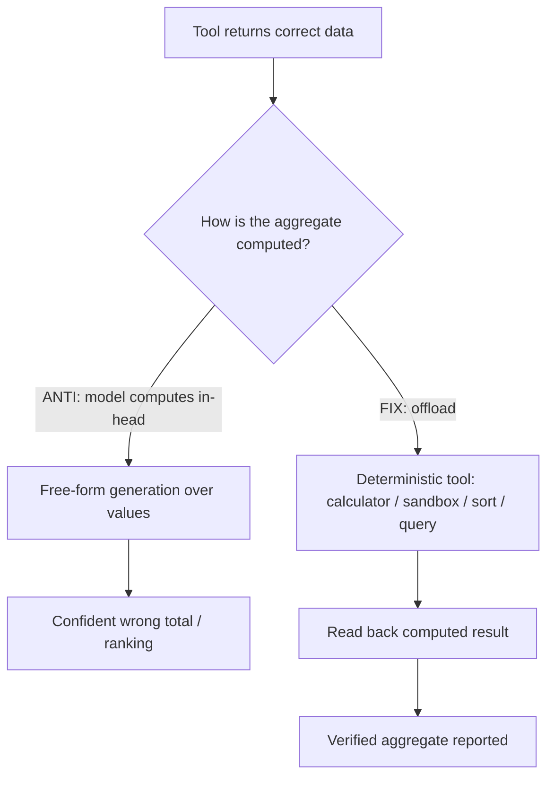

# Tool-Output Arithmetic Trust

**Also known as:** Tool Output Processing Failure, In-Head Aggregation Over Tool Data

**Category:** Anti-Patterns  
**Status in practice:** deprecated

## Intent

Anti-pattern: the agent compares, ranks, or sums correctly returned tool data in its own head instead of offloading the computation to a deterministic tool, emitting confident wrong aggregates.

## Context

An agent gathers data through tools — search hits with scores, rows of prices, durations, line items, or counts — and then has to combine those values to answer the user. The tool returns the data correctly; the remaining work is ordinary computation over it, such as finding the cheapest option, ranking results, summing a column, or comparing two totals. Because the data is already in the context window, treating the next step as more free-form text feels natural to the model.

## Problem

Token-by-token generation is not arithmetic. When the model performs comparison, ranking, or addition over tool data inside its own reasoning rather than in a deterministic step, it produces answers that read as authoritative but are numerically wrong: a mis-sorted ranking, a total that is off, a wrong cheapest pick. The data was right and the tool was right, so nothing in the trace flags the error, and the confident wrong aggregate flows straight to the user or into the next decision.

## Forces

- The tool already returned the values into context, so re-using a separate compute step feels redundant even though free-form generation is unreliable at exact arithmetic.
- Small inputs (a handful of rows) look easy enough to do in-head, but error rate rises silently with the number of items and the depth of the comparison.
- A wrong aggregate is indistinguishable in tone from a right one; there is no refusal or error to catch it, so the failure is silent.
- Forcing every comparison through a deterministic tool adds a call and a round-trip the agent would rather skip.

## Therefore

Therefore: avoid it by treating comparison, ranking, and arithmetic over tool data as computation to be offloaded to a deterministic tool, never as text the model generates from the values in its window.

## Solution

The corrected stance is to route every aggregate over tool data through a deterministic step rather than the model's free-form output. After a tool returns rows, the agent passes them to a calculator, a code-execution sandbox, a sort or filter primitive, or a query, and reads back the computed result; the model's job is to choose what to compute and how to phrase the answer, not to be the adder or the comparator. Where a single deterministic step is impractical, the aggregate is at least recomputed and cross-checked before it is reported, so a numeric claim never rests solely on token generation.

## Structure

```
Tool returns data --> [ANTI: model computes aggregate in-head] --> confident wrong total
             \--> [FIX: deterministic tool computes aggregate] --> read-back verified result
```

## Diagram



*The tool returns the data correctly; the failure is computing the aggregate in-head instead of offloading it to a deterministic step and reading the result back.*

## Example scenario

A travel agent calls a flights tool that correctly returns five fares. Asked for the cheapest, the agent eyeballs the list in its reasoning and confidently names a flight that is not actually the lowest fare. The tool was right and the data was right, so nothing flags the mistake, and the user books a pricier flight than they were told was cheapest.

## Consequences

**Liabilities**

- Confident wrong aggregates — a mis-ranked list, an off-by-some total, or a wrong cheapest pick — reach the user with no warning.
- The error is invisible in the trace because both the tool call and its returned data are correct; only the in-head step is wrong.
- Downstream steps that branch on the bad aggregate compound the mistake into a wrong action.
- Error rate scales with the number of items and the comparison depth, so the failure surfaces exactly on the larger inputs that matter most.

## Failure modes

- Silent miscount — the model sums or tallies a column of tool values and reports a total that is simply wrong.
- Mis-ranking — the model orders results by a returned score or price and gets the order wrong, recommending a worse option as the best.
- Wrong comparison — the model judges which of two tool-returned totals is larger and picks the wrong one, then acts on it.
- Over-trust on scale — small inputs happen to come out right, masking the failure until a larger input set produces a confident error.

## What this pattern constrains

Avoiding it forbids the agent from computing aggregates over tool data itself: comparison, ranking, and arithmetic must be offloaded to a deterministic tool, and a numeric claim is never reported until it has been read back from that computation.

## Applicability

**Use when**

- Watch for this when an agent answers with totals, rankings, or comparisons derived from tool data but no deterministic compute step appears in the trace.
- Watch for it when answers are correct on small inputs but degrade on larger result sets.
- Watch for it when a numeric recommendation drives a downstream action and there is no read-back of the computed value.

**Do not use when**

- The agent already offloads every aggregate to a calculator, code sandbox, sort, or query and reads the result back — the anti-pattern does not apply.
- The answer is purely qualitative with no comparison, ranking, or arithmetic over the returned values.

## Components

- Tool layer — returns the raw data (scores, prices, counts, durations) that the aggregate is computed over
- Aggregation step — where comparison, ranking, or arithmetic happens; the anti-pattern lets the model do this in free-form generation
- Deterministic compute tool — the calculator, code sandbox, sort/filter primitive, or query that should perform the aggregate instead of the model
- Read-back check — re-reads the computed value so a numeric claim never rests on token generation alone
- Reporting step — phrases the answer; in the corrected form it states only values produced by the deterministic step

## Tools

- Code-execution sandbox — runs the comparison or arithmetic deterministically and returns the exact result
- Calculator / math tool — offloads sums, totals, and numeric comparison out of the model's free-form output
- Sort, filter, and query primitives — produce rankings and selections (cheapest, top-k) deterministically over the returned rows

## Evaluation metrics

- Aggregate accuracy — fraction of reported totals, rankings, and comparisons that match a ground-truth deterministic computation
- Offload rate — fraction of aggregates over tool data that are routed through a deterministic step rather than generated in-head
- Accuracy-vs-input-size curve — whether aggregate accuracy degrades as the number of items or comparison depth grows
- Silent-error rate — fraction of wrong aggregates that reach the user with no flag, refusal, or read-back

## Known uses

- **[Aegis (agent-environment failure taxonomy)](https://arxiv.org/abs/2508.19504)** _pure-future_ — Names Tool Output Processing Failure — the agent makes computational errors such as comparisons and ranking when processing correctly-returned tool outputs — as a high-frequency failure class in its annotated data.
- **Code-execution / tool-calculator offloading** _available_ — Production agent stacks mitigate the failure by routing arithmetic and comparison through a code sandbox or calculator tool rather than the model's free-form output.

## Related patterns

- _alternative-to_ **Code Execution** — Code Execution is the corrected counterpart: it runs the computation in a sandbox and treats the run as the answer, which is exactly the offload this anti-pattern omits.
- _alternative-to_ **MRKL Systems (Modular Neuro-Symbolic)** — MRKL routes computation to a symbolic expert (a calculator) instead of asking one model to do the math; this anti-pattern is what happens when that routing is skipped for aggregates over tool data.
- _complements_ **Tool Output Trusted Verbatim** — Inverse failure on the same boundary: trusted-verbatim is about over-trusting the tool's content and safety, while this is the agent mis-computing over content the tool returned correctly.
- _complements_ **Premature Closure** — Both are confidence-without-checking failures; premature closure skips constraints during answer generation, this skips deterministic computation over already-correct data.
- _complements_ **False Confidence Syndrome** — The wrong aggregate is reported in the same authoritative tone as a correct one, which is the false-confidence surface that hides this failure from review.

## References

- [Aegis: Taxonomy and Optimizations for Overcoming Agent-Environment Failures in LLM Agents](https://arxiv.org/abs/2508.19504) — 2025
