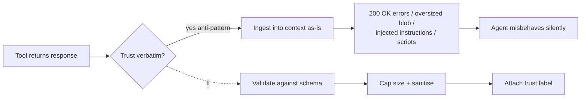

# Tool Output Trusted Verbatim

**Also known as:** Untyped Tool Returns, No Tool Output Validation

**Category:** Anti-Patterns  
**Status in practice:** deprecated

## Intent

Anti-pattern: trust whatever tools return without validation, schema enforcement, or trust labels.

## Context

Agents accept tool output as ground truth; assume the tool is honest, returns valid JSON, and stays within content limits.

## Problem

Real tools return errors as 200 OK with `{error: ...}`, multi-MB responses that blow context, HTML with embedded scripts, or text with embedded prompt-injection payloads.

## Forces

- Validation feels like duplicate work when typed function calls exist.
- Schema enforcement requires per-tool work.
- Size limits are tool-specific.

## Applicability

**Use when**

- Never use this; real tools return errors as 200 OK, oversized bodies, scripts, or prompt-injection payloads.
- Validate every tool result against a schema and cap response size.
- Apply tool-output-poisoning defenses and structured-output downstream.

**Do not use when**

- Tools are untrusted and content can include adversarial payloads.
- Downstream code assumes valid JSON or bounded sizes.
- Schema validation, size caps, or sanitisation are available.

## Solution

Don't. Validate every tool result against a schema. Cap response size. Sanitise HTML. Apply tool-output-poisoning defenses. See tool-output-poisoning, structured-output, input-output-guardrails.

## Example scenario

A team's agent treats every tool response as trusted gospel, with schema validation off, size cap off, no trust labels. Real tools then do what real tools do: a 200 OK with `{error: 'rate limit'}`, a 12MB HTML blob with embedded scripts, a JSON field whose 'description' contains a prompt-injection payload. The agent ingests it all and misbehaves. They stop doing this and validate, cap, sanitise, and apply tool-output-poisoning defenses at the boundary.

## Diagram

## Consequences

**Liabilities**

- Silent corruption of agent context.
- Indirect prompt injection succeeds.
- Context overflow from oversized responses.

## What this pattern constrains

By definition, this anti-pattern imposes no useful constraint; the missing validation is the failure.

## Known uses

- **Common in pre-2025 MCP integrations** — *Available*

## Related patterns

- *alternative-to* → [tool-output-poisoning](tool-output-poisoning.md)
- *alternative-to* → [structured-output](structured-output.md)
- *alternative-to* → [input-output-guardrails](input-output-guardrails.md)

**Tags:** anti-pattern, tool-trust
