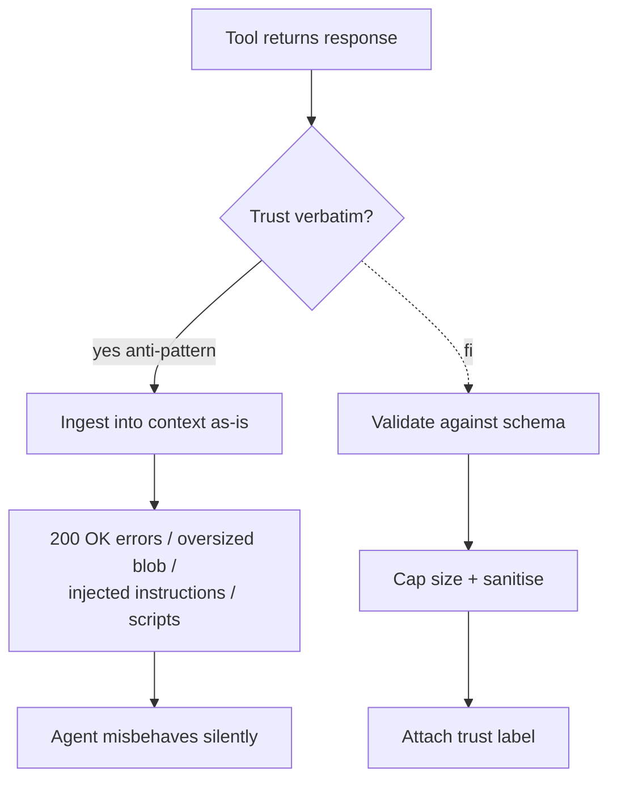

# Tool Output Trusted Verbatim

**Also known as:** Untyped Tool Returns, No Tool Output Validation

**Category:** Anti-Patterns  
**Status in practice:** deprecated

## Intent

Anti-pattern: trust whatever tools return without validation, schema enforcement, or trust labels.

## Context

A team is building an agent that calls tools and then feeds their output back into the model as if it were a fact. The implementation accepts whatever the tool returns at face value: no schema validation, no size limit, no trust labelling, no escape pass over instruction-shaped content. The implicit assumption is that the tool is honest, returns well-formed JSON, and stays within content limits.

## Problem

Real-world tools do not behave that way. They return errors as HTTP 200 OK with a JSON body of {"error": ...} that the agent confuses for a successful result. They return multi-megabyte responses that blow the context window. They return HTML with embedded scripts, or text with embedded prompt-injection payloads instructing the agent to ignore its previous instructions. By trusting every byte of tool output verbatim, the agent loses control over both its context budget and its safety boundary, and a misbehaving or hijacked tool can quietly redirect the agent.

## Forces

- Validation feels like duplicate work when typed function calls exist.
- Schema enforcement requires per-tool work.
- Size limits are tool-specific.

## Applicability

**Use when**

- Cite this entry when tool results flow into context with no validation layer.
- You are already here if an error page, oversized body, or injected instruction from a tool has steered the agent.
- Validate against a schema, cap response size, sanitise markup, and apply tool-output-poisoning defenses.

**Do not use when**

- Tools are untrusted and content can include adversarial payloads.
- Downstream code assumes valid JSON or bounded sizes.
- Schema validation, size caps, or sanitisation are available.

## Therefore

Therefore: at the tool boundary, validate every result against a schema, cap response size, sanitise embedded HTML, and attach a trust label before ingestion, so that 200-OK errors, oversized blobs, and injected instructions cannot silently poison the agent's context.

## Solution

Don't. Validate every tool result against a schema. Cap response size. Sanitise HTML. Apply tool-output-poisoning defenses. See tool-output-poisoning, structured-output, input-output-guardrails.

## Example scenario

A team's agent treats every tool response as trusted gospel, with schema validation off, size cap off, no trust labels. Real tools then do what real tools do: a 200 OK with `{error: 'rate limit'}`, a 12MB HTML blob with embedded scripts, a JSON field whose 'description' contains a prompt-injection payload. The agent ingests it all and misbehaves. They stop doing this and validate, cap, sanitise, and apply tool-output-poisoning defenses at the boundary.

## Diagram

## Consequences

**Liabilities**

- Silent corruption of agent context.
- Indirect prompt injection succeeds.
- Context overflow from oversized responses.

## What this pattern constrains

Avoiding it imposes a trust boundary at every tool return: results must not flow into context unvalidated; each one is schema-checked, size-capped, sanitised, and labeled with its trust level before the model reads it.

## Known uses

- **[GitHub MCP server (Invariant Labs disclosure, 2025)](https://invariantlabs.ai/blog/mcp-github-vulnerability)** — *Available* — Public disclosure of a prompt-injection chain where agents trusted issue text fetched through the GitHub MCP server verbatim, enabling exfiltration of private repository data.

## Related patterns

- *alternative-to* → [tool-output-poisoning](tool-output-poisoning.md)
- *alternative-to* → [structured-output](structured-output.md)
- *alternative-to* → [input-output-guardrails](input-output-guardrails.md)

**Tags:** anti-pattern, tool-trust
