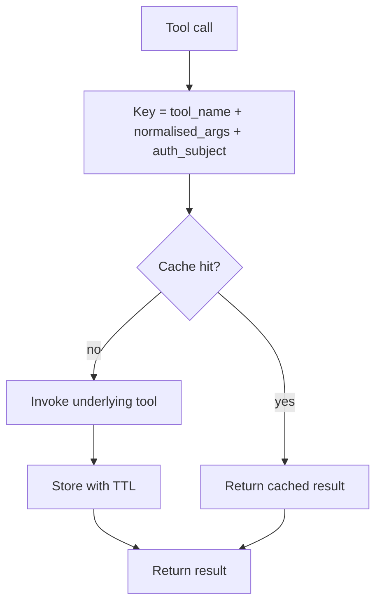

# Tool Result Caching

**Also known as:** Memoised Tools, Idempotent Cache

**Category:** Tool Use & Environment  
**Status in practice:** mature

## Intent

Cache the result of expensive deterministic tool calls keyed by their arguments so repeat calls within a session return immediately.

## Context

A team runs an agent that calls deterministic lookup or computation tools many times within a single task — fetching the same company profile from four sub-tasks, recomputing the same exchange rate, reading the same immutable document for several reasoning steps. The tools are paid (per-call cost), rate-limited, or simply slow, and the agent has no memory of having called them before.

## Problem

Repeat calls on identical arguments pay full latency and full per-call cost every time, even though the result has not changed and the tool author would gladly serve it from a cache. The agent's loop is structured one call at a time and has no awareness of caller history, so the same lookup gets re-fetched whenever a different reasoning step happens to need it. Caches written naively can leak results across users when caller identity is not part of the key.

## Forces

- Cache invalidation: when does the underlying data change?
- Per-user vs global caches differ on isolation guarantees.
- Cache hits hide tool latency the agent might benefit from learning about.

## Applicability

**Use when**

- Agents re-call the same tool with the same arguments multiple times within a task.
- Tools are deterministic enough to cache by normalised arguments.
- TTL and per-user vs global scoping can be defined per tool.

**Do not use when**

- Tool results are non-deterministic or time-sensitive (live state).
- Per-user scoping cannot be enforced and shared cache would leak data.
- Repeat-call rate is too low to recover the cache infrastructure cost.

## Therefore

Therefore: wrap deterministic tools in a cache keyed on (tool, normalised args, caller identity) with per-tool TTLs, so that repeat calls return instantly without leaking results across users.

## Solution

Wrap deterministic tools in a cache layered on `(tool_name, normalised_args)`. Set TTLs by tool type. On cache hit, return immediately without invoking the underlying tool. Per-user scoping for tools that read user data; global for read-only public data. Cache keys must include the auth subject (caller identity), not just args; args-only keys leak data when callers change.

## Example scenario

An agent that researches companies calls the same `get_company_profile(domain)` tool four times per session because different sub-tasks need it. Latency and per-call cost stack up. The team wraps deterministic tools in a cache keyed on `(tool_name, normalised_args)` with TTLs by tool type; per-user scoping keeps tenant-sensitive results from crossing accounts. Repeat calls return immediately, the underlying tool quota lasts longer, and session latency drops.

## Diagram

## Consequences

**Benefits**

- Latency drops on repeat calls.
- Cost reduction for paid APIs.

**Liabilities**

- Stale cache hits when underlying data changes.
- Non-deterministic tools cannot be cached safely.

## What this pattern constrains

Only tools declared deterministic may be cached; nondeterministic tools bypass the cache.

## Known uses

- **Most production agent platforms** — *Available*

## Related patterns

- *specialises* → [tool-use](tool-use.md)
- *complements* → [session-isolation](session-isolation.md)

**Tags:** cache, tool-use, performance
