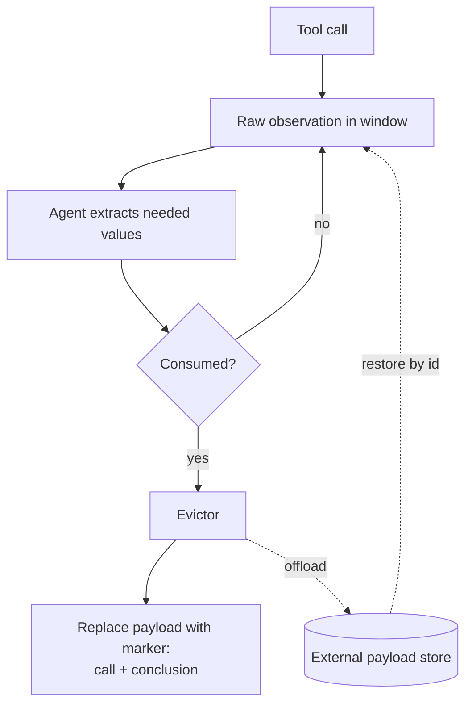

# Tool-Result Eviction

**Also known as:** Tool Clearing, Observation Pruning, Tool-Output Eviction

**Category:** Tool Use & Environment  
**Status in practice:** emerging

## Intent

Once a tool's raw output has been consumed, replace it in the live context window with a short marker of what was done, reclaiming tokens without losing that the call happened.

## Context

A tool-using agent calls search, file reads, API queries, or code execution, and each returns a bulky payload — a page of JSON, a file's full contents, a stack trace. The agent reads the payload, extracts what it needs, and acts. Turns later that raw payload is still sitting in the context window, consuming tokens and attention even though only its conclusion is still relevant.

## Problem

Raw tool outputs are the largest and most disposable thing in an agent's context. Keeping every observation verbatim crowds the window, raises cost, and buries the signal the agent actually reasoned over; but deleting a tool turn entirely loses the record that the call was made and what it concluded, which the agent may need to avoid repeating work or to justify its actions.

## Forces

- Raw observations dominate token usage but are mostly dead weight once consumed.
- Deleting an observation outright erases the trace that the call happened at all.
- What is 'consumed' is not always obvious — a result may be needed again later.
- Replacement markers must carry enough to prevent the agent re-issuing the same call.
- Eviction policy competes with caching: one discards, the other retains for replay.

## Therefore

Therefore: after an observation has been acted on, replace its raw payload in the window with a compact 'called X, got Y conclusion' marker, keeping the trace while dropping the bulk.

## Solution

Treat tool observations as evictable. When a tool result has been consumed — its needed values extracted into the agent's reasoning or into external memory — replace the raw payload in the working context with a short marker that records the call, its target, and the one-line conclusion ('read config.yaml: 3 services defined', 'searched docs: no rate-limit setting found'). Keep the marker so the agent does not re-issue the call; offload the full payload to external storage if it might be needed verbatim again. Apply eviction lazily (oldest-consumed first) or eagerly (immediately after extraction) depending on how tight the window is. Manus and the Chinese context-engineering literature describe this as tool clearing.

## Structure

```
Tool call -> raw observation in window -> agent extracts needed values -> (consumed) -> evictor replaces payload with marker; full payload optionally offloaded to external store.
```

## Diagram



*Consumed observations are swapped for compact markers; full payloads are offloaded and restored on demand.*

## Example scenario

A research agent runs ten web fetches, each returning a full page of markdown. After pulling the one figure it needs from each, the runtime replaces every fetched page in the window with a line like 'fetched acme.com/pricing: enterprise tier is $499/mo' and offloads the full pages to a blob store. The window stays lean across the next twenty reasoning steps, and when the agent later needs a page in full it restores it by call id instead of re-fetching.

## Consequences

**Benefits**

- Window pressure from bulky observations drops sharply.
- Cost and latency per call fall because dead payloads stop being re-sent.
- The trace of what was called and concluded survives in the marker.
- Signal-to-noise in the window improves, helping the model attend to what matters.

**Liabilities**

- Evicting a result still needed forces a redundant re-call.
- A marker that loses a key value can mislead later reasoning.
- Deciding when an observation is truly 'consumed' is error-prone.
- Without offload, an evicted payload needed verbatim later is gone.
- Eviction logic adds bookkeeping to the agent loop.

## What this pattern constrains

The agent must not retain raw tool payloads in the live window after they have been consumed; a consumed observation has to be replaced with a marker that preserves the call and its conclusion. Eviction must not delete the record that a call happened, only its bulky body.

## Applicability

**Use when**

- Tool observations are large relative to the context window.
- Most results are consumed once and not needed verbatim again.
- Window pressure or per-call cost is a binding constraint.
- You can write a faithful one-line marker for each consumed result.

**Do not use when**

- Tool outputs are small and the window is not under pressure.
- Results are frequently revisited verbatim and re-calling is costly or non-deterministic.
- Regulatory needs require the full observation to stay inline in the trace.
- You cannot reliably tell when a result has been consumed.

## Known uses

- **[Manus](https://manus.im/blog/Context-Engineering-for-AI-Agents-Lessons-from-Building-Manus)** — *Available* — Context-engineering writeup describes compressing or dropping observations once their information has been used, keeping a restorable reference rather than the full payload.
- **[上下文工程 (Chico's Tech Blog)](https://realtime-ai.chat/posts/context-engineering/)** — *Available* — Names tool clearing: remove a tool result from the window after it is used and replace it with a brief summary statement.

## Related patterns

- *complements* → [tool-result-caching](tool-result-caching.md) — Caching retains a result for replay across calls; eviction discards the consumed payload from the live window. The two trade off retention against window pressure.
- *complements* → [context-compaction](context-compaction.md) — Eviction removes a single consumed tool result; compaction folds a whole span of turns into a digest.
- *complements* → [context-window-packing](context-window-packing.md) — Packing decides what enters the window; eviction decides what leaves it once consumed.

## References

- (blog) Manus, *Context Engineering for AI Agents: Lessons from Building Manus*, 2025, <https://manus.im/blog/Context-Engineering-for-AI-Agents-Lessons-from-Building-Manus>
- (blog) Chico's Tech Blog, *上下文工程：2026 年比 prompt engineering 更重要的事*, 2026, <https://realtime-ai.chat/posts/context-engineering/>

**Tags:** tool-use, context-engineering, memory, token-budget, observations
