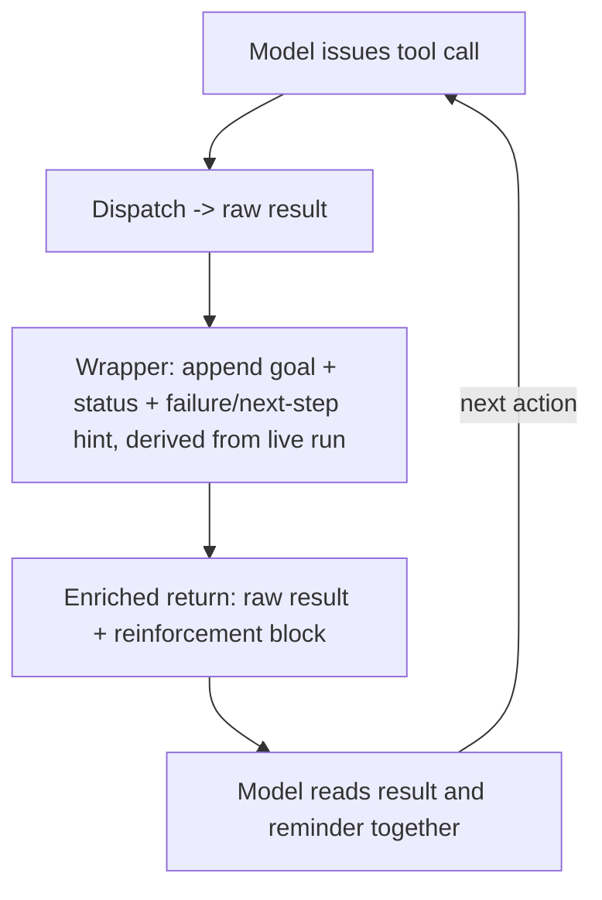

# Tool-Result Reinforcement

**Also known as:** Reinforcement (tool-return), Enriched Tool Return, Tool-Return Re-grounding

**Category:** Planning & Control Flow  
**Status in practice:** emerging

## Intent

Append a goal reminder, current task status, and failure or next-step hints to each tool return so the agent is re-grounded through the action channel it already reads.

## Context

An agent runs a long tool-call loop where most of the content the model reads back is the result of its own actions: a file dumped, a query answered, an HTTP body, an error trace. Across dozens of turns these raw returns dominate the active window while the standing goal, the place in the plan, and the lessons of earlier failures sit far up the history. The harness, however, owns the function that hands each tool result back to the model, so it can decide exactly what text that result carries.

## Problem

A tool return that carries only the raw result tells the model what happened but not why it was doing it or what to do next, and after a failed call it often returns just the raw error with no steer away from the dead end. Restating orientation only in the system prompt or an injected block leaves the goal competing with a wall of tool output the model is actively reading, and re-reading the whole history each turn is expensive. The orientation needs to ride the very channel the model attends to most: the tool result itself.

## Forces

- The tool return is the freshest, highest-attention text the model reads on an action turn, yet a raw result spends none of that attention on orientation.
- Padding every return with reminders, status, and hints costs tokens on each call, while a bare return costs a drifted plan or a repeated dead-end after a failure.
- A return that restates the whole plan reintroduces the bloat the loop was meant to avoid, while one too terse omits the next step the model needs.
- Reminders derived from live run state stay honest, whereas a static reminder copied onto every return goes stale as the task advances.

## Therefore

Therefore: have the harness wrap each tool result, raw output plus a compact reminder of the goal, the current task status, and a failure or next-step hint, so orientation arrives on the channel the model reads anyway.

## Solution

Route every tool result through a wrapper the harness controls before it reaches the model. The wrapper keeps the raw output and appends a small reinforcement block derived from the live run: the standing goal in one line, a one-line status of progress so far, and, on a failed call, a hint about what did not work and what to try next. On a successful call the block carries the goal and the immediate next step instead. The block is recomputed from the current run on each return rather than copied from the previous one, so it tracks progress, and it stays to a fixed small budget so it never swamps the result. Because the reminder rides the tool return, the model meets it at the exact point it is reasoning about what to do next, without a separate injection slot or a re-read of the history.

## Structure

```
Tool call --dispatch--> Raw result --wrap(goal + status + failure/next-step hint, derived from live run)--> Enriched return --> Model reads result + reminder together --> Next action
```

## Diagram



*The harness wraps each tool result, appending a freshly derived goal, status, and hint block so orientation rides the tool-return channel the model already reads.*

## Example scenario

An agent is asked to fix the failing tests across a service. Each test-runner call returns a long failure log; on its own that log tells the model what broke but not what it set out to do. With tool-result reinforcement, every run-tests return ends with a short block — goal: get the suite green; status: 6 of 9 files passing; last failure: import error in billing, try fixing the path before rerunning — so the agent keeps working the queue and stops re-running the same broken call.

## Consequences

**Benefits**

- Orientation reaches the model on the highest-attention text of an action turn, cutting goal drift without a separate injection block.
- A failure hint travels with the error, so the model is steered off a dead end on the same turn instead of retrying the same call.
- The reinforcement block is a few dozen tokens regardless of history length, so the orientation cost stays flat as the run grows.

**Liabilities**

- A reminder derived from a wrong reading of run state confidently misdirects the model, which trusts the text attached to its own result.
- Wrapping every return adds a small fixed cost to each tool call and lengthens the context the model must read.
- If the appended block crowds or visually merges with the raw output, the model may confuse the harness reminder for tool-produced content.

## Failure modes

- Stale reminder — the block is copied from a previous return instead of re-derived, so it reports a next step the agent already completed.
- Reminder swamps result — the reinforcement block grows until it crowds out the raw output the model actually needed from the call.
- Hint-as-data confusion — the appended steer is not clearly delimited from the tool output, and the model treats the harness reminder as a returned value.

## What this pattern constrains

The reinforcement block appended to a tool return may not alter or replace the raw result, and it must be re-derived from the live run on each return; a reminder carried over verbatim from a previous turn or one that overwrites the tool's actual output is a harness bug.

## Applicability

**Use when**

- Tasks run long enough that raw tool returns dominate the window and push the standing goal into the low-attention history.
- The harness owns the function that hands tool results back to the model and can wrap each return.
- Failed tool calls are common and the agent tends to retry the same dead end without a steer toward the next step.

**Do not use when**

- Tasks finish in a few turns, so the goal never drifts and per-return reminders are pure overhead.
- The tool-return channel is deliberately stripped of influence over the next action for injection safety, as in the action-selector pattern.
- Reliable run state cannot be derived, so an appended reminder would more often misdirect than orient the model.

## Components

- Tool-return wrapper — the harness function that intercepts each raw result before it reaches the model
- Reinforcement deriver — reads the live run and produces the goal line, status line, and failure or next-step hint for this return
- Reinforcement block — the compact, clearly-delimited text appended after the raw output, kept to a fixed small budget
- Run-state store — the source of truth the deriver reads, updated by each turn's tool calls and observations
- Result formatter — joins raw output and reinforcement block so the model can tell tool content from harness reminder

## Tools

- Tool-calling LLM — reads the enriched return and chooses the next action
- Tool-dispatch layer — executes the call and exposes the wrap point where the block is appended
- Run-state tracker — records progress and last failure so the block can be re-derived rather than copied

## Evaluation metrics

- Goal-drift rate — fraction of long runs where the agent abandons or misremembers the goal, with vs without the appended block
- Repeat-failure rate — how often the agent retries an identical failed call, compared to a no-hint baseline
- Reinforcement token overhead — average tokens the block adds per tool return against the orientation it buys
- Reminder fidelity — how often the appended goal and status agree with the true run state on audit

## Known uses

- **[Manus (as reported by ihower)](https://ihower.tw/blog/13513-agent-design-is-still-hard-2025)** _available_ — Practitioner write-up describes a 'reinforcement' move: after every tool call the agent returns more than the raw data — a goal reminder, task status, and a hint on failure — to keep the agent on track.

## Related patterns

- _complements_ **Standing State Injection** — Both restate goal, status, and next step from the live run; standing-state-injection injects the block as a system message ahead of reasoning, tool-result reinforcement appends it to the tool return the model reads on the action turn.
- _alternative-to_ **Action Selector Pattern** — Opposite direction on the tool-return channel: the action selector removes tool output from the decision context to block injection; tool-result reinforcement deliberately enriches the tool return to steer the agent, trusting the harness as the source of the appended text.
- _complements_ **Tool Output Trusted Verbatim** — Avoiding the anti-pattern puts a trust boundary at every tool return; tool-result reinforcement reuses that same wrap point to append harness-authored, clearly-delimited orientation rather than untrusted tool bytes.
- _complements_ **Now-Anchoring** — Both ride an existing channel with a freshly computed block; now-anchoring stamps the current time into the prompt, tool-result reinforcement stamps goal and status onto the tool return.

## References

- [AI Agent 產品開發仍然不簡單 (2025)](https://ihower.tw/blog/13513-agent-design-is-still-hard-2025) — ihower (Wen-Tien Chang), 2025
