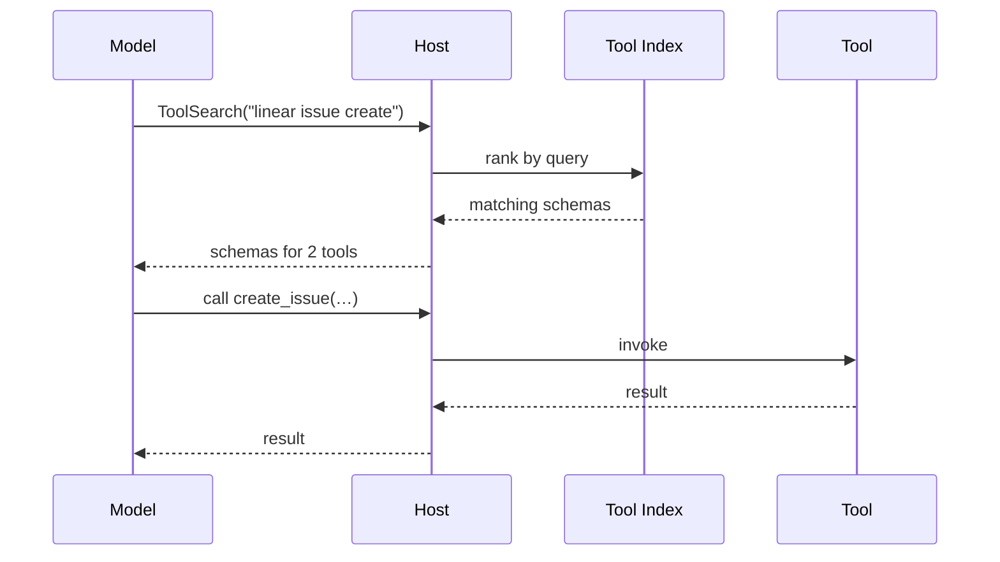

# Tool Search Lazy Loading

**Also known as:** Lazy Tool Loading, On-Demand Tool Schema Loading, ToolSearch Primitive

**Category:** Tool Use & Environment  
**Status in practice:** emerging

## Intent

Defer loading tool schemas into the context window until a search step shows they are needed.

## Context

Agents that connect to many tool servers (MCP, plugins, API gateways) where preloading every tool definition would consume a large fraction of the context window before any task has begun.

## Problem

Eagerly injecting all available tool definitions into the system prompt burns tokens that could be used for the task, slows every request, and forces the model to pick a relevant tool out of a long catalogue of irrelevant ones.

## Forces

- Tool definitions are large; a catalogue of 50+ tools can dominate the prompt budget.
- The model needs enough description to pick the right tool, but only when it is actually about to call one.
- Searching for tools at runtime adds an extra round trip before the first tool call.
- Hidden tools must still be discoverable — otherwise the model behaves as if they do not exist.

## Solution

Replace the eager tool list with a single search primitive (for example a ToolSearch tool) that returns matching tool schemas by query. The system prompt lists only the search primitive plus a short index of tool names or categories. When the model decides it needs a tool, it calls the search primitive, receives the full schema for the matching tools, and only then calls the tool by name. Schemas loaded by search are kept in context for the rest of the session so repeat use does not pay the lookup cost again.

## Diagram

## Example scenario

An assistant is wired to seven MCP servers exposing 60 tools combined. Preloading every schema costs roughly 30k tokens before the user has even spoken. Instead the host advertises only a ToolSearch tool plus a one-line index. When the user asks to file a Linear ticket, the model calls ToolSearch with the query "linear issue create", receives the schema for two relevant tools, and only then calls the real create-issue tool. The other 58 tools never enter the context.

## Consequences

**Benefits**

- Drastic reduction in baseline prompt tokens — only schemas that were searched for occupy context.
- Scales to hundreds of tools without saturating the prompt.
- Search results can rank by recent use, capability tags, or server-supplied hints.
- Tool surface becomes pluggable at runtime; servers can be added without re-templating the system prompt.

**Liabilities**

- Adds one extra tool call before the first real action when the right tool is not already loaded.
- Poor tool descriptions or weak search ranking can cause the model to overlook a relevant tool.
- Stateful — schemas loaded earlier in a session are visible later, which can leak across turns if not pruned.
- Harder to reason about deterministic behaviour because the effective tool surface depends on what was searched.

## What this pattern constrains

Tool schemas are not in context until the search primitive has returned them; the model may not call a tool whose schema has not yet been loaded by search or preloaded by the host.

## Applicability

**Use when**

- Total tool schemas would otherwise consume more than ~10% of the context window.
- Many tools are available but only a small subset is used per session.
- The host can intercept tool listing and intermediate a search step.

**Do not use when**

- The full tool palette is small enough that an eager list costs little.
- Every session needs the same handful of tools — a static loadout is simpler.
- The host cannot guarantee that the search primitive returns relevant tools (poor metadata, no ranking).

## Variants

- **Index-plus-search** — the system prompt lists tool names or category headers with one-line descriptions; the full schema is fetched on demand. Use when the model needs to know the menu but not the recipe.
- **Search-only** — only the search primitive is advertised; the model must form a query from the user's intent without seeing a tool list. Use when even an index is too long and search ranking is trustworthy.
- **Threshold-gated** — the host eagerly loads tools when the total schema budget is small and switches to search mode only when the budget exceeds a threshold. Use when sessions vary widely in attached tools.

## Known uses

- **Claude Code ToolSearch primitive** — *Available*. Deferred tool schemas are fetched via a select:/keyword query before the tool itself can be called.
- **MCP servers with large tool surfaces** — *Available*. Server-side search/index endpoints let clients pull schemas on demand instead of a single `list_tools` dump.

## Related patterns

- *alternative-to* → [tool-loadout](tool-loadout.md) — loadout selects a fixed subset up front; lazy search loads schemas during the run.
- *complements* → [tool-discovery](tool-discovery.md) — discovery finds that a tool exists; lazy loading defers its full schema until needed.
- *uses* → [mcp](mcp.md)
- *complements* → [context-window-packing](context-window-packing.md)

## References

- Anthropic Engineering, *Equipping agents for the real world with Agent Skills* (2025) — https://www.anthropic.com/engineering/equipping-agents-for-the-real-world-with-agent-skills
- *Model Context Protocol specification* — https://modelcontextprotocol.io/
- Thariq Shihipar on lazy MCP tool loading (2025) — https://x.com/trq212/status/2011523109871108570

**Tags:** mcp, context-window, tool-discovery, lazy-loading
