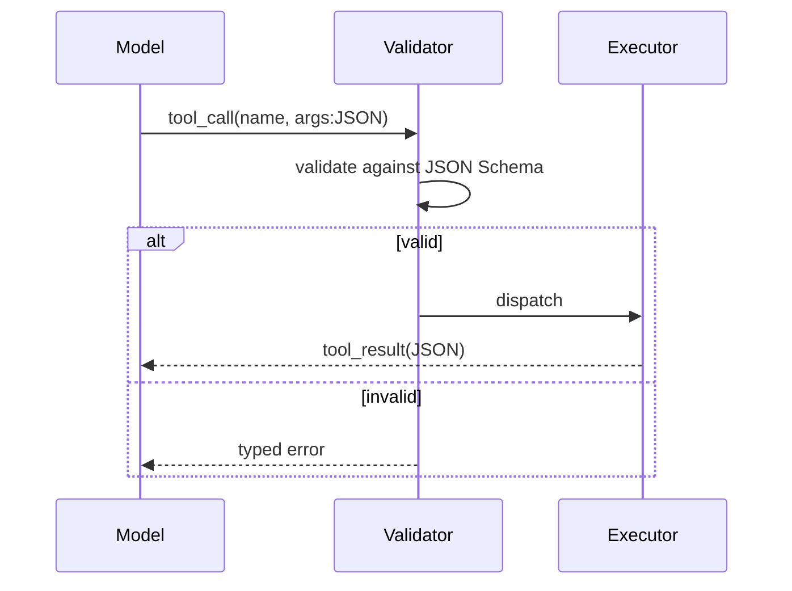

# Tool Use

**Also known as:** Function Calling, Tool Calling, Action Use

**Category:** Tool Use & Environment  
**Status in practice:** mature

## Intent

Let the LLM produce typed calls against an external toolkit instead of producing free-form text the surrounding system has to parse.

## Context

An agent must affect the outside world (read a record, edit state, render an artefact) and the model alone cannot do this safely or correctly.

## Problem

Free-form text is unparseable at the boundary; the model invents fields, mis-spells operations, or returns prose where the system needs structure.

## Forces

- The model is good at intent, weak at typed structure.
- The host system needs deterministic operations to act.
- Schema rigidity reduces the model's freedom; too much rigidity loses recall.

## Solution

Define a typed tool palette. The model emits tool calls conforming to a JSON Schema; the host validates and executes; results return as structured tool results. The agent becomes a thin client of a deterministic toolkit.

## Structure

```
Model -> tool_call(name, args:JSON) -> Validator -> Executor -> tool_result(JSON) -> Model.
```


## Applicability

**Use when**

- The model must affect external state or query authoritative systems.
- Operations are typed and a JSON Schema can describe them.
- Audit and validation need to live outside the model.

**Do not use when**

- The deliverable is free prose; structuring it as a tool call is overhead.
- The underlying API has no schema and cannot be wrapped cheaply.
- Calls are extremely high-frequency and per-call validation is the bottleneck.

## Example scenario

A customer-support agent receives 'cancel my order #4471.' Instead of writing free-form text the surrounding code has to parse, it emits a structured call: cancel_order({order_id: '4471'}). A validator checks the call against the API's schema; the executor runs it; the agent gets back {status: 'cancelled', refund_amount: 49.99}. The model never has to guess at field names or formatting.

## Diagram



## Consequences

**Benefits**

- Invalid calls are rejected at the schema layer rather than as runtime errors.
- The toolkit, not the model, is the locus of capability and audit.
- Tools can be tested and versioned independently of prompts.

**Liabilities**

- Tool palette design becomes the bottleneck; bad tools propagate to every call site.
- Models with weaker function-calling support drift; schema strictness must be tuned per model.

## What this pattern constrains

The model cannot affect state except through a registered tool with a typed signature.

## Known uses

- **ConvArch** — *Available*. Architecture-edit toolkit (add_node, connect, update_attribute) backed by JSON in PostgreSQL.
- **Bobbin (Stash2Go)** — *Available*. Per-screen api_tools and action_tools registered in a LangGraph ToolNode.
- **OpenAI Function Calling** — *Available*
- **Anthropic Tool Use** — *Available*
- **Claude Code** — *Available*
- **Cursor** — *Available*
- **Devin** — *Available*
- **Manus** — *Available*

## Related patterns

- *uses* → [structured-output](structured-output.md)
- *used-by* → [react](react.md)
- *specialises* → [mcp](mcp.md) — MCP standardises the tool protocol across vendors.
- *used-by* → [agentic-rag](agentic-rag.md)
- *used-by* → [memgpt-paging](memgpt-paging.md)
- *generalises* → [browser-agent](browser-agent.md)
- *alternative-to* → [hallucinated-tools](hallucinated-tools.md)
- *alternative-to* → [naive-rag-first](naive-rag-first.md)
- *generalises* → [code-execution](code-execution.md)
- *generalises* → [tool-result-caching](tool-result-caching.md)
- *alternative-to* → [schema-free-output](schema-free-output.md)
- *complements* → [awareness](awareness.md)
- *generalises* → [tool-discovery](tool-discovery.md)
- *generalises* → [toolformer](toolformer.md)
- *used-by* → [critic](critic.md)
- *used-by* → [parallel-tool-calls](parallel-tool-calls.md)
- *generalises* → [agent-computer-interface](agent-computer-interface.md)
- *alternative-to* → [code-as-action](code-as-action.md)
- *used-by* → [agent-as-tool-embedding](agent-as-tool-embedding.md)

## References

- (doc) *OpenAI: Function calling*, <https://platform.openai.com/docs/guides/function-calling>
- (doc) *Anthropic: Tool use*, <https://docs.anthropic.com/claude/docs/tool-use>

**Tags:** tool-use, function-calling, boundary
