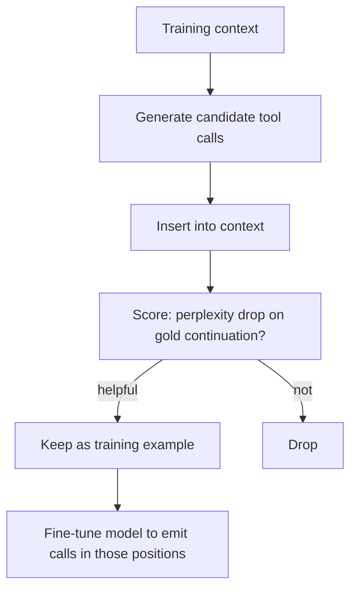

# Toolformer

**Also known as:** Self-Supervised Tool Learning

**Category:** Tool Use & Environment  
**Status in practice:** deprecated

## Intent

Train the model to learn when and how to call tools through self-supervised data, without human annotation.

## Context

A team is deploying tool use at scale and has noticed that prompt-based function-calling — telling the model in the system prompt what tools are available and hoping it calls them well — underperforms in production. They do not have a dataset of human-labelled tool-use traces showing when each tool should have been called and with what arguments, and creating one at scale is not affordable.

## Problem

Prompt-based tool calling is brittle: the model often forgets to call a tool when it should, calls the wrong one, or invents wrong arguments. The natural alternative — supervised fine-tuning on tool-use traces — requires costly human-labelled data the team does not have. They need a way to teach the model when and how to call tools using only self-supervised signals derived from outputs the model can already produce, so that the training data scales without human annotation.

## Forces

- Self-supervised data must distinguish helpful from unhelpful tool calls.
- The training-time tool surface diverges from runtime over time.
- Filtering noise dominates training cost.

## Applicability

**Use when**

- Tool use is deployed at scale and prompt-based function-calling underperforms.
- Human-labelled tool-use traces are unavailable.
- Self-supervised data can be generated by inserting candidate tool calls and scoring them.

**Do not use when**

- Prompt-based tool calling already meets accuracy targets.
- Fine-tuning capacity (compute, model access) is unavailable.
- The toolset is too small or unstable to justify fine-tuning.

## Therefore

Therefore: self-supervise tool-call placement by keeping only insertions that lower perplexity on the gold continuation, so that the model learns when and how to call tools without human-labelled data.

## Solution

Generate candidate tool calls during training. Insert each into a context. Score whether the resulting completion is improved (perplexity drop on the gold continuation). Keep helpful insertions as training data. Fine-tune the model to emit tool calls in those positions.

## Example scenario

A team wants their model to call a calculator and a search tool reliably without writing thousands of human-labelled tool-use traces. They use Toolformer-style self-supervision: at training time, candidate tool calls are inserted into many contexts and scored by whether the resulting completion's perplexity drops on the gold continuation; helpful insertions become training data. The fine-tuned model learns when and how to call tools without any human annotation.

## Diagram

## Consequences

**Benefits**

- No human-labelled tool-call data required.
- Model learns when not to call tools, not just when to.

**Liabilities**

- Training pipeline complexity.
- Tool surface drift between train and serve.
- Historical: superseded by RLHF-tuned tool-use in frontier models; not productionised at scale.

## What this pattern constrains

Tool use is bound to positions where self-supervised filtering judged the call helpful; ungrounded tool calls are not reinforced.

## Known uses

- **Toolformer paper baseline** — *Available*
- **Influences modern instruction-tuning of frontier models** — *Available*

## Related patterns

- *specialises* → [tool-use](tool-use.md)
- *complements* → [agent-skills](agent-skills.md)
- *alternative-to* → [tool-discovery](tool-discovery.md)

## References

- (paper) Schick, Dwivedi-Yu, Dessì, Raileanu, Lomeli, Zettlemoyer, Cancedda, Scialom, *Toolformer: Language Models Can Teach Themselves to Use Tools*, 2023, <https://arxiv.org/abs/2302.04761>

**Tags:** tool-use, self-supervised, training
