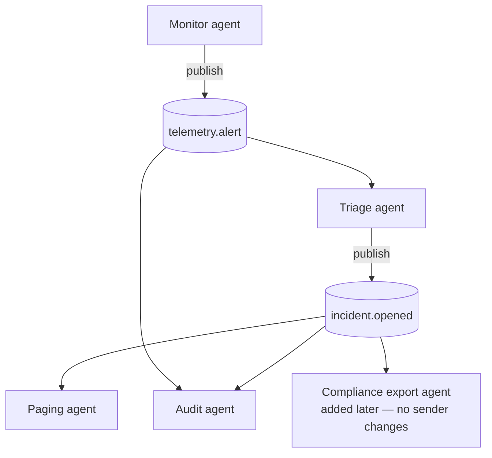

# Topic-Based Routing

**Also known as:** Agent Pub/Sub, Topic and Subscription, Subject-Based Routing

**Category:** Multi-Agent  
**Status in practice:** emerging

## Intent

Route inter-agent messages through named topics that agents subscribe to, instead of having senders address each other by id.

## Context

A team is building a multi-agent system in which a message produced by one agent is potentially of interest to several others, and the set of interested agents may change over time. The sender does not know — and should not need to know — exactly which agents will care about its message, and new subscribers should be able to join the system without forcing changes to anyone who is already publishing.

## Problem

Direct agent-to-agent addressing, where a sender names each receiver explicitly, creates a dense web of dependencies in which every sender carries knowledge about every receiver it might want to reach. Adding a new participant then requires editing every sender that should be able to reach it, and removing one leaves dangling references everywhere. The team needs a routing mechanism where senders publish to named topics and interested agents subscribe to those topics, so that sender and receiver are decoupled and the wiring can change without touching either end.

## Forces

- Decoupling sender from receiver is the central benefit of pub/sub.
- Topic semantics — wildcards, ordering guarantees, durability — change the failure modes substantially.
- Broadcast traffic on a busy topic can overwhelm slow subscribers without back-pressure.
- Debugging is harder when nobody owns the addressing decision.

## Applicability

**Use when**

- Sender should not know which agents care about a message.
- Subscribers join and leave over time without sender-side changes.
- Cross-cutting concerns (audit, observability) need to attach by adding a subscriber.

**Do not use when**

- The interaction is strictly point-to-point and decoupling is overkill (use handoff or direct send).
- Ordering and exactly-once semantics are required and the chosen bus does not provide them.
- Schema discipline is impossible in the team — pub/sub without schema control is a hard place to debug.

## Therefore

Therefore: route inter-agent messages through named topics with explicit subscriptions, so that senders do not know who reads them and new subscribers can join without sender-side changes.

## Solution

Define a small set of typed Topics (`telemetry.parsed`, `incident.opened`, `plan.proposed`). Agents publish to topics; agents that care subscribe to topics. The runtime fans messages out to all subscribers of a topic, applies back-pressure on slow consumers, and provides delivery guarantees appropriate to the topic class. Pair with actor-model-agents to keep each subscriber's processing isolated, and with event-driven-agent when the topic carries external events. Topic schemas are first-class artefacts; subscribers depend on the schema, not on the publisher.

## Example scenario

An incident-response platform has many agents. A monitor agent publishes to `telemetry.alert`; a triage agent subscribes to it and may publish to `incident.opened`; an audit agent subscribes to both topics; a paging agent subscribes only to `incident.opened`. Adding a new compliance-export agent that needs every incident is a one-line subscription on `incident.opened` — none of the existing publishers change. Topic schemas are versioned (`incident.opened.v1`) and subscribers declare which versions they accept.

## Diagram

## Consequences

**Benefits**

- Senders are decoupled from receivers; new subscribers join without sender changes.
- Cross-cutting workflows (logging, audit, monitoring) attach as additional subscribers.
- Scales to many participants where direct addressing would not.

**Liabilities**

- Diagnosing 'who is supposed to handle this topic?' requires runtime subscription introspection.
- Topic-schema drift can break subscribers silently.
- Slow subscribers need explicit back-pressure rules or they degrade the topic for everyone.

## What this pattern constrains

Senders do not address receivers by id; cross-agent messaging must go through named topics with explicit subscriptions, and topic schemas are not allowed to mutate without versioning.

## Known uses

- **AutoGen Core (Topic and Subscription)** — AutoGen Core exposes Topic and Subscription as core primitives, with documented example scenarios. *Available* — [link](https://microsoft.github.io/autogen/stable/user-guide/core-user-guide/core-concepts/topic-and-subscription.html)
- **NATS / Kafka as agent buses** — Production multi-agent deployments often run topics on a message broker for durability and scale. *Available* — [link](https://nats.io/)

## Related patterns

- *complements* → [actor-model-agents](actor-model-agents.md)
- *complements* → [event-driven-agent](event-driven-agent.md)
- *specialises* → [inter-agent-communication](inter-agent-communication.md)
- *alternative-to* → [blackboard](blackboard.md)
- *alternative-to* → [pipes-and-filters](pipes-and-filters.md)

## References

- *doc*: [AutoGen Core — Topic and Subscription](https://microsoft.github.io/autogen/stable/user-guide/core-user-guide/core-concepts/topic-and-subscription.html) — Microsoft

**Tags:** multi-agent, pub-sub, topic-routing, autogen
