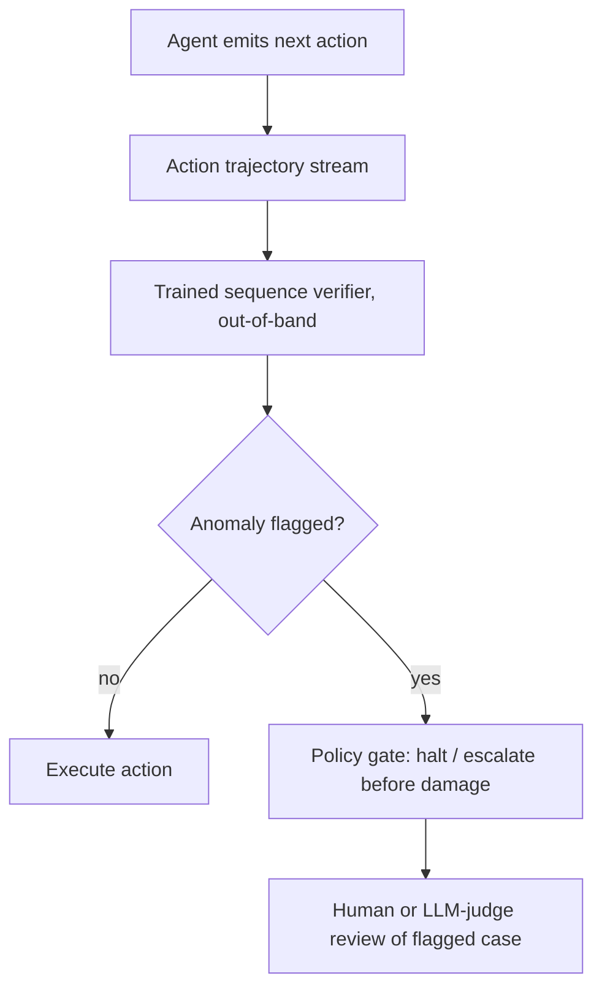

# Trajectory Anomaly Monitor

**Also known as:** Trajectory Guard, Sequence-Aware Action Monitor

**Category:** Safety & Control  
**Status in practice:** experimental

## Intent

Run a trained, non-LLM verifier out-of-band over the agent's action trajectory at runtime to flag task-misaligned plans and malformed step sequences at millisecond latency, before the actions cause damage.

## Context

An autonomous agent takes real actions in sequence — tool calls, plan steps, state changes — where a misaligned or malformed trajectory can cause damage. The team wants a runtime safety check on every step, but an LLM judge on each action is too slow and too expensive to sit in the hot path, and output-quality scoring after the fact arrives only once the action has already happened.

## Problem

Per-step oversight by an LLM judge adds latency and cost that production cannot absorb on every action, and scoring an agent's final output reveals nothing about a dangerous action mid-trajectory until it is too late. What is missing is a check that reads the whole action sequence as it unfolds — recognising that a plan has drifted off the task or that the step structure is malformed — and does so fast enough to intervene before the next action lands. Output-quality monitors are not sequence-aware, and loop-shape heuristics catch only repetition, not subtler misalignment.

## Forces

- Per-step LLM-judge oversight is the most flexible check but is far too slow and costly for the hot path.
- Output scoring is cheap but post-hoc, so it cannot stop a damaging action mid-trajectory.
- A trained sequence model is fast and sequence-aware but must be built, supervised, and maintained.
- The monitor must run out-of-band so it does not add the agent's own latency to every step.

## Applicability

**Use when**

- An agent takes consequential actions in sequence where a misaligned trajectory can cause damage.
- Per-step LLM-judge oversight is too slow or costly for the production hot path.
- Enough labelled trajectory data exists to train and maintain a verifier.

**Do not use when**

- Actions are low-stakes and reversible, so real-time gating is not warranted.
- There is no labelled trajectory data and none can be produced to train a verifier.
- An output-quality check after the fact is sufficient because nothing is irreversible mid-trajectory.

## Therefore

Therefore: train a lightweight non-LLM verifier over the agent's action sequence and run it out-of-band at runtime, so task-misaligned plans and malformed step sequences are flagged in milliseconds and can be gated before the next action lands.

## Solution

Train a dedicated verifier — a sequence model or a process-supervised classifier, not an LLM judge — on agent trajectories labelled for task alignment and structural validity. At runtime it consumes the agent's action sequence out-of-band and emits an anomaly signal at millisecond latency, fast enough to gate or pause the agent before the next action executes. Reported results put such a verifier at tens of milliseconds per check, well over an order of magnitude faster than an LLM-judge baseline, with process supervision over the trajectory outperforming output-only checks. Compose with a policy gate that halts or escalates on a flagged trajectory, and reserve LLM-judge review for the flagged cases rather than every step. Distinct from scoring final outputs and from loop-shape heuristics: the unit is the whole action sequence, and the timing is pre-damage.

## Diagram

## Example scenario

An agent with shell and database access executes multi-step tasks for users. Running an LLM judge on every action would triple latency, and scoring the final answer would only catch damage after it happened. The team trains a lightweight sequence model on labelled trajectories — good runs and known-bad ones — and runs it out-of-band on each step at tens of milliseconds. When a trajectory drifts toward an unrequested destructive command, the monitor flags it and a policy gate pauses the agent for human review before the command runs, at a fraction of the cost of judging every step with an LLM.

## Consequences

**Benefits**

- Real-time safety verification on every step without the latency or cost of an LLM judge in the hot path.
- Sequence-aware detection catches plan drift and malformed step structure that output scoring misses.
- Cheap enough to run always-on, so flagged trajectories can be gated before the next action.

**Liabilities**

- A trained verifier must be built, supervised with labelled trajectories, and maintained as the agent changes.
- It detects anomalies it was trained to recognise; novel misalignment outside the training distribution can slip through.
- A miscalibrated monitor either gates good trajectories (false positives) or misses bad ones (false negatives).

## What this pattern constrains

The agent may not advance to its next action while a flagged trajectory is unresolved; a step sequence the monitor judges task-misaligned or malformed is gated before execution rather than scored after the fact.

## Components

- Trajectory verifier — trained sequence model or process-supervised classifier over the action sequence
- Out-of-band runner — evaluates the trajectory without adding latency to the agent's own step
- Anomaly signal — the millisecond-latency flag for a task-misaligned or malformed sequence
- Policy gate — halts, pauses, or escalates the agent when a trajectory is flagged

## Tools

- Sequence model or classifier — the trained verifier itself
- Process-supervision labels — fine-grained trajectory annotations used to train it
- Action-trajectory stream — the runtime sequence of agent steps the monitor consumes

## Evaluation metrics

- Detection latency — per-check inference time, which must stay in the hot-path budget
- Anomaly precision and recall — flagged trajectories that were genuinely misaligned, and missed ones
- Pre-damage interception rate — share of dangerous trajectories gated before the action executed
- Speed-up vs LLM judge — latency and cost relative to per-step LLM-judge oversight

## Known uses

- **[Trajectory Guard](https://arxiv.org/abs/2601.00516)** — *Pure-future* — Lightweight sequence-aware model reporting tens-of-milliseconds inference, 17-27x faster than LLM-judge baselines, for real-time anomaly detection in agentic systems.
- **[TrajAD](https://arxiv.org/abs/2602.06443)** — *Pure-future* — Trajectory anomaly detector trained with fine-grained process supervision, outperforming output-only baselines.

## Related patterns

- *alternative-to* → [scorer-live-monitoring](scorer-live-monitoring.md)
- *alternative-to* → [llm-as-judge](llm-as-judge.md)
- *alternative-to* → [typed-tool-loop-detector](typed-tool-loop-detector.md)

## References

- (paper) *Trajectory Guard — A Lightweight, Sequence-Aware Model for Real-Time Anomaly Detection in Agentic AI* 2026,, <https://arxiv.org/abs/2601.00516>
- (paper) *TrajAD: Trajectory Anomaly Detection for Trustworthy LLM Agents* 2026,, <https://arxiv.org/abs/2602.06443>

**Tags:** safety, monitoring, trajectory, anomaly-detection, runtime-guard
