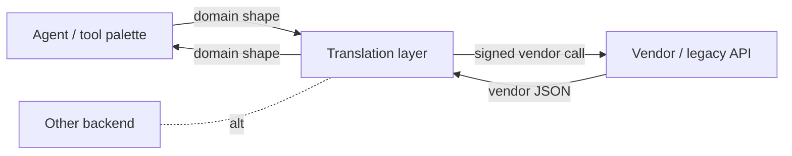

# Translation Layer

**Also known as:** Anti-Corruption Layer, Adapter Pattern (Agentic), API Façade

**Category:** Tool Use & Environment  
**Status in practice:** mature

## Intent

Insert a typed boundary between the agent's clean domain model and a messy or legacy external API.

## Context

The agent wants to reason in one shape (the domain it cares about); the data lives in another (vendor schemas, legacy APIs, third-party formats).

## Problem

Letting vendor shapes leak into the agent's context wastes tokens and ties the agent's reasoning to upstream churn.

## Forces

- The legacy shape is authoritative for storage but bad for reasoning.
- Translation must be reversible to write back without data loss.
- Round-tripping costs latency and complexity.

## Applicability

**Use when**

- The agent reasons in one shape (its domain) but data lives in another (vendor schemas).
- Vendor API churn would otherwise leak into the agent's context.
- A typed boundary can be maintained between the agent and upstream APIs.

**Do not use when**

- Only one vendor schema exists and aligns with the agent's needs already.
- The translation layer would add more complexity than it saves.
- Vendor shapes change so often that the translator becomes the bottleneck.

## Solution

A translation module sits between the agent's tool palette and the upstream API. Inbound: vendor JSON is mapped into the domain shape. Outbound: domain edits become signed vendor calls. The agent sees one consistent shape regardless of how many backends sit behind it.

## Example scenario

An agent integrates with a legacy ERP whose API returns 47-field nested objects with vendor-specific casing and undocumented enums. Letting these shapes leak into the agent's context wastes tokens and ties the agent's reasoning to upstream churn. The team puts a translation layer between the agent's tool palette and the ERP: inbound vendor JSON maps to a clean domain shape, outbound domain edits become signed vendor calls. The agent sees a small typed surface and the ERP can re-shape its API without breaking the agent.

## Diagram

## Consequences

**Benefits**

- Multiple backends can be swapped behind one tool surface.
- Domain evolution is decoupled from vendor schema changes.

**Liabilities**

- Mapping logic is its own maintenance burden.
- Lossy mappings silently degrade write fidelity if not flagged.

## What this pattern constrains

Tools see only the domain shape; the vendor shape never reaches the model.

## Known uses

- **Weft** — *Available*. WEFT JSON ↔ Ravelry OAuth-signed REST.

## Related patterns

- *complements* → [polymorphic-record](polymorphic-record.md)
- *composes-with* → [mcp](mcp.md)
- *complements* → [schema-extensibility](schema-extensibility.md)
- *complements* → [multilingual-voice-agent](multilingual-voice-agent.md)
- *alternative-to* → [code-switching-aware-agent](code-switching-aware-agent.md)

## References

- (book) Eric Evans, *Domain-Driven Design (Anti-Corruption Layer)*, 2003

**Tags:** translation, anti-corruption, ddd
