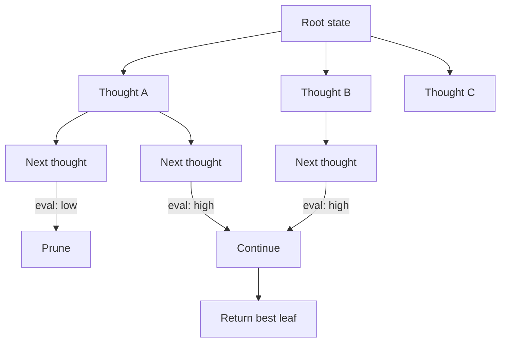

# Tree of Thoughts

**Also known as:** ToT, Deliberate Reasoning

**Category:** Reasoning  
**Status in practice:** emerging

## Intent

Search over a tree of partial reasoning states with explicit lookahead, evaluation, and backtracking.

## Context

A team is solving problems where it pays to consider several candidate next moves before committing to one: small puzzles such as Game of 24 or crosswords, short-horizon planning tasks, or creative writing where opening choices constrain everything that follows. They have already tried plain chain-of-thought and observed that once an early step is wrong, the rest of the chain compounds the mistake instead of recovering.

## Problem

Chain-of-thought produces a single linear reasoning trace and never reconsiders. If the first decision is wrong, the model has no machinery to back up, compare that decision against alternatives, or prune dead-end branches. It cannot weigh several candidate moves against each other at any node, which is exactly what is needed on tasks where the best opening is not obvious. The team needs explicit search vocabulary — lookahead, evaluation, backtracking — layered on top of reasoning so the model can recover from wrong commitments.

## Forces

- Search costs many model calls per problem.
- A value or heuristic function is needed to score partial states.
- Termination criteria are non-trivial.

## Applicability

**Use when**

- Problems benefit from exploring alternatives rather than committing to one chain (puzzles, planning, creative writing).
- Each thought step can be evaluated by the model or a programmatic check.
- Compute budget allows BFS, DFS, or beam search over thought nodes.

**Do not use when**

- Single-chain reasoning already reaches the answer reliably.
- Step evaluation is unreliable and search would explore noise.
- Latency or cost of search is unacceptable.

## Therefore

Therefore: search over a tree of partial reasoning states with evaluation and backtracking, so that dead-end branches are pruned rather than committed to.

## Solution

Decompose the problem into thought steps. At each node, sample several candidate next thoughts. Evaluate each (model self-evaluation or programmatic check). Apply BFS/DFS/beam to explore the tree. Backtrack from dead ends. Return the best leaf.

## Variants

- **BFS Tree of Thoughts** — Expand all nodes at depth d before moving to d+1; suits short, evaluable thought steps.
- **DFS Tree of Thoughts** — Go deep first and backtrack on dead ends; suits long horizons with cheap pruning.
- **Beam-search ToT** — Keep only the top-k highest-scoring partial paths at each depth; bounded cost.

## Example scenario

A puzzle-solving agent using chain-of-thought commits to its first reasoning trace; when an early step is wrong it cannot recover. The team rebuilds it as Tree of Thoughts: at each node the model samples several candidate next thoughts, evaluates each (model self-eval or programmatic check), and BFS or beam-explores the tree, backtracking from dead ends. Per-problem cost is higher but solve-rate on the harder puzzle class climbs because the agent can compare and unwind.

## Diagram

## Consequences

**Benefits**

- Higher accuracy on tasks where alternatives matter (Game of 24, crosswords, creative writing planning).
- Explicit search vocabulary (lookahead, prune, backtrack).

**Liabilities**

- 5-100x cost over CoT depending on branching factor and depth.
- Value function quality bounds search benefit.

## What this pattern constrains

The agent may only commit to a final answer after exploring at least one full path; search depth and branching are bounded by configuration.

## Known uses

- **ToT paper benchmarks (Game of 24, crosswords, creative writing)** — *Available*
- **LangChain ToT integration** — *Available*

## Related patterns

- *specialises* → [chain-of-thought](chain-of-thought.md)
- *specialises* → [graph-of-thoughts](graph-of-thoughts.md)
- *generalises* → [lats](lats.md)

## References

- (paper) Yao, Yu, Zhao, Shafran, Griffiths, Cao, Narasimhan, *Tree of Thoughts: Deliberate Problem Solving with Large Language Models*, 2023, <https://arxiv.org/abs/2305.10601>
- (paper) Yue Liu, Sin Kit Lo, Qinghua Lu, Liming Zhu, Dehai Zhao, Xiwei Xu, Stefan Harrer, Jon Whittle, *Agent design pattern catalogue: A collection of architectural patterns for foundation model based agents* (2025) — https://doi.org/10.1016/j.jss.2024.112278

**Tags:** reasoning, search, tree
