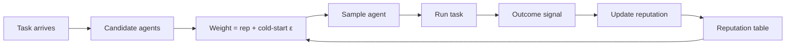

# Trust and Reputation Routing

**Also known as:** Reputation-Based Agent Selection, Trust-Weighted Routing

**Category:** Routing & Composition  
**Status in practice:** emerging

## Intent

Maintain a per-agent reputation score updated from outcome quality and peer feedback, and route new tasks preferentially to high-reputation agents.

## Context

A platform hosts many agents (third-party plug-ins, model variants, internal specialists). Tasks arrive that any of several agents could plausibly handle. The routing decision is currently 'pick the first capable' or 'round-robin' or 'pick by static rank'.

## Problem

Static routing wastes the platform's most valuable signal: track record. Agents that have historically produced good outcomes get the same allocation as agents that have repeatedly failed. New tasks are routed to the wrong agents because routing ignores past evidence. Without a reputation layer, the platform cannot learn from outcomes; bad agents stay in rotation and good agents are under-used.

## Forces

- Reputation must be updated from outcome signal (success rate, user rating, peer review).
- Reputation must be slow to gain and fast to lose, or attacker agents game it.
- Cold-start agents need exploration weight or they never get a chance.
- Reputation must be auditable to be legitimate.

## Applicability

**Use when**

- Multiple candidate agents per task with varying historical quality.
- Outcome signal is observable (deterministic, user rating, peer review).
- Cold-start exploration is tunable and acceptable.

**Do not use when**

- Each task has a single canonical agent — routing is trivial.
- Outcome signal is unreliable or game-able beyond rescue.
- Reputation entrenchment of legacy agents would crowd out genuine improvements.

## Therefore

Therefore: maintain a per-agent reputation score updated from outcome quality and route new tasks with weight proportional to reputation, so the platform learns from track record while reserving exploration weight for newcomers.

## Solution

For each agent maintain a reputation score updated after each task from outcome signals (deterministic success, user rating, peer review by another agent). Route new tasks by sampling weighted by reputation, with a small exploration term for newcomers (cold-start). Decay reputation over time so stale records don't dominate. Surface reputation scores in operator dashboards. Distinct from a router LLM (which picks once per request based on intent): reputation routing is statistical and longitudinal.

## Example scenario

A code-agent marketplace hosts 40 plug-in agents claiming various capabilities. After tasks complete, the user rates and a quality LLM-judge scores the result. Each agent's reputation updates. A new refactoring task is routed with weight proportional to reputation across the agents that claim refactoring capability; a small fraction goes to a newly-registered agent (cold-start exploration). Repeatedly-bad agents fade out of rotation without manual deprovisioning.

## Diagram

## Consequences

**Benefits**

- Platform learns from outcomes; bad agents naturally lose share.
- Operators have a vocabulary for 'this agent is trusted, this one isn't'.
- Composes with coalition formation (high-reputation agents preferred in coalitions).

**Liabilities**

- Reputation games — agents optimise for the reputation signal rather than task quality.
- Cold-start exploration must be carefully tuned; too little starves newcomers, too much wastes traffic.
- Reputation can entrench legacy agents and starve genuine improvements.

## What this pattern constrains

Candidate agents must not be treated as equally trustworthy after track records diverge; routing is weighted by reputation with an explicit cold-start exploration term.

## Known uses

- **eBay/Stack Overflow style reputation systems (canonical reference)** — *Available* — <https://en.wikipedia.org/wiki/Reputation_system>
- **Multiagent Systems (Weiss) — Trust and reputation chapter** — *Available* — <https://mitpress.mit.edu/9780262731317/multiagent-systems/>
- **Multi-agent platforms with per-agent quality scoring** — *Available*

## Related patterns

- *complements* → [routing](routing.md)
- *complements* → [coalition-formation](coalition-formation.md)
- *complements* → [contract-net-protocol](contract-net-protocol.md)
- *uses* → [agent-as-judge](agent-as-judge.md)
- *complements* → [shadow-canary](shadow-canary.md)
- *alternative-to* → [bayesian-bandit-experimentation](bayesian-bandit-experimentation.md)
- *complements* → [multi-principal-welfare-aggregation](multi-principal-welfare-aggregation.md)
- *complements* → [vickrey-auction-allocation](vickrey-auction-allocation.md)

## References

- (book) *Multiagent Systems, 2nd ed.*, Gerhard Weiss (ed.), 2013, <https://mitpress.mit.edu/9780262731317/multiagent-systems/>
- (doc) *Reputation system*, <https://en.wikipedia.org/wiki/Reputation_system>

**Tags:** routing, reputation, multi-agent
