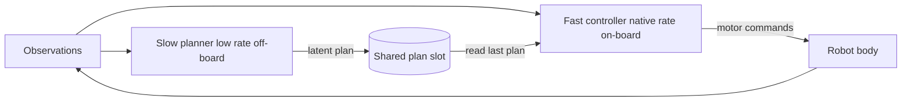

# Two-Rate Cloud-Brain / Edge-Controller Split

**Also known as:** Fast-Slow VLA Split, Two-Clock Brain-Controller, Asynchronous Dual-System Robot Policy

**Category:** Planning & Control Flow  
**Status in practice:** experimental

## Intent

Run a slow planner at low frequency that emits a compact latent plan, and a small on-device controller that tracks it at the robot's native control rate without ever blocking on the planner.

## Context

An embodied agent has to keep a physical body stable and on-task. The body needs new motor commands tens of times a second to stay balanced and to track a moving target, but the large model that understands the scene, follows the instruction, and chooses what to do next takes far longer than one control period to produce an output. The big model often runs off-board on a cloud or workstation accelerator, while only a small accelerator sits on the robot.

## Problem

A single model cannot be both the deliberate planner and the real-time motor loop. If the high-rate controller waits for each new plan from the slow planner, its effective rate collapses to the planner's inference speed and the body falls out of balance or overshoots its target. If the slow planner is forced to run fast enough for control, it must shrink until it can no longer reason about the scene or the instruction. The agent needs deliberation and real-time actuation at the same time on the same body.

## Forces

- Real-time stability needs a fixed high control rate; a missed deadline is a physical failure, not a slow response.
- Scene understanding and instruction following need a large model whose inference is far slower than one control period.
- On-board compute and power are limited, so the large model often runs off-board and reaches the body over a link with variable latency.
- The two parts must agree on what to do, yet they update on two different clocks.

## Therefore

Therefore: split the agent into a slow planner that emits a compact latent plan at low rate and a small on-device controller that decodes that plan into motor commands at the native control rate, and let the controller keep running on the last plan whenever a fresh one has not yet arrived.

## Solution

Separate the agent into two loops that run on two clocks and communicate through a small shared latent. The slow planner — a large model, often off-board — reads the instruction and recent observations and emits a compact latent plan or goal at low frequency, for example a few hertz. The fast controller — a small model on the robot — takes that latent plan plus the latest proprioception and sensor readings and produces motor commands at the native control rate, for example fifty to a hundred hertz. The fast loop never waits for the slow loop: it reads whichever latent plan is currently posted and keeps tracking it, and the slow loop overwrites that plan asynchronously whenever its next inference finishes. The interface between them is the latent plan, so the planner can be retrained or moved across the link without changing the controller's deadline.

## Structure

```
Slow planner (low rate, off-board) --latent plan--> shared slot <--read-- Fast controller (native control rate, on-board) --motor commands--> robot body --observations--> both loops
```

## Diagram



*The slow planner posts a latent plan asynchronously; the fast controller reads the last posted plan and closes the motor loop at the native control rate.*

## Example scenario

A humanoid robot is told to carry a tray across a moving crowd. A large planner on a nearby workstation looks at the scene a few times a second and posts a short latent goal such as 'step left, keep the tray level'. A small model on the robot reads that goal and the robot's balance sensors a hundred times a second and sends the leg and arm commands that keep it upright. When a person steps in and the next plan is late, the small model keeps tracking the last goal so the robot does not stumble.

## Consequences

**Benefits**

- Deliberation and real-time control coexist on one body without either starving the other.
- The control loop keeps a stable rate even when the planning link is slow or jittery.
- The large planner can run off-board on bigger accelerators while only a small controller sits on the robot.
- Planner and controller can be sized, trained, and updated independently across the latent interface.

**Liabilities**

- A stale latent plan can drive the body confidently in the wrong direction until the next plan arrives.
- Tuning the planner's rate against the controller's tracking horizon is delicate and task-specific.
- A link drop leaves the controller with no fresh plan, so it needs a safe fallback or hold behaviour.
- Debugging spans two clocks, which makes timing faults hard to reproduce.

## Failure modes

- Stale-plan drift — the controller tracks an out-of-date latent plan and the body acts on a scene that has already changed.
- Rate coupling — an implementation detail makes the fast loop block on the slow loop, so the control rate quietly collapses.
- Latent mismatch — the controller decodes a latent the retrained planner no longer means, and motor commands diverge.
- No-plan stall — the planning link drops and the controller has no defined hold or safe-stop behaviour.

## What this pattern constrains

The fast controller must close its loop at the native control rate and may not block waiting on the slow planner; it must act on the last posted latent plan, and when no fresh plan has arrived it must keep tracking the previous one or fall back to a safe hold rather than stall.

## Applicability

**Use when**

- An agent controls a physical body that needs motor commands at a fixed high rate to stay stable.
- The model that understands the scene and instruction is too slow to run inside one control period.
- The large model can run off-board while only a small controller fits on the device.
- A compact latent plan can carry intent from the slow loop to the fast loop.

**Do not use when**

- The task has no real-time actuation deadline, so a single model per turn is enough.
- One model is fast enough to both reason and act within the control period.
- No safe fallback exists for the controller when the planning link drops.
- The body's behaviour cannot be captured in a latent plan small enough to send at low rate.

## Components

- Slow planner — large model, often off-board, that reads instruction and observations and emits a latent plan at low rate
- Fast controller — small on-device model that decodes the latent plan into motor commands at the native control rate
- Shared plan slot — the single latent plan the fast loop reads and the slow loop overwrites asynchronously
- Latent plan interface — the compact intent representation that decouples the two clocks
- Fallback policy — the hold or safe-stop behaviour the controller runs when no fresh plan arrives

## Tools

- On-device accelerator — runs the small controller within each control period
- Off-board accelerator — runs the large planner for scene and instruction understanding
- Real-time control loop — schedules the controller at a fixed rate and enforces its deadline
- Low-latency link — carries latent plans from planner to controller and observations back

## Evaluation metrics

- Achieved control-loop frequency vs the target native rate — whether the fast loop holds its deadline
- Planner update rate vs control rate — how many control steps run per posted plan
- Stale-plan window — how long the controller drives on an out-of-date plan before refresh
- Task success and stability under planner-link latency and drops vs a synchronous baseline

## Known uses

- **[Fast-in-Slow (FiS-VLA)](https://arxiv.org/abs/2506.01953)** _pure-future_ — Dual-system vision-language-action model: System 2 reasons slowly while System 1 executes actions at a much higher control frequency on asynchronous clocks.
- **[Asynchronous Fast-Slow VLA (DuoCore-FS)](https://arxiv.org/abs/2512.20188)** _pure-future_ — Truly asynchronous fast-slow framework where the high-frequency action loop does not wait on the slow vision-language reasoning loop for whole-body manipulation.
- **[PhysiFlow](https://arxiv.org/abs/2603.05410)** _pure-future_ — Humanoid whole-body VLA using a multi-brain latent flow-matching split with robust high-frequency tracking on edge devices.
- **[Figure Helix](https://www.figure.ai/news/helix)** _available_ — System 2 is an onboard VLM running at 7-9 Hz that posts a latent vector to System 1, a reactive visuomotor policy that runs as a separate real-time process at 200 Hz and never blocks on S2 — exactly the slow-planner / fast-controller split.
- **[NVIDIA Isaac GR00T N1](https://nvidianews.nvidia.com/news/nvidia-isaac-gr00t-n1-open-humanoid-robot-foundation-model-simulation-frameworks)** _available_ — Open humanoid foundation model whose System 2 VLM reasons and plans while a fast System 1 diffusion policy (~10ms latency) decodes the plan into low-level actions at the high control rate.
- **[Gemini Robotics On-Device (backbone + decoder)](https://arxiv.org/abs/2503.20020)** _available_ — A VLA backbone (originally cloud-hosted, ~160ms) emits action chunks that an on-robot decoder unrolls with a rolling horizon to hide the slow leg behind a smooth 50 Hz control loop.

## Related patterns

- _alternative-to_ **Talker-Reasoner** — Talker-Reasoner splits a conversational agent so the chat turn never blocks on deliberation; this split is for an embodied body where the fast loop is a fixed-rate motor controller, not a dialogue turn.
- _alternative-to_ **Dual-System GUI Agent** — The GUI split routes by subproblem (planning vs pixel grounding) with no timing invariant; here the split is by clock rate and the fast loop must hold its control deadline.
- _complements_ **Hierarchical Agents** — Hierarchy decomposes tasks logically across levels; this split adds a frequency boundary so the lowest level runs on its own real-time clock.
- _complements_ **Local-to-Cloud Handoff** — Handoff promotes a session once from local to cloud; this split keeps a continuous off-board planner driving an on-board controller throughout the task.

## References

- [Fast-in-Slow: A Dual-System Foundation Model Unifying Fast Manipulation within Slow Reasoning](https://arxiv.org/abs/2506.01953) — 2025
- [Asynchronous Fast-Slow Vision-Language-Action Policies for Whole-Body Robotic Manipulation](https://arxiv.org/abs/2512.20188) — 2025
- [PhysiFlow: Physics-Aware Humanoid Whole-Body VLA via Multi-Brain Latent Flow Matching and Robust Tracking](https://arxiv.org/abs/2603.05410) — 2026
- [Foundation Models for Robotics: VLA](https://rohitbandaru.github.io/blog/Foundation-Models-for-Robotics-VLA/) — 2025
- [Gemini Robotics: Bringing AI into the Physical World](https://arxiv.org/abs/2503.20020) — Gemini Robotics Team, Google DeepMind, 2025
- [OpenHelix: A Short Survey, Empirical Analysis, and Open-Source Dual-System VLA Model for Robotic Manipulation](https://arxiv.org/abs/2505.03912) — Can Cui et al., 2025
