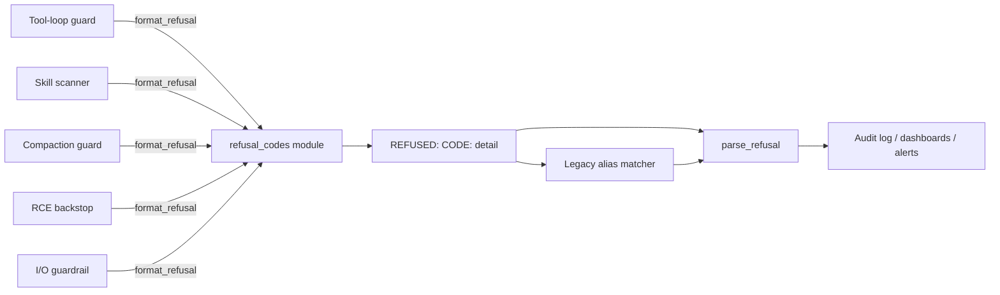

# Typed Refusal Codes

**Also known as:** Machine-Readable Refusal Reasons, Refusal Reason Enum

**Category:** Safety & Control
**Status in practice:** emerging

## Intent

Define a single source of truth for machine-readable refusal codes across all guard surfaces, so refusals can be triaged mechanically rather than by string-grepping ad-hoc human-readable messages.

## Context

A mature agent stack accumulates many guard surfaces: a tool-loop guard, a skill-scanner that refuses risky imports, a post-compaction guard that rejects suspicious context restorations, an RCE backstop, an input/output guardrail. Each was added at a different time and emits its own refusal string in a different shape. Downstream observability — logs, audits, dashboards, on-call triage — has to grep through human-readable strings to count and classify refusals, and small wording changes silently break the dashboards.

## Problem

Refusals are the single most important class of events to triage cleanly: they are the boundary between policy-aligned behaviour and policy-violating behaviour. When every guard formats its own refusal string by hand, the audit story collapses. Counts of 'how many refusals last week, of what kind' depend on regexes that break when one guard's author rephrases the message; legacy guards that pre-dated a category cannot be retrofitted without text-search risk; downstream consumers (a Slack alert, a dashboard, a fine-tuning negative example pipeline) all build their own ad-hoc parser. A single source of truth for refusal codes is the obvious lever; the team rarely pulls it because each guard feels self-contained.

## Forces

- Many independent guard surfaces emit refusals; centralisation is non-trivial.
- Codes must be machine-readable (enum-style) and human-readable in one string.
- Legacy refusal phrasings must keep working or existing dashboards break.
- New codes appear over time; the enum must be extensible without breaking parsers.
- Parsing must be cheap; refusal events fire on the hot path.

## Therefore

Therefore: define a single ReasonCode enum with format and parse helpers, format every refusal across every guard as 'REFUSED: CODE: detail', preserve known legacy substrings as code aliases, and treat unknown codes as a parse miss rather than a crash, so refusal events become uniformly typed across the whole stack while legacy consumers keep working.

## Solution

Maintain a single module that exports: a ReasonCode enum (e.g. POLICY_VIOLATION, RATE_LIMIT, UNVERIFIED_TOOL, RCE_RISK, LOOP_DETECTED, INTEGRITY_FAILURE, CONTEXT_INJECTION, ...); a format_refusal(code, detail) helper returning 'REFUSED: CODE: detail'; a parse_refusal(string) helper that returns (code, detail) or None; and a KNOWN_CODES constant for consumers to validate against. Every guard surface in the system uses format_refusal exclusively. Legacy substrings ('cannot comply', 'blocked by policy', etc.) are recognised by parse_refusal as code aliases so old logs keep parsing. Unknown codes return None from the parser rather than throwing. Downstream tooling depends only on the parser, never on raw strings.

## Example scenario

An agent stack has five places that can emit a refusal: a tool-loop guard, a skill-scanner that refuses risky imports, a post-compaction integrity check, an RCE backstop, and a top-level input/output guardrail. Without centralisation, each emits its own string ('I cannot help with that', 'blocked by policy', 'unsupported tool', etc.), and the dashboard parses these with brittle regex. After centralisation, every surface emits 'REFUSED: POLICY_VIOLATION: vendor block on this domain' or 'REFUSED: LOOP_DETECTED: same tool called 7x in 12s'. The dashboard groups by code, the on-call channel alerts on RCE_RISK and INTEGRITY_FAILURE, and the legacy substrings still parse because they are recognised as aliases.

## Diagram

*All guards format through one helper; downstream parses once and triages mechanically by code.*

## Consequences

**Benefits**

- Refusal triage becomes mechanical: count by code, group by surface, alert by category.
- New guards inherit the audit story for free.
- Legacy substrings remain parseable, so existing dashboards keep working.

**Liabilities**

- Centralisation is upfront work that pays back only after several guard surfaces exist.
- The enum becomes a contract; renaming a code is a breaking change for consumers.
- Detail strings remain human-authored; useful detail is still author-discipline-dependent.

## What this pattern constrains

No guard surface in the stack may emit a refusal string by hand; every refusal must flow through format_refusal so the code field is machine-readable and the detail string is the only free-form portion.

## Applicability

**Use when**

- The stack has three or more guard surfaces that each emit refusals.
- Downstream observability depends on counting or alerting on refusal categories.
- Legacy refusal phrasings already exist and must keep parsing.

**Do not use when**

- The agent has exactly one refusal surface; centralisation is over-engineered.
- Refusals are not audited downstream and the enum would be pure ceremony.
- The team cannot enforce that all surfaces use the shared formatter.

## Known uses

- **Author's long-running personal agent (single private deployment)** — *Available* — Single-source evidence: one private deployment by the catalog author; no independently documented use yet.

## Related patterns

- *complements* → [refusal](refusal.md)
- *complements* → [input-output-guardrails](input-output-guardrails.md)
- *complements* → [policy-as-code-gate](policy-as-code-gate.md)
- *complements* → [decision-log](decision-log.md)
- *complements* → [incident-response-runbook](incident-response-runbook.md)

## References

- (doc) *OpenAI Moderation API — typed category outputs*, <https://platform.openai.com/docs/guides/moderation>
- (spec) *HTTP Semantics (RFC 9110) — status codes as typed reasons*, 2022, <https://datatracker.ietf.org/doc/html/rfc9110>

**Tags:** safety, audit, refusal, schema, observability
