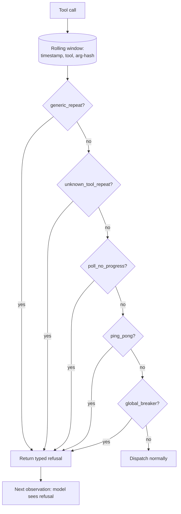

# Typed Tool-Loop Failure Detector

**Also known as:** Dispatch-Boundary Veto, Five-Mode Loop Guard, Tool-Call Pattern Detector

**Category:** Cognition & Introspection
**Status in practice:** emerging

## Intent

Lift tool-loop detection from prompt-level rules to a mechanical dispatch-boundary veto with typed failure modes and per-tool caps that returns a formatted refusal the model must consume.

## Context

A team is running an agent with a rich tool palette in which loop bugs — the agent calling the same tool over and over, or cycling through a small subset of tools without progress — can eat substantial budget before any safety net trips. Prompt-level instructions telling the model 'do not call X more than three times' are not actually enforced: the model can simply ignore them. A single global circuit-breaker on total tool calls catches the most extreme cases but hides the specific shape of the failure when it does fire.

## Problem

Tool-explosion is named elsewhere in the catalogue as an anti-pattern, but naming it provides no mechanism to catch it. A single global circuit-breaker misses the shape of the underlying failure: a thirty-call canvas-action burst looks identical to thirty healthy file reads under a flat global counter, so the breaker either trips too often on legitimate bursts or too late on real failures. Prompt-level rules are advisory only, so the model can ignore them when it is most stuck. The team needs detection lifted from the prompt to a mechanical check at the dispatch boundary, with typed failure modes and per-tool caps that emit a refusal the model is forced to consume rather than silently retry.

## Forces

- Per-tool caps are noisy without good defaults.
- A typed refusal must be formatted so the model can consume it as input rather than silently retry.
- Global breaker is the backstop but should be the last to fire.
- Detection windows must be tunable; too short trips legit work, too long drains money before tripping.

## Therefore

Therefore: at the dispatch boundary classify every tool call against a small set of typed failure modes (generic repeat, unknown-tool repeat, no-progress poll, ping-pong, global breaker) with per-tool caps and return a formatted refusal when a mode trips, so the next observation forces the model to react instead of silently looping.

## Solution

A dispatcher pre-check function. On each tool call, append `(timestamp, tool_name, hash(args))` to a bounded rolling window. Evaluate five rules: (1) generic-repeat: same `(tool, arg-hash)` at least N times in window; (2) unknown-tool-repeat: call to unregistered tool at least M times; (3) poll-no-progress: same tool with no state change at least K times; (4) ping-pong: alternating between two tools at least J cycles; (5) global-circuit-breaker: total tool calls in window at least G. Each rule has per-tool overrides (for example a known-bursty tool capped lower than the default). On trip, the dispatcher returns `{error: 'tool_loop_detected', mode: <id>, observed: <stats>}` as the tool result. The model sees this in its next turn and must adjust.

## Example scenario

A long-running personal agent has a canvas-action tool that occasionally enters a thirty-call burst when an interaction goes wrong. The global step-budget catches it eventually but only after thousands of tokens. The team adds a Typed Tool-Loop Failure Detector with per-tool caps: canvas-action is capped at four calls in a sixty-second window. When the burst starts, the fifth call returns a typed refusal `{mode: 'generic_repeat', observed: {...}}`. The model sees the refusal in its next observation and shifts to a different approach instead of pounding the same tool.

## Diagram

*Five typed modes run at the dispatch boundary; a trip returns a formatted refusal so the model adjusts in its next turn.*

## Consequences

**Benefits**

- Loop failures are caught at the dispatch boundary, not in prompt-text-the-model-may-ignore.
- Typed modes make triage and per-tool tuning meaningful.
- Formatted refusal as a tool result keeps the model in-loop rather than crashing.

**Liabilities**

- Per-tool caps must be calibrated or legit work trips.
- Five modes is more state to maintain than a single breaker.
- A determined model can still loop on tools that the cap missed.

## What this pattern constrains

No tool call may bypass the dispatch-boundary loop check; a tripped detector blocks that specific call and returns a typed refusal that becomes the next observation, and the per-tool cap cannot be raised mid-session by the model.

## Applicability

**Use when**

- Tool palette is rich enough that prompt-level rules are not reliably followed.
- Loop bugs are observable in telemetry and have wasted budget historically.
- Per-tool calibration is feasible (known-bursty tools have caps tuned individually).

**Do not use when**

- Tool palette is tiny and prompt-level rules suffice.
- Per-tool caps cannot be calibrated without churning legit workflows.
- A single global circuit-breaker already catches all observed failure shapes.

## Known uses

- **[Sparrot (author's long-running personal agent; single private deployment)](https://marco-nissen.com/sparrot/)** — *Available* — Tool-loop detection is mechanical at the dispatch boundary with five typed failure modes (repeat, unknown, poll, ping-pong, circuit-breaker) and per-tool caps, returning a structured refusal the model must consume rather than a prompt-level reminder. Single-source evidence: one private deployment by the catalog author.

## Related patterns

- *specialises* → [circuit-breaker](circuit-breaker.md)
- *complements* → [step-budget](step-budget.md)
- *complements* → [pre-generative-loop-gate](pre-generative-loop-gate.md)

## References

- (book) Michael T. Nygard, *Release It! Design and Deploy Production-Ready Software (circuit breaker chapter)*, 2018, <https://pragprog.com/titles/mnee2/release-it-second-edition/>
- (paper) Shishir G. Patil, Tianjun Zhang, Xin Wang, Joseph E. Gonzalez, *Gorilla: Large Language Model Connected with Massive APIs*, 2023, <https://arxiv.org/abs/2305.15334>

**Tags:** cognition, self-adjustment, tool-loop, dispatch
