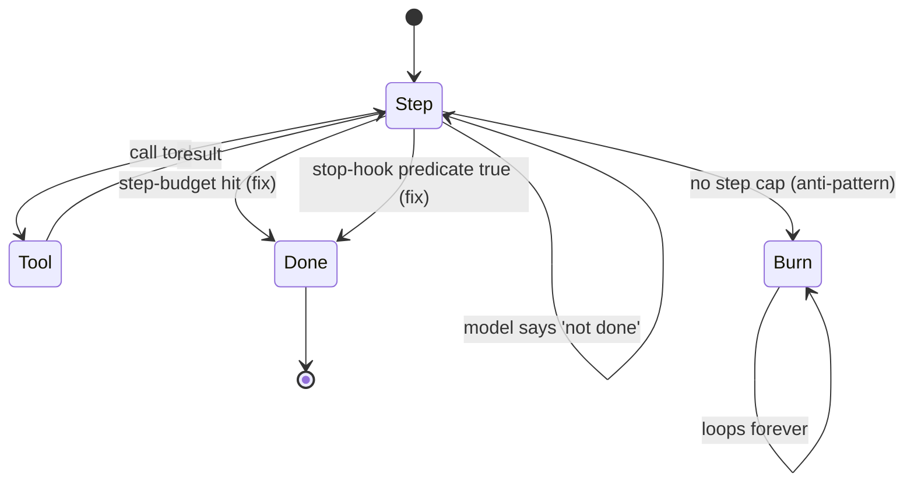

# Unbounded Loop

**Also known as:** No Step Cap, Open-Ended Agent, Agent Stuck, Loops Forever

**Category:** Anti-Patterns  
**Status in practice:** deprecated

## Intent

Anti-pattern: run the agent loop without a step budget and let model self-termination decide.

## Context

A team has implemented an agent loop as 'keep iterating while the model says it is not done', with no external counter, timer, or cost cap to interrupt the loop from outside. The implicit assumption is that the model will say 'done' when the work is complete, and that this self-termination signal is reliable enough to drive the loop's exit.

## Problem

In practice the model rarely declares itself done on hard tasks: it wanders into related questions, retries failed actions, or loops on errors without recognising that it is looping. With no external bound on iterations, total cost, or wall-clock time, the loop can run for hours and burn through significant budget before anyone notices. The user is left waiting while the agent grinds. Picking an exact cap is empirical and feels arbitrary, but no cap at all is worse: the agent will eventually be put in a state where it never terminates on its own, and unbounded cost is the result.

## Forces

- Caps cut off legitimate work.
- Choosing the cap is empirical.
- Model self-termination feels natural until it fails.

## Applicability

**Use when**

- Never use this; the agent wanders and cost is unbounded when termination depends solely on the model.
- Set max_steps and add a stop hook (see step-budget, stop-hook).
- Pair with cost-gating to cap total spend per task.

**Do not use when**

- Cost or latency must be bounded.
- The model is observed not to declare 'done' reliably.
- Programmatic stop conditions can be defined for the loop.

## Therefore

Therefore: set a `max_steps` cap and a programmatic stop-hook predicate on the loop, so that termination is decided by construction rather than left to whether the model happens to declare itself done.

## Solution

Don't. Set max_steps. Add a stop hook. See step-budget, the-stop-hook.

## Example scenario

A team ships an agent without a step budget, trusting the model to decide when to stop. On a flaky network it retries the same tool forever; on an ambiguous task it wanders for forty turns and bills accordingly. The post-mortem is brief: they add `max_steps` and a stop-hook predicate. Cost becomes bounded by construction and the same incident class disappears from the support queue.

## Diagram

## Consequences

**Liabilities**

- Cost blow-up.
- Silent quality regressions when models drift.

## What this pattern constrains

By definition, this anti-pattern imposes no useful constraint; the missing constraint is the failure mode.

## Known uses

- **Early autonomous-agent demos (AutoGPT, BabyAGI initial versions)** — *Available*

## Related patterns

- *alternative-to* → [step-budget](step-budget.md)
- *alternative-to* → [stop-hook](stop-hook.md)

**Tags:** anti-pattern, loop, budget
