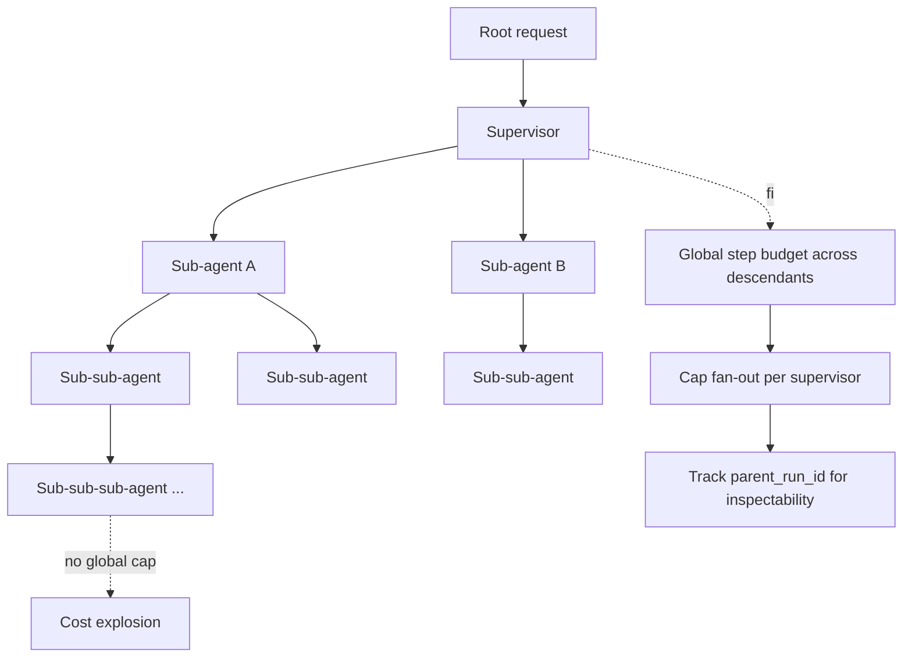

# Unbounded Subagent Spawn

**Also known as:** Recursive Spawn, Subagent Fan-Out Bomb

**Category:** Anti-Patterns  
**Status in practice:** deprecated

## Intent

Anti-pattern: a supervisor or orchestrator spawns sub-agents that can themselves spawn sub-agents without a global cap.

## Context

Multi-agent systems with `supervisor` / `orchestrator-workers` / `lead-researcher` patterns where each level decomposes the task and spawns more agents.

## Problem

step-budget caps a single agent's loop; cost-gating caps a single action's cost. Neither caps total system spend through fan-out. A buggy decomposition can recursively explode the agent tree.

## Forces

- Per-agent caps look like sufficient governance until fan-out is observed.
- Detecting recursive spawn requires global agent tree state.
- Killing a single instance does not kill its descendants.

## Applicability

**Use when**

- Never use this; fan-out without a global cap can recursively explode the agent tree.
- Maintain a global step budget across all descendants of a root request.
- Cap fan-out per supervisor and track parent_run_id for inspectability.

**Do not use when**

- Sub-agents may spawn further sub-agents.
- Total system cost across the agent tree is bounded by SLOs.
- A kill-switch is available for emergency descent halt.

## Therefore

Therefore: maintain one global step budget across all descendants of a root request, cap fan-out per supervisor at five to ten children, and thread a `parent_run_id` through every spawn so the entire agent tree is inspectable and killable as a whole, so that recursive decomposition cannot blow the cost ceiling beneath per-agent caps.

## Solution

Don't. Maintain a global step budget across all descendants of a root request. Cap fan-out per supervisor (typically 5-10 children). Track parent_run_id in lineage so the agent tree is inspectable. Pair with kill-switch for emergency descent halt.

## Example scenario

A research orchestrator decomposes a topic into ten sub-topics, each spawning a sub-agent; each of those decomposes into ten more sub-agents, and there is no global cap. One run consumes the month's budget in fifteen minutes through fan-out alone, even though each individual loop has a step budget. The team adds a global step budget across all descendants of a root request, caps fan-out per supervisor (5-10 children), and tracks `parent_run_id` so the agent tree is inspectable and killable as a whole.

## Diagram

## Consequences

**Liabilities**

- Catastrophic cost spikes from runaway decomposition.
- Untracked descendants survive a top-level halt.
- Provider rate-limits cascade through the tree.

## What this pattern constrains

By definition, this anti-pattern imposes no useful constraint; the missing global fan-out cap is the failure.

## Known uses

- **Observed in early multi-agent demos (AutoGPT-style 2023)** — *Available*

## Related patterns

- *alternative-to* → [step-budget](step-budget.md)
- *alternative-to* → [cost-gating](cost-gating.md)
- *alternative-to* → [kill-switch](kill-switch.md)
- *complements* → [subagent-isolation](subagent-isolation.md)

**Tags:** anti-pattern, multi-agent, fan-out
