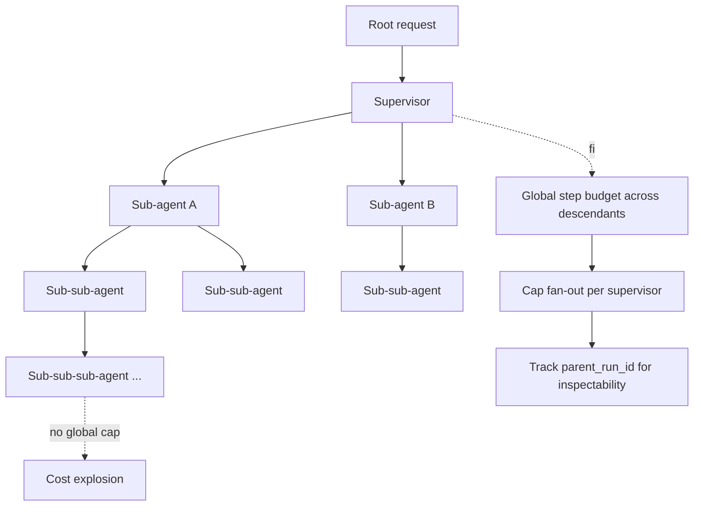

# Unbounded Subagent Spawn

**Also known as:** Recursive Spawn, Subagent Fan-Out Bomb

**Category:** Anti-Patterns  
**Status in practice:** deprecated

## Intent

Anti-pattern: a supervisor or orchestrator spawns sub-agents that can themselves spawn sub-agents without a global cap.

## Context

A team is operating a multi-agent system that uses supervisor, orchestrator-workers, or lead-researcher style decomposition. At each level a parent agent breaks the task down and spawns child agents to handle the pieces, and those children can themselves spawn further sub-agents if their slice of the task is still too large. There is no global cap on how many agents the whole tree is allowed to contain or how deep the recursion can go.

## Problem

Per-agent safety mechanisms — step-budget caps the loop of a single agent, cost-gating caps the cost of a single action — do not constrain total system spend through fan-out. A buggy decomposition that always splits a task into too many pieces can recursively explode the agent tree, with each individual agent looking well-behaved while the whole system burns budget exponentially. Killing one instance does not kill its descendants, and detecting recursive spawn requires global tree state that is rarely tracked. The result is that a single bad decomposition prompt can run up costs that no per-agent limit ever sees.

## Forces

- Per-agent caps look like sufficient governance until fan-out is observed.
- Detecting recursive spawn requires global agent tree state.
- Killing a single instance does not kill its descendants.

## Applicability

**Use when**

- Cite this entry when sub-agents can spawn sub-agents with no global budget.
- You are already here if one request can recursively explode into an agent tree nobody can enumerate.
- Enforce a shared step budget across descendants, cap fan-out per supervisor, and track parent_run_id (pair with kill-switch).

**Do not use when**

- Sub-agents may spawn further sub-agents.
- Total system cost across the agent tree is bounded by SLOs.
- A kill-switch is available for emergency descent halt.

## Therefore

Therefore: maintain one global step budget across all descendants of a root request, cap fan-out per supervisor at five to ten children, and thread a `parent_run_id` through every spawn so the entire agent tree is inspectable and killable as a whole, so that recursive decomposition cannot blow the cost ceiling beneath per-agent caps.

## Solution

Don't. Maintain a global step budget across all descendants of a root request. Cap fan-out per supervisor (typically 5-10 children). Track parent_run_id in lineage so the agent tree is inspectable. Pair with kill-switch for emergency descent halt.

## Example scenario

A research orchestrator decomposes a topic into ten sub-topics, each spawning a sub-agent; each of those decomposes into ten more sub-agents, and there is no global cap. One run consumes the month's budget in fifteen minutes through fan-out alone, even though each individual loop has a step budget. The team adds a global step budget across all descendants of a root request, caps fan-out per supervisor (5-10 children), and tracks `parent_run_id` so the agent tree is inspectable and killable as a whole.

## Diagram

## Consequences

**Liabilities**

- Catastrophic cost spikes from runaway decomposition.
- Untracked descendants survive a top-level halt.
- Provider rate-limits cascade through the tree.

## What this pattern constrains

Avoiding it imposes a global cap: descendants of a root request share one step budget; per-supervisor fan-out cannot exceed a small bound (typically 5-10 children), and every child records parent_run_id so the tree stays inspectable.

## Known uses

- **Observed in early multi-agent demos (AutoGPT-style 2023)** — *Available*

## Related patterns

- *alternative-to* → [step-budget](step-budget.md)
- *alternative-to* → [cost-gating](cost-gating.md)
- *alternative-to* → [kill-switch](kill-switch.md)
- *complements* → [subagent-isolation](subagent-isolation.md)

**Tags:** anti-pattern, multi-agent, fan-out
