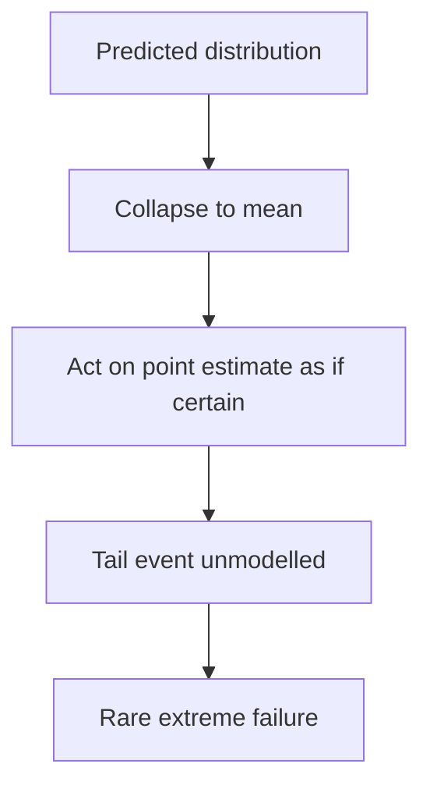

# Uncertainty Neglect Bias

**Also known as:** Mean-Collapse Decisioning, Tail-Event Blindness

**Category:** Anti-Patterns  
**Status in practice:** emerging

## Intent

Anti-pattern: an agent collapses a predicted distribution to its mean and acts on the point estimate, discarding the tail, so rare extreme outcomes stay invisible to its decision and tail risk goes unmodelled.

## Context

An agent makes high-stakes decisions from predictions that are really distributions — a latency forecast, a demand estimate, a risk score — each with a spread, not just a most-likely value. To act, it reduces the prediction to a single number, usually the mean or the top choice. Many deployments, such as autonomous network or infrastructure control, run this loop continuously across a multi-agent system.

## Problem

Collapsing a distribution to its mean throws away the tail, which is exactly where the rare, costly outcomes live: the latency spike, the SLA breach, the extreme demand. The agent then plans on the average case as if it were certain, so a low-confidence prediction is acted on with the same commitment as a high-confidence one, and the false certainty propagates to other agents that consume the decision. Decisions look fine in the typical case and fail precisely when the tail event the agent never modelled arrives.

## Forces

- Acting requires a single value, so reducing a distribution to its mean is the path of least resistance.
- The mean is right most of the time, which hides that the discarded tail is where the expensive failures are.
- Modelling and planning over the full distribution, for example via a risk measure like conditional value-at-risk, costs more computation and design than using the point estimate.
- A confident-looking point decision propagates cleanly to downstream agents, so the lost uncertainty is never reintroduced.

## Therefore

Therefore: do not collapse a predicted distribution to its mean before deciding; carry the spread into the decision, weight the tail with a risk measure, and treat a wide or low-confidence prediction as a reason to act conservatively or ask for help rather than as a fact.

## Solution

Keep the uncertainty in the prediction and let it shape the action. Instead of acting on the mean, plan against the distribution — weight tail outcomes with a risk measure such as conditional value-at-risk, or use a calibrated prediction set and act autonomously only when it is tight enough. When the spread is wide or the confidence is low, choose a conservative action, hedge, or escalate rather than committing as if the estimate were certain. Carry the uncertainty forward to downstream agents instead of passing them a bare point estimate, so the system as a whole does not mistake an average for a guarantee.

## Structure

```
Predicted distribution -> collapse to mean -> act on point estimate as if certain -> tail event unmodelled -> rare extreme failure (BROKEN) ; Corrected: carry the spread, weight the tail (CVaR / calibrated set), act conservatively or escalate on wide spread
```

## Diagram



*Collapsing the prediction to its mean discards the tail, so the agent commits to the average case and fails when the rare extreme arrives.*

## Example scenario

A network-control agent forecasts request latency and routes traffic to the path with the best mean predicted latency. One path has a slightly better average but a heavy tail of occasional spikes; the agent, acting on the mean, keeps choosing it, and every so often a spike blows the latency SLA. A decision that weighted the tail would have preferred the steadier path.

## Consequences

**Liabilities**

- Rare extreme outcomes the tail contained — latency spikes, SLA breaches, demand shocks — hit unmitigated because the decision never saw them.
- Low-confidence predictions are committed to as if certain, so error is largest exactly when the model was least sure.
- The false certainty propagates across a multi-agent system, so one agent's collapsed estimate becomes another's premise.
- Failures cluster in the tail, where they are most expensive, while average-case metrics look healthy.

## Failure modes

- Mean collapse — the agent reduces a distribution to its average and discards the spread before deciding.
- Tail blindness — rare high-cost outcomes are never represented in the decision.
- Certainty laundering — a low-confidence prediction is passed downstream as a definite value.
- Average-case overfit — the policy is tuned to typical inputs and fails on the tail it ignored.

## What this pattern constrains

A predicted distribution must not be collapsed to its mean before a high-stakes decision; the spread is carried into the action, tail outcomes are weighted with a risk measure, and a wide or low-confidence prediction cannot be acted on as if it were certain.

## Applicability

**Use when**

- Recognising this failure when an agent makes high-stakes decisions from the mean of a prediction and ignores its spread.
- Reviewing a control or planning loop that reduces distributions to point estimates before acting.
- Diagnosing failures that cluster in rare extreme cases while average-case metrics look healthy.

**Do not use when**

- The decision already carries the full distribution and weights tail risk, or gates on a calibrated prediction set.
- Outcomes have negligible tails, so the mean is a faithful summary.
- The action is trivially reversible and cheap, so tail outcomes carry no real cost.

## Components

- Probabilistic predictor — the model that emits a distribution, not just a point
- Point-estimate reducer — the step that collapses the distribution to its mean before deciding
- Decision policy — the planner that acts on the reduced value as if it were certain
- Missing risk measure — the absent tail-weighting such as CVaR, or the calibrated-set gate
- Downstream consumers — other agents that inherit the collapsed estimate as a premise

## Tools

- Forecasting or scoring model — produces the predictive distribution the agent acts on
- Risk measure such as CVaR — the corrective that weights tail outcomes in the decision
- Calibrated prediction set — the corrective that gates autonomy on how tight the prediction is

## Evaluation metrics

- Tail-event loss — cost incurred on rare extreme outcomes the mean-based decision ignored
- Calibration of action confidence — how well decisiveness tracks the actual spread of the prediction
- Average-vs-tail performance gap — difference between typical-case and worst-case outcomes
- Uncertainty-propagation rate — how often a low-confidence prediction is passed downstream as certain

## Known uses

- **[Agentic negotiation for 6G](https://arxiv.org/html/2511.19175)** _available_ — Names uncertainty neglect bias — discarding the tail of a predicted distribution and deciding on the mean — and mitigates it with a tail-risk measure over digital-twin-predicted latency distributions.
- **[Cognitive-bias tutorial for 6G autonomous networks](https://arxiv.org/pdf/2510.19973)** _available_ — Lists uncertainty neglect bias among recurring biases in autonomous-network agents that make high-stakes decisions on averages while ignoring tail risk.

## Related patterns

- _complements_ **False Confidence Syndrome** — False confidence is miscalibrated expressed certainty on an answer; uncertainty neglect discards the tail of a predicted distribution and acts on the mean.
- _alternative-to_ **Calibrated Help-Gate via Conformal Prediction** — The conformal help-gate keeps the calibrated prediction set and acts only when it is a singleton; uncertainty neglect collapses that set to its mean and acts regardless.
- _complements_ **Risk-Averse Reward Proxy** — Risk-averse planning treats the objective as uncertain and plans conservatively; uncertainty neglect ignores tail risk and plans on the point estimate.
- _complements_ **Confidence Reporting** — Confidence-reporting surfaces the uncertainty; uncertainty neglect is the failure to act on it, collapsing a distribution to its mean.

## References

- [LLM-Based Agentic Negotiation for 6G: Addressing Uncertainty Neglect and Tail-Event Risk](https://arxiv.org/html/2511.19175) — 2025
- [A Tutorial on Cognitive Biases in Agentic AI-Driven 6G Autonomous Networks](https://arxiv.org/pdf/2510.19973) — 2025
