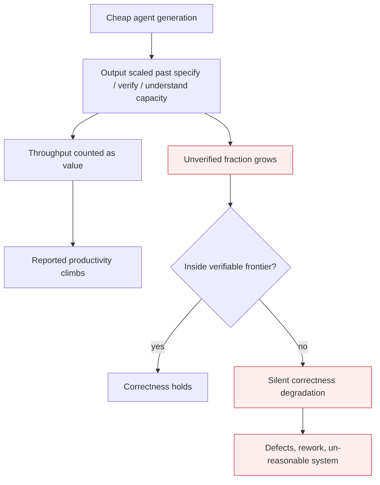

# Understanding-Capacity Gap

**Also known as:** Verification-Capacity Gap, Output-Rush, Verständnis-Knappheit

**Category:** Anti-Patterns  
**Status in practice:** emerging

## Intent

Anti-pattern: a team scales agent-generated output past its own capacity to specify, verify, and understand it, mistaking generation throughput for delivered value while correctness degrades outside the verifiable frontier.

## Context

Code generation, document drafting, and analysis become near-free as agents take over the production of work. A small team can now emit far more pull requests, reports, and changes per week than it ever could by hand, and the volume becomes the headline metric: lines shipped, tickets closed, features generated. The scarce input is no longer the labour of producing the artifact but the labour of stating precisely what is wanted, checking that the artifact actually does it, and holding a working mental model of the growing system. That second kind of labour does not get cheaper as generation does, and it does not scale with the agent fleet.

## Problem

When the team treats raw generation throughput as the measure of progress, it commits to more output than anyone on the team can specify in enough detail to be unambiguous, verify against intent, or hold in their head as a coherent system. Each unverified change looks done because it compiles, reads fluently, and was merged, so the perceived productivity curve climbs. Underneath, the fraction of output that nobody has actually understood grows, and reliability holds only on the cases that happen to fall inside the team's shrinking verifiable frontier. Outside that frontier — the inputs, interactions, and assumptions nobody had the capacity to check — correctness silently degrades, and the gap surfaces later as defects, rework, and a system the team can no longer reason about or safely change.

## Forces

- Generation throughput is cheap, visible, and easy to celebrate, while specification and verification are slow, invisible, and easy to defer.
- Specifying intent precisely and verifying that an artifact meets it scale with human attention, not with the size of the agent fleet, so adding agents widens the gap rather than closing it.
- Fluent, plausible agent output lowers scrutiny exactly where a hidden defect would hide, so the unverified fraction feels safe to ship.
- Perceived productivity and actual productivity diverge: practitioners report feeling faster while measured throughput of correct, understood work stalls or falls.
- Understanding compounds — every change made on top of un-understood work makes the next change harder to verify — so the gap is self-reinforcing once it opens.

## Therefore

Therefore (the anti-pattern): the team scales the agent fleet and ships everything it produces, counting generated volume as value, until the backlog of unspecified and unverified output exceeds anyone's capacity to understand the system, and correctness quietly fails outside the cases that were ever checked.

## Solution

The remedy is to treat the capacity to specify, verify, and understand as the binding constraint and to refuse to scale generation past it. Measure delivered, verified, understood output rather than raw generation volume, and make the unverified fraction a tracked, visible number that gates further generation. Cap work in progress to what the team can actually review and reason about, so each generated change is specified precisely enough to be checkable and is verified against intent before more is produced on top of it. Invest the freed-up production time into the labour that did not get cheaper — sharper specifications, stronger checks, and deliberate effort to keep a working mental model of the system — and define the team's verifiable frontier explicitly so work outside it is flagged as unvalidated rather than silently assumed correct. Where verification cannot keep pace, throttle generation rather than letting the gap grow.

## Structure

```
Cheap generation -> Output scaled past specify/verify/understand capacity -> Volume counted as value (throughput metric climbs) -> Unverified fraction grows -> Correctness holds inside verifiable frontier only -> Outside the frontier: silent degradation -> Defects, rework, un-reasonable system
```

## Diagram



*Throughput counted as value drives output past verification capacity; outside the verifiable frontier, correctness degrades silently.*

## Example scenario

A platform team of five adopts coding agents and triples its weekly pull-request count; leadership cheers the throughput and the team scales to a fleet of agents emitting changes faster than anyone can read them. Pull requests merge on a green build and a thirty-second skim because the diffs look clean, and the dashboard shows record output. Two quarters later the service has a class of intermittent failures nobody can place, the original authors cannot explain large parts of the codebase the agents wrote, and the time spent diagnosing and reworking un-understood changes now outweighs the time the agents ever saved. The headline productivity was generated volume; the delivered, verified, understood value had been falling the whole time.

## Consequences

**Liabilities**

- The reported productivity curve rises while the share of work nobody has verified or understood grows underneath it, so confidence is highest where exposure is worst.
- Defects accumulate outside the verifiable frontier and surface later as incidents and rework that erase the apparent generation gain.
- The team loses a coherent mental model of its own system, so every later change is harder to specify and riskier to make.
- Each agent added widens the gap rather than closing it, because verification capacity does not scale with the fleet.
- Throughput-as-value metrics actively reward the behaviour that opens the gap, entrenching it.

## Failure modes

- Output-rush — the team optimises for generated volume, celebrating throughput while the verified, understood fraction quietly shrinks.
- Frontier blindness — nobody tracks what falls outside the team's capacity to verify, so degraded correctness there is invisible until it fails in production.
- Perceived-productivity illusion — practitioners feel faster and report higher productivity while measured delivery of correct, understood work stalls or declines.
- Compounding un-understanding — changes are stacked on top of un-verified work until the system can no longer be reasoned about, and verification cost grows faster than the team can pay it.

## What this pattern constrains

Generation must not be scaled past the team's measured capacity to specify, verify, and understand the output: raw generation volume must not be treated as delivered value, the unverified fraction must be tracked and must gate further generation, and work outside the team's verifiable frontier must be flagged as unvalidated rather than assumed correct.

## Applicability

**Use when**

- A team uses agents to generate code, documents, or analysis at a volume well above what it could produce by hand.
- Progress is measured mainly by generation throughput — changes shipped, tickets closed, output produced — rather than by verified, understood delivery.
- Output is merged or shipped on light review because it reads fluently and the build is green, so the unverified fraction is neither measured nor capped.

**Do not use when**

- Generation is explicitly throttled to what the team can specify, verify, and reason about, with the unverified fraction tracked as a gating metric.
- Delivered value is measured as verified, understood output, and work outside the team's verifiable frontier is flagged as unvalidated rather than counted as done.
- The output is throwaway, sandboxed, or never relied upon, so un-understood generated volume carries no downstream correctness risk.

## Components

- Generation engine — the agent fleet producing code, documents, or analysis at high volume
- Throughput metric — the visible count (changes shipped, tickets closed) that the team mistakes for delivered value
- Verifiable frontier — the bounded set of cases the team actually has capacity to specify and check
- Unverified backlog — the growing share of generated output that nobody has specified precisely or verified against intent
- Mental model — the team's working understanding of the system, eroded as un-understood changes accumulate
- Work-in-progress cap — the cure-side limit that ties generation rate to verification and understanding capacity

## Tools

- Coding and content agents — produce the high-volume output whose verification the team cannot match
- Throughput dashboards — surface generation volume and, if misused, frame it as the success metric
- Verification-coverage tracking — measures the unverified fraction and the boundary of the verifiable frontier
- Work-in-progress limits and review gates — throttle generation to what can actually be verified and understood

## Evaluation metrics

- Unverified-output fraction — share of generated output merged or shipped without verification against intent
- Verified-throughput vs raw-throughput ratio — how much of the counted output has actually been checked and understood
- Perceived-vs-measured productivity gap — difference between self-reported speed and measured delivery of correct, understood work
- Outside-frontier defect rate — production defects traced to inputs or interactions that fell outside the team's verifiable frontier
- System-comprehension coverage — fraction of the codebase or artifact set a team member can explain without re-reading from scratch

## Known uses

- **[EconLab AI — Das Verständnis-Manifest](https://econlab-ai.de/blog/verstaendnis-knappes-gut-agentic-engineering)** _available_ — German practitioner manifesto naming the gap directly: as code generation became cheap in 2026, the binding constraint shifts to understanding, and teams that chase output volume ('Output-Rausch') fall on the wrong side of the jagged frontier.
- **[METR — early-2025 AI developer-productivity field study](https://metr.org/blog/2025-07-10-early-2025-ai-experienced-os-dev-study/)** _available_ — Randomised field study of experienced open-source developers: tasks took ~19% longer with AI tools while participants believed AI made them faster — the perceived-vs-actual productivity divergence at the core of this anti-pattern.

## Related patterns

- _complements_ **Hidden Validation-Work Amplification** — Both separate visible automation gain from hidden human burden; that anti-pattern is about validation effort exceeding the automation saving, this one about scaling output past the capacity to specify, verify, and understand it so correctness degrades unseen.
- _complements_ **Agentic Skill Atrophy** — Skill atrophy erodes the individual capacity to review agent output over time; this gap is the team-level mismatch where output is scaled past whatever review capacity remains, so the two reinforce each other.
- _complements_ **False Confidence Syndrome** — False confidence is the per-output miscalibration that makes unverified work look trustworthy; here that same misplaced trust, aggregated across a high-throughput fleet, lets the unverified fraction grow unchecked.
- _complements_ **Verifier-Aware Reward Hacking** — Both fail at the verification boundary; reward hacking games the grader so a pass is meaningless, while this anti-pattern ships work that was never put in front of any verifier at all.

## References

- [Das Verständnis-Manifest: Verständnis als knappes Gut im Agentic Engineering](https://econlab-ai.de/blog/verstaendnis-knappes-gut-agentic-engineering) — 2026
- [Measuring the Impact of Early-2025 AI on Experienced Open-Source Developer Productivity](https://metr.org/blog/2025-07-10-early-2025-ai-experienced-os-dev-study/) — METR, 2025
