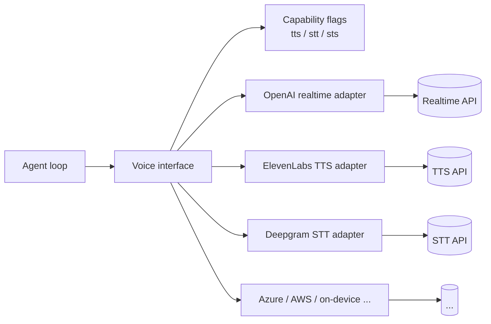

# Unified Voice Interface

**Also known as:** Voice Abstraction Layer, TTS/STT/STS Unified API, Provider-Agnostic Voice

**Category:** Streaming & UX  
**Status in practice:** emerging

## Intent

Expose text-to-speech, speech-to-text, and real-time speech-to-speech through a single interface so a voice agent can swap providers without rewriting the loop.

## Context

Voice agents built on a fast-moving provider landscape (OpenAI realtime, Google, ElevenLabs, Deepgram, Azure, AWS, on-device) where capability and price shift faster than application code can be rewritten.

## Problem

Per-provider voice SDKs differ in streaming chunk format, audio framing, lifecycle events, and TTS/STT versus realtime STS shape; coding the agent loop against one SDK ties the application to that vendor and forecloses cost or quality switches.

## Forces

- TTS, STT, and STS have meaningfully different control-flow shapes (one-shot vs streaming vs bidirectional), but the application wants one mental model.
- Realtime speech-to-speech needs bidirectional audio framing — half-duplex APIs cannot fully emulate it.
- Provider feature parity is incomplete: not every provider offers all three modes or all voices.
- Latency budgets in voice are tight (sub-300ms turn-taking); abstraction overhead must be small.
- Voice-event vocabulary (turn-start, partial-transcript, barge-in, voice-activity) needs to be unified across providers.

## Applicability

**Use when**

- Building voice agents that may switch providers for cost, quality, or latency reasons.
- Multiple voice modes (TTS, STT, realtime STS) are in play in the same product.
- The application UI consumes a uniform voice-event vocabulary independent of provider.
- Provider capability gaps must be discoverable at runtime.

**Do not use when**

- The application is locked to one provider's realtime offering and that lock is acceptable.
- Latency budgets are so tight that any abstraction layer is suspect — measure before rejecting.
- Only one mode is needed and a thin per-provider client suffices.

## Therefore

Therefore: define one Voice interface that spans TTS, STT, and STS with capability flags, so that the agent loop addresses voice as one resource and the provider becomes a configuration choice rather than a code shape.

## Solution

Define a Voice interface with three primary methods — `speak(text) -> AudioStream`, `listen(audio_stream) -> TranscriptStream`, `converse(audio_stream) -> AudioStream` (the realtime STS path) — and a uniform event vocabulary (`turn_start`, `partial_transcript`, `final_transcript`, `barge_in`, `voice_activity_start/stop`). Each provider implementation declares which modes and voices it supports via capability flags; the agent loop checks capability rather than provider name. Pair with streaming-typed-events (the underlying typed event transport), multilingual-voice-agent (language adaptation on top), and provider-string-routing (string-addressed provider selection). Treat realtime STS as a first-class mode, not a flavour of TTS+STT, because the bidirectional framing differs.

## Structure

Agent loop ↔ Voice interface { speak, listen, converse, capabilities } ↔ Provider adapter (OpenAI realtime, ElevenLabs, Deepgram, Azure, ...) ↔ provider API.

## Example scenario

A consumer voice assistant team wants to ship realtime speech-to-speech on iOS, fall back to TTS+STT on platforms where realtime is unavailable, and run STT-only for transcription-mode users. They build their agent loop against a unified Voice interface with `speak`, `listen`, and `converse` methods plus a capability flag for `realtime_sts`. On iOS the loop picks the realtime provider; on Android it falls back to TTS+STT through the same interface; transcription-mode disables `speak` entirely. When a cheaper TTS provider lands, the change is a configuration switch — the agent loop does not move.

## Diagram

## Consequences

**Benefits**

- Provider switch is configuration, not code.
- Multi-provider deployments (TTS from one provider, STT from another) become trivial.
- Capability flags let the application degrade gracefully when a mode is unavailable.
- Event vocabulary stays uniform across providers, so UI components can be stable.

**Liabilities**

- Lowest-common-denominator pressure on the abstraction — provider-specific voices and effects need capability flags.
- Realtime STS bidirectional framing is hard to emulate when only TTS+STT are available; capability gaps must be explicit.
- Adding another mode (avatar, lip-sync) means evolving the interface.
- Voice-event vocabulary across providers drifts; the adapter layer has to keep up.

## What this pattern constrains

The agent loop must call voice operations through the unified interface and must read provider capability via capability flags; the loop is not allowed to import provider-specific voice SDK classes.

## Known uses

- **Mastra Voice** — Mastra's Voice system documents a unified interface spanning TTS, STT, and real-time STS. *Available* — [link](https://mastra.ai/docs/voice/overview)
- **LiveKit Agents** — Voice-AI framework with pluggable TTS/STT and realtime model providers behind a uniform agent interface. *Available* — [link](https://docs.livekit.io/agents/)
- **Pipecat** — Open-source voice-AI pipeline with provider-agnostic TTS/STT/realtime stages. *Available* — [link](https://github.com/pipecat-ai/pipecat)

## Related patterns

- *complements* → [streaming-typed-events](streaming-typed-events.md)
- *specialises* → [multilingual-voice-agent](multilingual-voice-agent.md)
- *complements* → [provider-string-routing](provider-string-routing.md)
- *uses* → [translation-layer](translation-layer.md)

## References

- *doc*: [Mastra — Voice overview](https://mastra.ai/docs/voice/overview) — Mastra
- *doc*: [LiveKit Agents](https://docs.livekit.io/agents/) — LiveKit

**Tags:** streaming-ux, voice, tts, stt, sts, mastra, livekit
