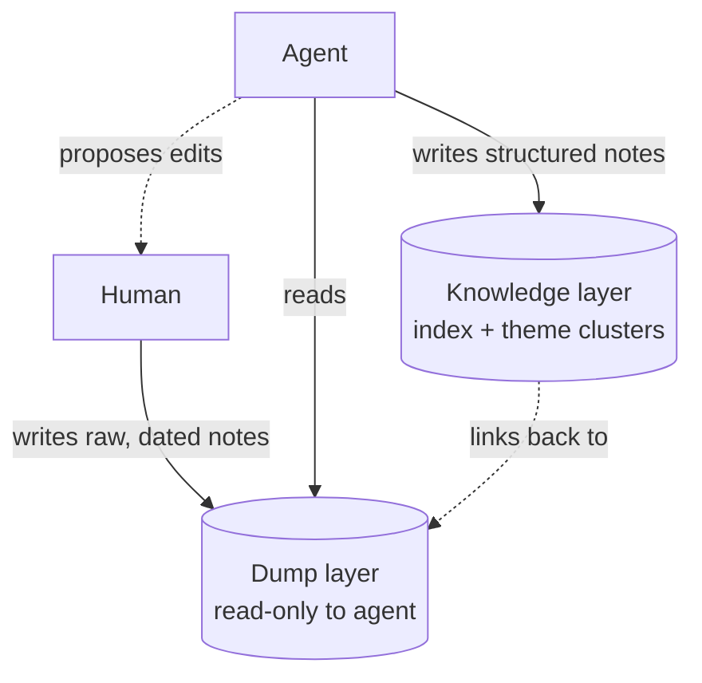

# Unstructured Human Capture Layer

**Also known as:** Human Dump Layer, Read-Only Raw Notes Layer, Two-Layer Capture (Dump / Knowledge)

**Category:** Memory  
**Status in practice:** emerging

## Intent

Keep a human-authored raw dump layer that the agent may read but never edit, and confine all structuring to a separate derived layer, so half-formed human thought survives as durable context.

## Context

A person works alongside an agent over weeks and keeps notes — half-formed ideas, contradictions, dead ends, observations recorded before they have hardened into a position. The agent has memory tools and is eager to help: it tags, reformats, deduplicates, and reorganises whatever it can write to. The notes are valuable to the agent as context, so the temptation is to fold them into the agent's tidy knowledge store. The moment the agent normalises a half-formed note, the raw material the person was still thinking through is gone.

## Problem

Unstructured human thought and a structured knowledge base have opposite requirements, and a single shared store cannot satisfy both. Tagging, choosing headings, and aligning format all force a premature commitment that discards the loose, contradictory, still-forming material that gave the note its value. Yet the agent does need structure to retrieve and reason over the corpus. If the agent is allowed to rewrite the human's raw notes, it strips them down to whatever it could already articulate; if the agent is forbidden to structure anything, the corpus stays unsearchable. The capture surface and the retrieval surface pull in incompatible directions over the same data.

## Forces

- Structuring a note — tags, headings, a fixed format — is exactly what makes it retrievable, and exactly what kills the half-formed material the human was still working out.
- The agent is more capable at organising than the human and will, given write access, normalise the raw layer toward what it can already express.
- The corpus is useless to the agent as one undifferentiated pile, yet equally useless if every entry has been flattened into the agent's own categories.
- Contradictions, dead ends, and unresolved hypotheses carry signal, but only survive if no consistency pass is run over the layer that holds them.

## Therefore

Therefore: split capture into a read-only human dump layer the agent may never modify and a separate derived knowledge layer the agent grows by reading the dump, so the raw material stays intact while structure accrues beside it.

## Solution

Maintain two distinct layers over the same body of notes. The dump layer is human-authored and deliberately unstructured: dated free-form entries, kept rough on purpose, holding contradictions and unfinished thoughts. The agent has read access to this layer and nothing more — it may quote, cite, and reason over a dump entry, and it may propose changes for the human to apply, but it cannot write, tag, reformat, or reorganise it. The knowledge layer is separate and derived: an index, theme clusters, and structured notes that the agent reads the dump to build and maintain. When the agent learns something from the raw layer, it writes the structured form into the knowledge layer and leaves the source untouched, linking back to the dump entry rather than absorbing it. The enforcement is at the tool boundary, not the prompt: the agent is granted read-only access to the dump path and read-write access only to the derived path, so the rough material is structurally safe from the agent's own tidiness.

## Structure

```
Human --writes--> Dump layer (raw, dated, read-only to agent)
Agent --reads--> Dump layer
Agent --writes--> Knowledge layer (index + theme clusters, derived)
Agent --proposes edits to--> Human (who alone may change the dump)
```

## Diagram



*The human writes the raw dump layer; the agent reads it and writes only the derived knowledge layer, proposing dump edits back to the human.*

## Example scenario

A researcher keeps a daily/ folder of rough, dated notes — stray observations, contradictory takes, ideas not yet worth defending. The agent is mounted with read-only access to daily/ and read-write access to a separate knowledge/ folder. Each day it reads the new dumps and grows knowledge/: an index and a few theme clusters that cite the raw entries. When it spots a likely typo in a dump note, it proposes the fix to the researcher rather than editing it, leaving the rough material exactly as written.

## Consequences

**Benefits**

- Half-formed thought, contradictions, and dead ends survive as context instead of being normalised away the moment the agent could touch them.
- The agent still gets a structured, retrievable corpus — built in the derived layer — without paying for it in lost raw material.
- The read-only boundary is enforced at the tool layer, so the guarantee does not depend on the agent obeying a prompt.
- Provenance is clear: every structured note links back to the unaltered dump entry it was derived from.

**Liabilities**

- The two layers can drift: the derived knowledge layer goes stale when dump entries change and no re-derivation pass runs.
- The human must keep dumping for the layer to stay valuable; if capture lapses, the agent has only an ageing corpus to derive from.
- Duplicated content across the dump and the derived layer raises storage and re-reading cost compared with one normalised store.
- A proposal-only agent cannot fix obvious errors in the raw layer itself, so typos and mislabels persist until the human acts.

## Failure modes

- Tidy-up creep — the agent is given write access to the dump for one 'harmless' cleanup and silently starts normalising the raw layer.
- Derived-layer staleness — the knowledge layer is built once and never re-derived, so it diverges from the dump it claims to index.
- Capture collapse — the human stops dumping because the structured layer looks complete, and the raw stream dries up.
- Proposal flood — the agent proposes so many edits to the human that the proposals themselves become an unstructured backlog.

## What this pattern constrains

The agent may read but must never edit, tag, reformat, or restructure the human dump layer; any change to the raw layer is proposal-only and applied by the human, and all structuring the agent performs is written to a separate derived layer.

## Applicability

**Use when**

- A human accumulates loose, half-formed notes over time that lose their value once tagged, reformatted, or reorganised.
- The agent needs structure to retrieve and reason over the corpus, but that structure can live in a layer separate from the raw notes.
- The capture boundary can be enforced at the tool layer — read-only on the dump path, read-write on a derived path — rather than relying on the agent to behave.

**Do not use when**

- The notes are already structured records where normalising in place is the desired behaviour.
- There is no human steadily authoring raw material, so a dedicated capture layer would stay empty.
- The cost of maintaining two layers and re-deriving the knowledge layer outweighs the value of preserving rough material.

## Components

- Dump layer — the human-authored, deliberately-unstructured store of dated raw notes; read-only to the agent
- Knowledge layer — the derived structured store (index, theme clusters) the agent reads the dump to build and maintain
- Permission boundary — tool-layer enforcement granting the agent read-only on the dump path and read-write only on the derived path
- Derivation step — the agent's process of reading dump entries and writing structured notes that link back to their sources
- Proposal channel — the path by which the agent suggests changes to the dump for the human to apply, since it may not write the raw layer

## Tools

- Read-only filesystem mount or scoped storage permission — exposes the dump path for reading while blocking writes at the boundary
- Read-write knowledge store — the derived layer the agent maintains (files, a wiki, or a vector index)
- Retrieval / linking tool — lets a derived note cite the exact dump entry it was built from for provenance

## Evaluation metrics

- Raw-layer integrity — count of agent-originated writes to the dump path; the correct value is zero
- Derivation freshness — lag between a new or changed dump entry and the knowledge layer reflecting it
- Provenance coverage — fraction of derived notes that link back to a specific dump entry
- Capture continuity — rate of new human dump entries over time, signalling whether the raw stream stays alive

## Known uses

- **[okikusan two-layer note system (daily/ + knowledge/)](https://qiita.com/okikusan-public/items/e7de5f0abecf4f13c9c8)** _available_ — Personal long-running agent setup described on Qiita: the daily/ tree is the 暗黙考 (tacit-thought) dump layer the agent must not touch — 'AI は触らない（提案のみ、書き換えない）' (the agent does not touch it: proposals only, no rewriting) — while knowledge/ is a derived hub layer (INDEX + theme MOCs) the agent grows by reading the dumps. Rationale given verbatim: '暗黙考は整理した瞬間に死ぬ' (tacit thought dies the moment it is organised).

## Related patterns

- _complements_ **Append-Only Thought Stream** — Append-only protects the agent's OWN log from rewrite by the agent; this protects the HUMAN's raw dump from rewrite by the agent. Both freeze a source layer and accrete structure elsewhere.
- _alternative-to_ **Scratchpad** — A scratchpad is the agent's own writable working space, purged at task end; the dump layer is human-authored, durable, and read-only to the agent.
- _complements_ **Filesystem as Context** — Filesystem-as-context externalises the agent's working state to files the agent writes; here the dump path is mounted read-only and only the derived knowledge path is writable.
- _alternative-to_ **Tacit-Knowledge Elicitation Agent** — The elicitation agent actively interviews experts and structures the output into a knowledge base; here the human dumps freely and the agent is forbidden to structure the raw layer at all — structuring is confined to a separate derived layer.

## References

- [コードでは書けない領域に降りる AI エージェント — ロングテール × 暗黙知 × 暗黙考](https://qiita.com/okikusan-public/items/e7de5f0abecf4f13c9c8) — okikusan-public, 2026
