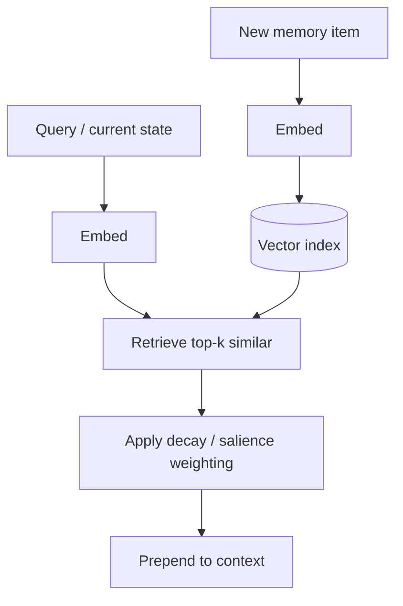

# Vector Memory

**Also known as:** Embedding-Indexed Memory, Vector Store Memory

**Category:** Memory  
**Status in practice:** mature

## Intent

Store memories as embeddings in a vector index and retrieve the most semantically similar items at query time.

## Context

A long-running agent accumulates facts and observations over time, and on each step it needs to find the small subset of past items that is relevant to the current situation. Relevance is best judged by semantic similarity rather than by exact term match or chronological recency: 'find the past notes whose meaning is close to what is happening now'.

## Problem

An append-only log of everything the agent has seen grows unboundedly and quickly becomes too large to search by linear scan. Without a semantic retrieval layer, the agent has no way to find the relevant past, because keyword search misses paraphrase and chronological recency misses older but topically relevant items. The team needs a memory store that supports similarity queries against an embedding of the current context, so that the agent can pull back exactly the items it should be thinking about now.

## Forces

- Embedding choice constrains retrieval quality.
- Index updates have non-trivial latency.
- Forgetting is achieved by deletion or decay; both have failure modes.

## Applicability

**Use when**

- Long-running agents accumulate facts whose relevance is best judged by similarity.
- Append-only logs would otherwise grow unboundedly without retrieval.
- An embedding model and vector index can be deployed and maintained.

**Do not use when**

- Memory is small and a typed key-value store would serve better.
- Recency or exact-match retrieval matters more than semantic similarity.
- Vector index maintenance cost outweighs the retrieval benefit.

## Therefore

Therefore: embed every memory item and retrieve the top-k most similar at query time, so that recall is driven by semantic match instead of exact keys or scrollback position.

## Solution

Each memory item is embedded and indexed. At query time, embed the query (or a summary of current state), retrieve top-k most similar memories, prepend to context. Optional decay (boost recent, age old) and salience weighting.

## Example scenario

A long-running personal agent's append-only thought log grows past a million entries; finding relevant past becomes hopeless and dumping it all into context is impossible. The team embeds each memory item, indexes it in a vector store, and at query time retrieves top-k semantically similar items (plus optional recency boost). Now 'what did I decide about latency three months ago' returns the actual right entries rather than the most recent or none, and prompt size stays bounded as memory grows.

## Diagram

## Consequences

**Benefits**

- Semantically relevant past surfaces automatically.
- Scales to memory stores too large for context.

**Liabilities**

- Misses purely temporal queries ('what did I do yesterday?').
- Embedding drift on schema changes.

## What this pattern constrains

The agent reads memory only through the retriever; full-store scans are not part of the loop.

## Known uses

- **MemGPT / Letta archival memory** — *Available*
- **Generative Agents memory stream (Park et al.)** — *Available*
- **LangChain VectorStoreRetrieverMemory** — *Available*

## Related patterns

- *used-by* → [memgpt-paging](memgpt-paging.md)
- *specialises* → [naive-rag](naive-rag.md) — Vector Memory is RAG over the agent's own past.
- *alternative-to* → [knowledge-graph-memory](knowledge-graph-memory.md)
- *used-by* → [self-archaeology](self-archaeology.md)
- *used-by* → [co-located-memory-surfacing](co-located-memory-surfacing.md)
- *complements* → [salience-attention-mechanism](salience-attention-mechanism.md)

## References

- (paper) Park et al., *Generative Agents: Interactive Simulacra of Human Behavior*, 2023, <https://arxiv.org/abs/2304.03442>

**Tags:** memory, vector, embedding
