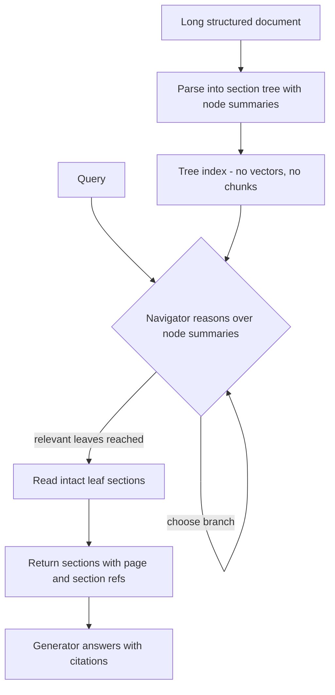

# Vectorless Reasoning-Based Retrieval

**Also known as:** Reasoning-Based RAG, Tree-Search Retrieval, Table-of-Contents Retrieval, Vectorless RAG

**Category:** Retrieval & RAG  
**Status in practice:** experimental

## Intent

Retrieve by having the model reason its way down a document's own table-of-contents tree to the relevant sections, instead of embedding chunks and ranking them by vector similarity.

## Context

A team answers questions over long, structured professional documents — financial filings, contracts, regulatory manuals, technical specifications — where the source already carries a clear hierarchy of parts, sections, and subsections. The standard retrieval-augmented pipeline splits each document into fixed-size chunks, embeds them, and at query time returns the chunks whose embeddings sit closest to the query in vector space. On these documents that pipeline keeps surfacing passages that look similar to the question but are not the ones that answer it, and chunk boundaries cut tables, clauses, and definitions in half.

## Problem

Vector similarity is a proxy for relevance, and on long professional documents the proxy breaks down: the passage that repeats the query's words is often not the passage that answers it, while the passage that does answer it shares little surface vocabulary. Fixed-size chunking compounds the mismatch by severing the structure the document relied on to make sense — a number is separated from the line item it belongs to, a clause from the term it defines. The retrieved context is also opaque: the system returns vector hits with no account of why this span and not another, so an analyst cannot audit the retrieval and the generator inherits whatever the embedding happened to rank highest.

## Forces

- Surface similarity and topical relevance diverge on dense, jargon-heavy documents, yet similarity is what embeddings measure.
- Chunking is needed to fit an embedding window but destroys the document's own structure.
- Reasoning over structure is more accurate but spends an LLM call per navigation step, where a vector lookup is a single cheap nearest-neighbour query.
- Retrieval that cannot be explained cannot be audited, which matters most in the regulated domains where these documents live.

## Applicability

**Use when**

- Documents are long and carry a clear, reliable hierarchy of parts, sections, and subsections worth navigating.
- The domain is one where vocabulary overlap misleads similarity search — finance, law, regulatory, technical manuals.
- Retrieval must be auditable, with each result pointing to a named page and section.
- Keeping spans intact — tables, clauses, definitions — matters more than embedding-window economy.

**Do not use when**

- The corpus is large and unstructured and queries are broad lookups that similarity search already serves well.
- Documents are flat or have no usable section structure for the model to navigate.
- Per-query latency and cost budgets cannot absorb an LLM call per navigation step.
- Queries are corpus-wide sensemaking that needs cross-document aggregation rather than within-document navigation.

## Therefore

Therefore: build a tree index from the document's own section hierarchy and let the model reason from node to node down that tree to the answer, so retrieval is driven by relevance judgements over structure rather than by similarity over embeddings.

## Solution

At index time, parse the document into a tree that mirrors its natural structure — parts, sections, subsections — and write a short summary at each node, keeping the leaf text intact rather than splitting it into fixed-size chunks. No embeddings are computed and no vector store is built. At query time, present the model with the tree as a table of contents and have it judge which branch is most likely to hold the answer, descend into that node, and repeat — a tree search in which the model, not a similarity score, decides each step. The walk ends at the leaf sections the model judges relevant, and retrieval returns those sections together with their page and section identifiers, so every result is traceable to a named location in the source. Compose with a generator that reads the returned sections, and with citation-attribution since the page and section references are already in hand.

## Variants

- **Single-pass tree selection** — The model is shown the whole table-of-contents tree at once and selects the relevant node set in one call, then reads those leaves. Use when the tree fits in context and a single reasoning pass can pick the right sections.
- **Iterative tree descent** — The model descends one level at a time, choosing a branch, reading its children's summaries, and recursing, like a depth-first tree search. Use when the tree is large or deep and showing it whole would not fit or would dilute the decision.
- **Agentic tree navigation** — An agent loop drives the tree navigator as one tool among others, deciding when to descend, backtrack, or stop. Use when retrieval needs to interleave with other tools or to recover from a wrong branch.

## Diagram

## Example scenario

An analyst asks a question over a 200-page annual report — what was the year-over-year change in operating cash flow, and what did management attribute it to? A chunk-and-embed pipeline returns several passages that mention operating cash flow but not the one tying the figure to management's explanation, because that explanatory paragraph shares little vocabulary with the question. The team switches to a vectorless approach: the report is parsed into its own table-of-contents tree, and the model reads the section titles, descends into the cash-flow statement and then the management-discussion section, and returns those two sections with their page numbers. The answer is grounded in named sections the analyst can open and check, and no chunk boundary split the figure from its surrounding line items.

## Consequences

**Benefits**

- Retrieval follows the document's own structure, so spans stay whole and a result is a named section rather than an arbitrary window.
- Every retrieval is traceable to a page and section, which makes the step auditable and feeds citations directly.
- There is no embedding model, vector store, or chunking pipeline to build, tune, or keep in sync as the corpus changes.
- Relevance is a reasoning judgement, so a section that answers the query in different words than it uses is still reachable.

**Liabilities**

- Each navigation step is an LLM call, so retrieval latency and cost scale with tree depth rather than with a single nearest-neighbour lookup.
- A wrong branch choice high in the tree is unrecoverable for that walk — the same failure mode as any top-down routing.
- The approach assumes the document has a usable hierarchy; flat or poorly structured sources give the model little to navigate.
- It targets retrieval within structured documents and does not address corpus-wide retrieval across many unstructured sources, where similarity search still earns its place.

## What this pattern constrains

Retrieval may only return sections the model reaches by reasoning down the document tree; a passage the walk never descends into is not retrievable, and there is no similarity-ranked fallback over the whole corpus.

## Known uses

- **[PageIndex (VectifyAI)](https://github.com/VectifyAI/PageIndex)** — *Available* — Open-source (MIT) reference implementation: builds a table-of-contents tree from a document and has an LLM tree-search it for retrieval, returning page and section references rather than vector hits. Ships an MCP server and an OpenAI Agents SDK example that expose the tree navigator as a retrieval tool.

## Related patterns

- *alternative-to* → [naive-rag](naive-rag.md)
- *alternative-to* → [hierarchical-retrieval](hierarchical-retrieval.md)
- *alternative-to* → [graphrag](graphrag.md)
- *used-by* → [agentic-rag](agentic-rag.md)
- *complements* → [citation-attribution](citation-attribution.md)

## References

- (repo) VectifyAI, *PageIndex — Vectorless, Reasoning-based RAG*, 2025, <https://github.com/VectifyAI/PageIndex>
- (blog) VectifyAI, *PageIndex: Reasoning-Based RAG*, <https://pageindex.ai/blog/pageindex-intro>
- (doc) *PageIndex documentation*, <https://docs.pageindex.ai>

**Tags:** rag, retrieval, vectorless, tree-search, reasoning, long-document
