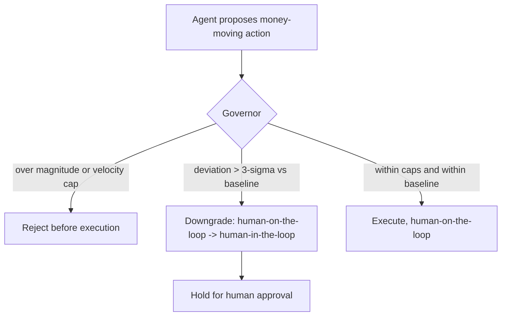

# Velocity-and-Magnitude Governor

**Also known as:** Velocity Governor, Magnitude Governor, Pre-Trade Velocity Control

**Category:** Safety & Control  
**Status in practice:** emerging

## Intent

Hard-code per-unit-time caps on the financial magnitude of agent actions, and on any deviation beyond a statistical threshold force a downgrade from human-on-the-loop to human-in-the-loop.

## Context

An agent acts inside a market or money-moving system where each step carries financial weight: it places orders, sizes positions, moves funds, or commits spend. The dangerous variable is not how many calls the agent makes per second but how many dollars it commits per second. A loop bug, a mispriced signal, or a prompt injection can drive the agent to commit a large notional in a window too short for any human to notice, and a healthy call rate can still hide a runaway dollar rate.

## Problem

Generic throttles bound the wrong quantity. Capping requests, tokens, or loop iterations leaves dollars-per-second unbounded, so an agent that stays well within its call budget can still place orders far larger or faster than its established baseline before anyone intervenes. Conversely a flat per-action cost ceiling ignores velocity: many small actions in a tight window aggregate into a large exposure that no single action trips. The system needs a control that bounds committed financial magnitude per unit time, recognises when the agent's volume or value departs from its normal envelope, and reacts proportionally rather than only by a full stop.

## Forces

- A throttle tuned for compute (calls, tokens, steps) does not bound exposure; the same call rate can hide a benign dollar rate or a catastrophic one.
- A fixed dollar ceiling per action misses velocity, while a pure velocity counter misses one oversized action; a useful governor must bound both magnitude and rate together.
- An out-of-band halt is too blunt for a deviation that is large but plausible, yet leaving a >3-sigma departure to run autonomously is too permissive; the response must be graduated.
- Tight caps and an eager downgrade trigger stop runaways but also stall legitimate high-value bursts, so the baseline and threshold must be calibrated, not guessed.

## Therefore

Therefore: meter committed financial magnitude per unit time against a calibrated baseline, and on a beyond-threshold deviation degrade the agent's autonomy from human-on-the-loop to human-in-the-loop instead of letting it continue or killing it outright.

## Solution

Borrow the pre-trade control of high-frequency trading and place a governor in the action path that every money-moving step must clear. The governor maintains hard caps on financial magnitude per unit time across several horizons (notional per second, order or transaction size, cumulative position, transactions per window) and a rolling baseline of normal volume and value. Each pending action is checked against the caps; an action that would breach a cap is rejected before it executes. In parallel the governor scores how far the current volume or value departs from baseline, and when that deviation exceeds a statistical threshold (for example more than three sigma) it forces an autonomy downgrade: the agent moves from human-on-the-loop, where a human watches but rarely intervenes, to human-in-the-loop, where every further material action waits for affirmative human approval. The downgrade is graduated and automatic, distinct from a full halt, and the baseline plus threshold are calibrated from historical activity rather than assumed.

## Structure

```
Agent action --> Governor [magnitude caps + velocity caps + baseline deviation score] --(within caps & within sigma)--> execute (human-on-the-loop) ; --(over cap)--> reject ; --(>3-sigma deviation)--> downgrade to human-in-the-loop, hold for approval
```

## Diagram



*Every money-moving action clears the governor: caps reject oversized or too-fast actions, and a beyond-threshold deviation downgrades autonomy to human-in-the-loop.*

## Example scenario

A trading-desk agent is cleared to place orders on its own while an analyst watches the dashboard. Its strategy hits a feedback loop and starts firing buy orders ten times larger and far faster than its usual pattern. The governor caps each order at the per-second notional limit, rejects the ones over size, and because the burst is more than three sigma above the agent's baseline it downgrades the agent so the analyst must approve every further order before it reaches the market.

## Consequences

**Benefits**

- Bounds dollars-per-second, not just calls-per-second, so a runaway that stays within its compute budget still cannot commit an unbounded notional.
- Couples magnitude and velocity, catching both one oversized action and many small actions that aggregate within a tight window.
- Responds proportionally: a large-but-plausible deviation tightens human oversight rather than halting the system, preserving availability while removing the agent's unsupervised authority.

**Liabilities**

- A baseline or threshold set too tight stalls legitimate high-value bursts and trains operators to wave approvals through.
- A baseline learned from a quiet period under-bounds a volatile one, so the caps and sigma threshold need recalibration as conditions shift.
- An attacker who can drift the baseline slowly (for example by ramping volume over days) can raise the ceiling before the harmful burst.

## Failure modes

- Baseline drift exploitation — slow ramping moves the rolling baseline upward so a later large burst no longer reads as a deviation.
- Approval rubber-stamping — frequent downgrades desensitise the human-in-the-loop reviewer, who approves the runaway action the control was meant to surface.
- Aggregation blind spot — magnitude is metered per action but velocity is not, so many sub-threshold actions clear the governor and sum to an unbounded exposure.
- Calibration lag — caps tuned for calm markets are too loose in a volatile window, letting harmful magnitude through before recalibration.

## What this pattern constrains

An action whose committed financial magnitude or velocity would exceed a per-unit-time cap cannot execute; and once a deviation crosses the statistical threshold the agent must not perform further material actions autonomously, only with explicit human-in-the-loop approval.

## Applicability

**Use when**

- Agent actions move money or take market positions, so the quantity worth bounding is committed financial magnitude per unit time rather than call or token count.
- A stable baseline of normal volume and value exists, so a deviation threshold (for example three sigma) can be calibrated rather than guessed.
- A graduated response is wanted: a large-but-plausible deviation should tighten human oversight rather than halt the system outright.

**Do not use when**

- Actions carry no financial weight, where bounding compute with rate limiting or a step budget is the right control.
- No reliable baseline of normal activity exists, so a statistical-deviation trigger would fire arbitrarily.
- The only acceptable response to a breach is a full stop, where a kill switch fits better than a graduated autonomy downgrade.

## Components

- Governor — the in-path gate every money-moving action must clear before it executes
- Magnitude caps — hard ceilings on notional, order or transaction size, and cumulative position
- Velocity caps — hard ceilings on committed value and transaction count per time window
- Baseline model — rolling estimate of the agent's normal volume and value, with a statistical deviation threshold
- Autonomy controller — lowers the agent from human-on-the-loop to human-in-the-loop when the deviation crosses the threshold
- Approval hold — queue where material actions wait for affirmative human sign-off after a downgrade

## Tools

- Pre-trade risk engine — meters each pending action against magnitude and velocity caps in the action path
- Time-windowed counters — track cumulative value and action count per second, minute, and longer horizons
- Statistical baseline store — holds the rolling mean and variance used to score deviation against the sigma threshold
- Human approval queue — routes held actions to an operator for sign-off after an autonomy downgrade

## Evaluation metrics

- Maximum committed notional per unit time — confirms the magnitude-per-second ceiling actually holds under load
- Time-to-downgrade — latency from a beyond-threshold deviation to the agent losing autonomous authority
- False-trip rate — fraction of legitimate high-value bursts wrongly downgraded, indicating caps or threshold set too tight
- Escaped-exposure rate — exposure committed beyond the intended caps, including via aggregated sub-threshold actions
- Approval dwell and override rate — how long held actions wait and how often reviewers approve them, surfacing rubber-stamping

## Known uses

- **[High-frequency trading pre-trade risk controls](https://www.sec.gov/rules/final/2010/34-63241.pdf)** _available_ — Exchange and broker-mandated pre-trade checks (notional caps, maximum order size, position limits, message-rate limits) that every order clears before it reaches the market; the source of the velocity-and-magnitude framing for agentic systems.
- **[Sakura Sky trustworthy-agent primitives](https://www.sakurasky.com/blog/missing-primitives-for-trustworthy-ai-part-6/)** _pure-future_ — Proposes velocity and magnitude governors, borrowed from high-frequency trading, as hard-coded constraints on agent behavior alongside kill switches and circuit breakers.
- **[CDOTrends FSI agent control proposal](https://www.cdotrends.com/story/4854/your-fsi-ai-needs-kill-switch-should-terrify-you)** _pure-future_ — Argues that when an agent's transaction volume deviates by more than three sigma from baseline the system must force a transition from human-on-the-loop to human-in-the-loop.

## Related patterns

- _alternative-to_ **Rate Limiting** — Rate limiting caps requests, tokens, or calls per window; the governor caps committed financial magnitude per window instead — same throttle shape, a different governed quantity (dollars-per-second, not calls-per-second).
- _complements_ **Cost Gating** — Cost gating blocks a single action whose expected cost crosses a threshold; the governor adds the velocity dimension (cumulative magnitude per unit time) and a statistical-deviation trigger that gating alone does not have.
- _complements_ **Autonomy Slider** — The governor's beyond-threshold deviation is what drives the slider down from human-on-the-loop to human-in-the-loop; the slider expresses the autonomy level, the governor decides when to lower it.
- _complements_ **Kill Switch** — A kill switch is a full out-of-band halt; the governor is the graduated step before it, downgrading autonomy on a large-but-plausible deviation rather than stopping the system outright.

## References

- [Trustworthy AI Agents: Kill Switches and Circuit Breakers (Missing Primitives, Part 6)](https://www.sakurasky.com/blog/missing-primitives-for-trustworthy-ai-part-6/)
- [Your FSI AI Needs a Kill Switch. That Should Terrify You.](https://www.cdotrends.com/story/4854/your-fsi-ai-needs-kill-switch-should-terrify-you)
- [SEC Rule 15c3-5: Risk Management Controls for Brokers or Dealers with Market Access](https://www.sec.gov/rules/final/2010/34-63241.pdf) — 2010
