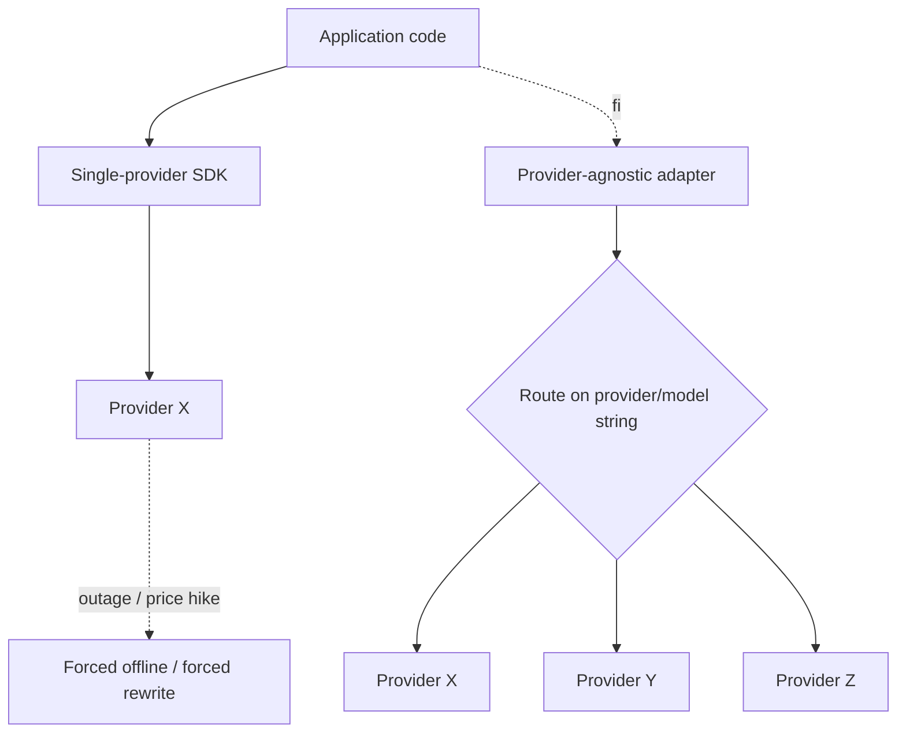

# Vendor Lock-In

**Also known as:** Single-Provider Coupling, Hard-Coded Provider SDK, Provider-Specific Application Code

**Category:** Anti-Patterns  
**Status in practice:** deprecated

## Intent

Anti-pattern: couple application code directly to one model provider's SDK, request shape, and proprietary features so that switching providers requires rewriting application code rather than swapping an adapter.

## Context

A team is building an LLM application or agent framework directly against a single provider's SDK — calling its specific request shape, depending on its proprietary streaming chunks, using its particular tool-call format. There is no abstraction layer between the application code and the vendor SDK, because the team has no immediate plan to support a second provider and the SDK exposes useful features that would be diluted by a lowest-common-denominator interface.

## Problem

Every provider has its own request schema, its own streaming semantics, its own tool-call shape, and its own rate-limit headers. Application code that has been written directly against one provider cannot be redirected to another without invasive changes through the whole codebase, because the vendor's shape has leaked everywhere. Once that coupling exists, the team can no longer evaluate routing requests to a cheaper or stronger competitor for the same task, cannot fall back to another provider during an outage, and cannot move workloads for compliance reasons. Switching providers is a normal lifecycle event, not a hypothetical one, and vendor lock-in turns it into a rewrite.

## Forces

- Provider SDKs are richer than the lowest common denominator and expose useful proprietary features.
- An abstraction layer adds maintenance cost and may lag behind upstream features.
- Per-provider quirks (streaming chunks, tool-call shapes, rate-limit headers) are non-trivial to unify.
- Switching providers for quality, cost, or compliance reasons is a normal lifecycle event, not a hypothetical.

## Applicability

**Use when**

- Never as a deliberate choice. If you must bind to one provider for a feature, isolate the binding behind a feature module.
- Treat the provider as a swappable adapter from the first commit; retrofitting an abstraction later is expensive.
- Even one-provider deployments benefit from an adapter — outages and price changes do happen.

**Do not use when**

- The application is expected to live longer than one provider contract cycle (twelve to twenty-four months).
- Compliance, cost, or quality may push the team to a different provider in future.
- The application reads provider headers, error shapes, or rate-limit semantics directly — those will diverge.

## Therefore

Therefore: code against a provider-agnostic interface (a unified language-model spec, a `provider/model` string router, or a thin adapter), so that swapping providers is a configuration change rather than a code rewrite.

## Solution

Don't couple application code to one provider's surface. Use a provider-agnostic abstraction (Vercel AI SDK's language model spec, LiteLLM, Mastra's `provider/model` string, OpenAI-API-compatible adapters) and keep provider-specific extensions behind capability flags. Where a feature only exists on one provider, isolate it in a feature module rather than threading it through the agent loop. See provider-string-routing, provider-fallback, multi-model-routing.

## Example scenario

A startup builds its agent product against one provider's SDK, threading provider-specific objects through the agent loop and reading provider-specific error fields in retry logic. Two years later, the provider doubles per-token price and tightens rate limits; the team wants to fall back to a competitor for cheap traffic and keep the incumbent for hard tasks. The migration takes three months because tool-call shapes, streaming chunk formats, and error semantics are all wired into application code. They rebuild against a provider-agnostic adapter and a `provider/model` string router; the next vendor evaluation is a config change.

## Diagram

## Consequences

**Liabilities**

- Provider outage forces the whole application offline.
- Quality/cost evaluation against rival providers becomes a fork-and-rewrite project.
- Compliance moves (regional providers, sovereign inference) require invasive rewrites.
- Negotiating-leverage with the incumbent provider erodes over time.

## What this pattern constrains

By definition, this anti-pattern imposes no useful constraint; the missing constraint — application code must not depend on provider-specific surface — is the failure mode.

## Known uses

- **Vercel AI SDK (named as a deliberate design rejection)** — Vercel AI SDK explicitly frames its standardised language-model specification against vendor lock-in. *Available* — [link](https://ai-sdk.dev/docs/foundations/providers-and-models)
- **LiteLLM** — OpenAI-compatible proxy across 100+ providers, marketed as the lock-in avoidance layer. *Available* — [link](https://docs.litellm.ai/)

## Related patterns

- *alternative-to* → [provider-string-routing](provider-string-routing.md)
- *alternative-to* → [provider-fallback](provider-fallback.md)
- *alternative-to* → [multi-model-routing](multi-model-routing.md)
- *complements* → [sovereign-inference-stack](sovereign-inference-stack.md)

## References

- *doc*: [Vercel AI SDK — Providers and Models](https://ai-sdk.dev/docs/foundations/providers-and-models) — Vercel

**Tags:** anti-pattern, routing-composition, provider-agnostic, vercel-ai-sdk
