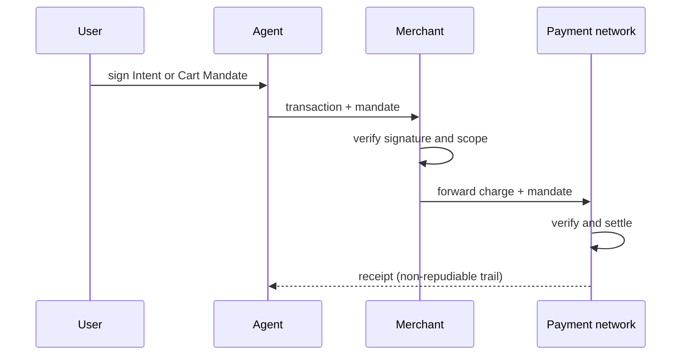

# Verifiable Purchase Mandate

**Also known as:** Signed Purchase Mandate, Agent Payment Mandate

**Category:** Safety & Control  
**Status in practice:** emerging

## Intent

Anchor agent-initiated payments in a cryptographically signed mandate that captures the user's authorization and travels with the transaction, so a merchant or payment network can independently verify the agent acted on genuine user intent.

## Context

An agent shops and pays on a user's behalf — booking travel, restocking supplies, settling an API bill. Traditional payment rails assume a human is present at checkout and authorises each charge directly through a card entry, a tap, or a one-time code. When an agent drives the checkout that assumption breaks, and the merchant and payment network see a charge with no direct proof that the human actually approved it.

## Problem

Without verifiable evidence of authorization, an agent's payment is indistinguishable from an error, a hallucination, or a compromised key. A merchant cannot tell an approved purchase from an over-eager agent buying the wrong item, the network cannot attribute liability in a dispute, and a blanket pre-authorization that lets the agent spend freely gives away accountability. The system needs proof, checkable after the fact by parties who never saw the user, that a specific purchase matched a specific human authorization.

## Forces

- Autonomy wants the agent to transact without a human present at the moment of purchase; accountability wants every charge tied to a verifiable human decision.
- A broad standing authorization is convenient but surrenders non-repudiation, while a per-charge human approval preserves proof and defeats the point of delegating to an agent.
- The merchant and payment network verifying the purchase never observed the user, so trust has to ride in the transaction itself rather than in the agent's word.

## Therefore

Therefore: have the user cryptographically sign a mandate stating what they authorised, attach it to the transaction, and let each downstream party verify the signature, separating an upfront conditional Intent Mandate for delegated autonomous spend from an explicit Cart Mandate that approves exact items and price in real time.

## Solution

Represent the user's authorization as a signed mandate — a tamper-evident credential such as a signed JSON-LD object that records the conditions or the exact cart the user approved. For a real-time purchase the user signs a Cart Mandate over the finalised items and price; for a delegated task the user signs an Intent Mandate upfront stating the conditions under which the agent may buy, and the agent later produces a transaction that the mandate covers. The mandate travels with the payment so the merchant, the credential provider, and the network each verify the signature and confirm the charge falls within what was authorised, leaving a non-repudiable trail for dispute resolution.

## Structure

```
User --sign(Intent|Cart Mandate)--> Agent --transaction + mandate--> Merchant --verify--> Payment network --verify + settle--> non-repudiable audit trail.
```

## Diagram



*The user's signed mandate travels with the transaction; each party verifies it independently, leaving a non-repudiable record.*

## Example scenario

A user tells a shopping agent 'reorder my usual coffee when we run low, up to 30 euros a month' and signs an Intent Mandate stating that limit. Two weeks later the agent finds the coffee at 18 euros and places the order, presenting a transaction the mandate covers. The merchant and payment network verify the user's signature, and the charge clears with a record that ties it back to the original authorization.

## Consequences

**Benefits**

- A merchant or network can verify, without having seen the user, that a charge matches a specific signed authorization.
- Intent versus Cart mandates let one scheme cover both autonomous delegated spend and real-time human-approved checkout.
- The signed trail gives dispute resolution and liability attribution a deterministic anchor instead of the agent's unverifiable claim.

**Liabilities**

- Key management becomes load-bearing: a stolen or mis-scoped signing key forges authorization just as a stolen card does.
- An over-broad Intent Mandate re-opens the accountability gap it was meant to close, authorising purchases the user would not have made.
- Every party in the chain must implement and verify the credential format, raising integration cost and coupling to the protocol.

## Failure modes

- Over-broad intent — the Intent Mandate's conditions are loose enough that the agent buys something the user never meant to authorise, yet it still verifies.
- Replay or scope creep — a mandate is reused beyond the single transaction or amount it was meant to cover.
- Key compromise — a leaked signing key mints valid mandates, and verification cannot distinguish them from genuine ones.

## What this pattern constrains

An agent cannot complete a payment without presenting a mandate that the merchant and network can verify; a charge that exceeds or falls outside the signed Intent or Cart Mandate must be rejected, and no party may settle on the agent's assertion alone.

## Applicability

**Use when**

- Agents complete purchases or payments where a merchant or network must trust that a human authorised the spend.
- Disputes and liability require after-the-fact proof of what the user actually approved.
- Both autonomous delegated buying and real-time human-approved checkout must be supported under one scheme.

**Do not use when**

- A human is present and authorises each charge through the normal payment flow, so no agent-specific proof is needed.
- Spending happens inside a closed system that already trusts the agent's identity end-to-end.
- The added key-management and protocol-integration cost outweighs the value for low-stakes, easily reversible transactions.

## Components

- Mandate — a signed credential stating the conditions (Intent) or the exact cart (Cart) the user authorised
- User signing key — the credential the user holds to authorise spend; its security underpins the whole scheme
- Agent — constructs the transaction and attaches the covering mandate
- Merchant verifier — checks the signature and that the charge falls within the mandate
- Payment network — re-verifies the mandate, settles, and retains the trail for disputes

## Tools

- Verifiable digital credential / JSON-LD signing — produces the tamper-evident mandate
- Public-key signature verification — lets each downstream party check authorization without the user present
- Agent payment protocol (AP2, x402, ACP) — carries the mandate alongside the charge

## Evaluation metrics

- Share of agent charges carrying a verifiable mandate versus unauthenticated charges
- Dispute-resolution time and chargeback rate against mandate-backed transactions
- Out-of-scope charge rate — transactions attempted outside the signed mandate's bounds
- Intent-mandate breadth — how often a delegated mandate authorises a purchase the user later disowns

## Known uses

- **[Agent Payments Protocol (AP2)](https://ap2-protocol.org/)** _available_ — Google-led open protocol; Mandates are cryptographically signed verifiable credentials (Intent, Cart, Payment) proving user authorization to merchants and networks.
- **[Agentic Commerce Protocol (ACP)](https://www.agenticcommerce.dev/)** _available_ — OpenAI and Stripe protocol where the buyer authorises spend inside the agent and the agent receives a scoped, verifiable payment token for the merchant.

## Related patterns

- _complements_ **Agent-Initiated Payment** — Agent-initiated payment answers a payment-required challenge with a proof of payment; the mandate is the upstream proof of user authorization that makes that charge accountable.
- _complements_ **Session-Scoped Payment Authorization** — Session scoping bounds how much the agent may spend; the mandate proves the user authorised the spend in the first place — bound and proof are orthogonal.
- _complements_ **Delegated Agent Authorization** — Delegated authorization scopes the agent's credentials; the purchase mandate is the per-transaction, network-verifiable evidence layered on top for commerce.
- _complements_ **Deontic Token Delegation** — Both reify a permission as a transferable artifact; deontic tokens carry obligations along a delegation chain, the mandate carries a signed purchase authorization to the payment network.
- _complements_ **Agent-Readable Commerce Surface** — The commerce surface accepts the charge; the purchase mandate is the signed user authorization the surface verifies before fulfilling.

## References

- [AP2 — Agent Payments Protocol Documentation (Mandates)](https://ap2-protocol.org/) — Google, 2026
- [Announcing Agent Payments Protocol (AP2)](https://cloud.google.com/blog/products/ai-machine-learning/announcing-agents-to-payments-ap2-protocol) — Google Cloud, 2025
- [Agentic payments protocols compared: MPP, ACP, AP2, x402](https://www.crossmint.com/learn/agentic-payments-protocols-compared) — Crossmint, 2026
