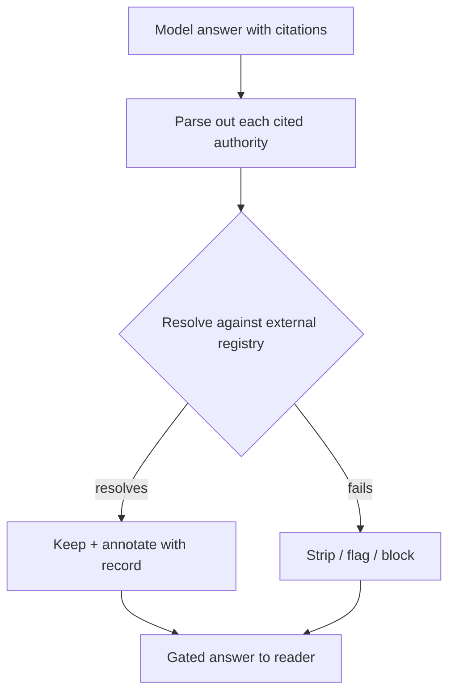

# Verify-Before-Cite Resolution Gate

**Also known as:** Citation Resolution Gate, Authority Existence Check

**Category:** Verification & Reflection  
**Status in practice:** emerging

## Intent

After generation, resolve every cited authority against an external ground-truth registry and strip or block any citation that does not exist before the answer reaches the reader.

## Context

A research, legal, or medical assistant produces answers that cite external authorities — case names, docket numbers, statutes, papers, digital object identifiers — and those citations carry weight the reader will act on. The system may already retrieve documents, but the model can still write a citation that was never retrieved, paraphrase a real case under a wrong number, or invent a plausible authority outright. The authorities being cited live in external indexes the model does not control, such as Westlaw, LexisNexis, CourtListener, or PubMed.

## Problem

Language models are fluent at producing authoritative-looking references that do not resolve to anything real, and the fabrication looks correct until a reader checks it. In regulated domains a single non-existent citation that ships can trigger sanctions, retractions, or lasting loss of trust. Binding a citation to a retrieved chunk is not enough, because the cited authority may sit outside the retrieval set entirely, and the model's own confidence in the citation is uncorrelated with whether the authority exists. The system needs an external, deterministic existence check that runs on the finished output rather than trusting the text as written.

## Forces

- A citation that resolves inside a closed retrieval registry can still name an authority that does not exist in the wider world the registry does not cover.
- Resolving against an external authority index is a deterministic lookup, but the index has rate limits, latency, and coverage gaps that a citation gate must tolerate.
- Stripping a non-resolving citation protects the reader but can leave a claim unsupported, forcing a choice between a weaker answer and a blocked one.

## Therefore

Therefore: parse every cited authority out of the finished output, resolve each one against an external ground-truth registry, and keep a citation only once it resolves — strip, flag, or block the rest.

## Solution

Run a deterministic post-generation stage between the model and the reader. First parse the structured citations out of the answer: case names and docket numbers, statute identifiers, paper titles, digital object identifiers. For each, query an external authority index — a legal database such as Westlaw, LexisNexis, or CourtListener, or a medical index such as PubMed — and require an exact match on the load-bearing fields (the docket number, the jurisdiction, the title verbatim). A citation that resolves is kept and annotated with the resolved record. A citation that fails to resolve — fabricated, repealed, wrong jurisdiction, non-existent docket — is stripped from the output, flagged for review, or, in the strictest setting, blocks delivery of the whole answer until a human or a regeneration pass repairs it. The gate is deterministic and runs on every output, so the model cannot smuggle an invented authority past it regardless of how confident the prose sounds.

## Structure

```
Model answer --parse--> Citation extractor --resolve each--> External authority registry --(resolves? keep+annotate / fails? strip|flag|block)--> Gated answer to reader
```

## Diagram



*Each cited authority is resolved against an external registry; only resolving citations reach the reader.*

## Example scenario

A legal-research assistant drafts a memo that cites four cases and two statutes. Before the memo renders, a resolution gate parses out each citation and queries CourtListener and a statute index. Three cases resolve and are annotated with links; the fourth — a real-sounding name with a docket number that matches no court record — fails to resolve, so the gate strips it and flags the supporting claim as unsourced. One statute resolves but to a repealed version, and the gate marks it for review. The reader never sees an authority that does not exist.

## Consequences

**Benefits**

- Every authority that reaches the reader has been confirmed to exist in an external index, closing the gap that retrieval-internal binding leaves open.
- The check is deterministic and uniform across outputs, so fabricated, repealed, and wrong-jurisdiction citations are caught by the same gate.
- The resolved record can be attached to each kept citation, giving the reader a traceable link back to the authority.

**Liabilities**

- Registry coverage gaps and exact-match strictness can strip a citation that is real but indexed differently, weakening a correct answer.
- An external lookup per citation adds latency and depends on an index that may rate-limit or go down.
- Stripping citations silently can leave claims unsupported unless the gate also surfaces what it removed.

## Failure modes

- False strip — a real authority indexed under a slightly different title or number fails the exact match and is removed from a correct answer.
- Coverage blind spot — the cited authority is valid but lives in a jurisdiction or index the registry does not cover, so the gate cannot confirm it either way.
- Surface-match pass — the registry confirms a docket number exists but not that it supports the claim the model attached to it, so a real-but-misapplied citation slips through.

## What this pattern constrains

A citation may not appear in the output until it resolves against the external authority index; non-resolving citations are stripped, flagged, or block delivery, and a citation that cannot be checked against any registry must not be presented as verified.

## Applicability

**Use when**

- Outputs cite external authorities — cases, statutes, papers, digital object identifiers — that a reader will rely on or act upon.
- An external ground-truth registry exists that the cited authorities can be resolved against, such as Westlaw, CourtListener, or PubMed.
- A fabricated or wrong citation reaching the reader carries regulatory, safety, or trust consequences.

**Do not use when**

- The answer makes no external citations, so there is nothing to resolve.
- No authoritative registry covers the cited domain, so a resolution result would be neither confirm nor deny.
- Citations are already bound to a closed retrieval set and no external authority can be cited, in which case citation-attribution alone suffices.

## Components

- Citation extractor — parses structured citations (case names, docket numbers, statutes, titles, DOIs) out of the finished answer
- Resolver client — queries one or more external authority indexes and returns a match record or an explicit no-match
- Match policy — decides what counts as a resolution (exact docket, verbatim title, correct jurisdiction) versus a failure
- Disposition stage — keeps and annotates resolving citations and strips, flags, or blocks the rest
- External authority registry — the ground-truth index (Westlaw, LexisNexis, CourtListener, PubMed) the citations are checked against

## Tools

- Legal authority databases — Westlaw, LexisNexis, or CourtListener APIs for resolving case and docket citations
- Bibliographic indexes — PubMed or DOI resolvers for resolving paper and article citations
- Citation-parsing library — extracts and normalises citation strings into queryable fields

## Evaluation metrics

- Citation-resolution rate — fraction of cited authorities that resolve to a live, matching registry record
- Fabricated-citation block rate — share of non-existent citations the gate strips or blocks before delivery
- False-strip rate — fraction of real authorities wrongly removed because of indexing or match-strictness mismatch
- Gate latency per citation — added round-trip time of the external resolution lookup

## Known uses

- **[BriefCatch citation validation](https://www.briefcatch.com/blog/blog-citation-validation-engines-fake-case-law)** _available_ — Cross-references every citation in a legal document against authoritative databases (Westlaw, LexisNexis, CourtListener); a case that does not appear in any of them is flagged.
- **[NexLaw legal assistant](https://www.nexlaw.ai/)** _available_ — Legal-AI platform that validates generated case citations against legal sources rather than trusting the model's free-text references.
- **[HalluGraph (legal RAG)](https://arxiv.org/abs/2512.01659)** _planned_ — Graph-alignment auditor that scores whether entities and relations in a generated legal answer are grounded in source documents, reported AUC up to 0.979 on structured documents.
- **[vLex Vincent AI](https://vlex.com/vincent-ai)** _available_ — Legal research assistant (part of Clio) that returns answers with citations linked back to primary sources resolved against vLex's authority collection, so cited cases and materials are real rather than free-text.
- **[LexisNexis Lexis+ AI (Protege)](https://www.lexisnexis.com/en-us/products/lexis-plus-ai.page)** _available_ — Generative legal assistant whose responses are grounded in and linked to LexisNexis's verified case-law and statute databases, with benchmark hallucination rates below those of free-text models.
- **[Clearbrief Cite Check Report](https://www.lawnext.com/2025/12/clearbrief-launches-cite-check-report-to-give-law-firm-partners-an-audit-trail-against-ai-hallucinations.html)** _available_ — Word add-in that cross-references every citation in a brief against LexisNexis and Fastcase/vLex databases to flag missing or non-existent cases before filing.
- **[Reducing Hallucinations in Medical AI Through Citation-Enforced Prompting in RAG Systems](https://www.mdpi.com/2076-3417/16/6/3013)** _available_ — Medical-AI study showing citation-enforced RAG that grounds each generated reference against retrieved/indexed sources to suppress fabricated PubMed-style citations in clinical answers.

## Related patterns

- _alternative-to_ **Hallucinated Citations** — Hallucinated-citations is the anti-pattern of trusting free-text references; this gate is the positive remedy that resolves each one against an external registry before output.
- _complements_ **Citation Attribution** — Attribution binds answer spans to chunks inside this turn's closed retrieval registry; this gate adds an external existence check for authorities the retrieval set may never have contained.
- _complements_ **Canonical-Entity Grounding** — Entity grounding resolves identifiers the agent uses in actions against a system of record; this gate resolves authorities the model cites in output against an external index.
- _complements_ **Deterministic-LLM Sandwich** — The gate is the post-generation deterministic slice of the sandwich, specialised to resolving citations against an authority registry.

## References

- [Spotting Fake Case Law with Citation Validation Engines](https://www.briefcatch.com/blog/blog-citation-validation-engines-fake-case-law) — 2025
- [HalluGraph: Auditable Hallucination Detection for Legal RAG Systems via Knowledge Graph Alignment](https://arxiv.org/abs/2512.01659) — 2025
- [Citation Grounding: Detecting and Reducing LLM Citation Hallucinations via Legal Citation Graphs](https://arxiv.org/abs/2606.00898) — Volodymyr Ovcharov, 2026
- [Source or It Didn't Happen: A Multi-Agent Framework for Citation Hallucination Detection](https://arxiv.org/abs/2605.08583) — 2026
- [CiteCheck: Retrieval-Grounded Detection of LLM Citation Hallucinations in Scientific Text](https://arxiv.org/html/2605.27700v1) — 2026
