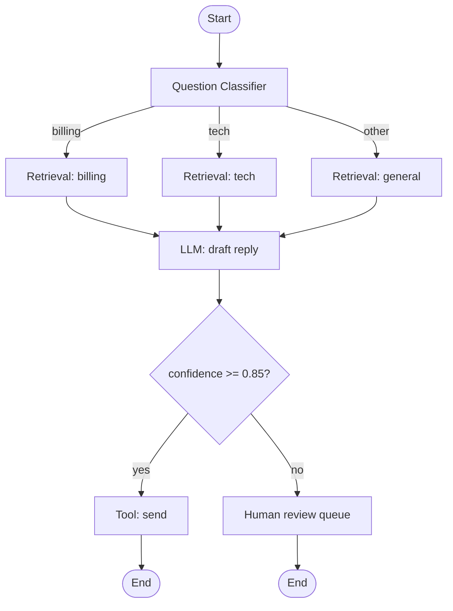

# Visual Workflow Graph

**Also known as:** Typed-Node Canvas, Drag-and-Drop Workflow Builder, Low-Code Agent Canvas

**Category:** Planning & Control Flow  
**Status in practice:** mature

## Intent

Express agentic logic as a visual graph of typed nodes connected on a canvas with Start and End nodes so non-coding stakeholders can read and edit the flow.

## Context

A team is building on a low-code or no-code platform — Dify, Coze, n8n, Flowise, Langflow, FastGPT, Bisheng — or in an IDE-embedded workflow editor, where the same product surface is used both by developers and by non-developers such as business users or operations teams. The workflow itself is the artefact those users will edit and review, not the code behind it.

## Problem

Procedural agentic code is dense and unfamiliar for non-coders, and review-heavy even for developers because the orchestration logic is buried inside source files. The graph topology — which nodes feed which, which branches gate which — is the part that most needs to be inspectable, but in a procedural codebase that topology has to be reconstructed by reading code. The platform needs a graph-shaped representation of the workflow as the primary artefact, with code only behind the individual nodes that need it.

## Forces

- Visual editing lowers the bar for non-developer contributors but raises the bar for version control and merge.
- A typed-node vocabulary (LLM, retrieval, tool, conditional, iteration, code) lets the canvas validate connections statically.
- The graph must round-trip with the runtime — what runs is what is drawn.
- Conditional and iteration nodes need to compose without becoming visually unreadable.
- Agent nodes inside the graph blur the line between deterministic workflow and agentic loop.

## Applicability

**Use when**

- Non-developer stakeholders must read, review, or edit the workflow.
- Topology inspectability is a stronger requirement than code-level concision.
- Iteration, conditional, and agent constructs need to compose visibly.
- The runtime can execute a serialised graph artefact directly.

**Do not use when**

- The workflow is mostly bespoke logic that the typed-node vocabulary cannot express cleanly.
- The team has no good story for diffing and reviewing the graph artefact.
- Latency budgets are so tight that node-by-node execution overhead is the bottleneck.
- The product needs LLM-driven dynamic plans rather than predefined topology.

## Therefore

Therefore: model the workflow as a typed-node graph with explicit Start and End nodes, validate connections by node-type contract, and execute the graph as drawn, so that topology is the source of truth and the canvas is what runs.

## Solution

Define a small vocabulary of node types — Start, End, LLM, Retrieval, Tool, Conditional, Iteration (see iteration-node), Code, Agent — each with a typed input/output schema. Build the workflow on a drag-and-drop canvas connecting nodes by edges; the editor validates connections by type. Persist the graph as a serialisable artefact (JSON/YAML) that the runtime executes directly. Pair with iteration-node (the per-element subgraph construct), pluggable execution semantics for Agent nodes, and policy-as-code-gate for guarded edges. Treat the canvas as a UI projection of the artefact, not the source of truth alone — diffs and reviews work on the artefact.

## Structure

Canvas (drag-and-drop UI) ↔ Graph artefact (JSON/YAML, version-controlled) ↔ Workflow runtime that executes the graph.

## Example scenario

A customer-success team wants to build a triage workflow that classifies incoming messages, retrieves relevant docs, drafts a reply, and routes high-confidence drafts to send while low-confidence drafts go to human review. Their engineering team uses Dify: a Start node receives the message; a Question Classifier routes by category; a Knowledge Retrieval node fetches docs per category; an LLM node drafts the reply; a Conditional node splits on confidence; one branch ends in Send, the other in Human Review. The whole workflow is one canvas. When customer success wants to add a new category, they edit the canvas; the engineering team reviews the artefact diff in the PR.

## Diagram

## Consequences

**Benefits**

- Topology is inspectable at a glance.
- Non-developers can read and propose edits.
- Typed-node contracts catch wiring errors before execution.
- Iteration, conditional, and agent nodes compose without leaving the canvas.
- The graph artefact is auditable and reviewable.

**Liabilities**

- Version-controlling visual diffs is harder than text diffs without good artefact-level diffing.
- Large graphs become visually unreadable — modularisation (subflows) is mandatory at scale.
- Lowest-common-denominator node vocabulary may not cover bespoke logic; Code escape-hatch nodes appear and bypass the canvas's safety.
- Cross-graph refactoring is harder than across-code refactoring.

## What this pattern constrains

All workflow logic must be expressed through typed nodes connected on the canvas; the runtime is not allowed to execute paths that do not appear in the graph artefact.

## Known uses

- **Dify** — Dify's headline feature is a visual canvas for building and testing AI workflows. *Available* — [link](https://github.com/langgenius/dify)
- **Coze** — Coze workflows expose a typed-node canvas with Start/End nodes and full agent/tool/conditional vocabulary. *Available* — [link](https://www.coze.com/)
- **n8n** — n8n's visual node canvas hosts AI Agent and Chain root nodes alongside conventional automation nodes. *Available* — [link](https://docs.n8n.io/)
- **Flowise / Langflow** — LangChain-family visual workflow builders with typed-node canvases. *Available* — [link](https://flowiseai.com/)
- **FastGPT / Bisheng** — Chinese-ecosystem visual workflow platforms with the same canvas shape. *Available*

## Related patterns

- *uses* → [iteration-node](iteration-node.md)
- *complements* → [event-driven-agent](event-driven-agent.md)
- *complements* → [policy-as-code-gate](policy-as-code-gate.md)
- *complements* → [agent-as-tool-embedding](agent-as-tool-embedding.md)
- *alternative-to* → [spec-first-agent](spec-first-agent.md)

## References

- *repo*: [Dify](https://github.com/langgenius/dify) — LangGenius
- *doc*: [n8n — AI nodes](https://docs.n8n.io/) — n8n

**Tags:** planning-control-flow, visual-workflow, low-code, dify, coze, n8n, flowise, langflow
