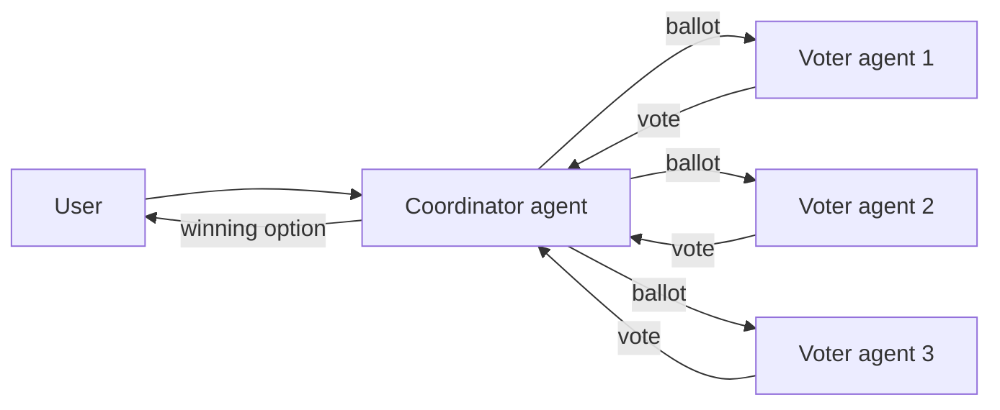

# Voting-Based Cooperation

**Also known as:** Multi-Agent Voting, Agent Consensus by Vote, Inter-Agent Election

**Category:** Multi-Agent  
**Status in practice:** emerging

## Intent

Finalise a decision across multiple agents by collecting and tallying their votes on candidate options, so the joint output reflects collective rather than single-agent judgement.

## Context

A multi-agent system in which several agents — possibly with different models, prompts, or perspectives — produce candidate answers or evaluations on the same task, and a single decision must be returned.

## Problem

Picking one agent's output as the final answer wastes the diversity of the others; running an unstructured debate may not converge. How can different agents' opinions be combined fairly and accountably?

## Forces

- Diversity: agents may disagree on a plan or solution; that diversity is the value.
- Fairness: the procedure must respect each participating agent's standing.
- Accountability: a vote leaves a traceable record of who chose what.
- Centralisation risk: voting can entrench whichever agents dominate the electorate.

## Applicability

**Use when**

- Multiple agents have diverse, defensible opinions and one decision must be returned.
- Audit-grade traceability of how the decision was reached is required.
- Voting weights or eligibility can be defined per role or stake.

**Do not use when**

- Agents are near-duplicates and would all vote the same way — self-consistency is cheaper.
- Iterative refinement is more useful than a discrete election — use debate or evaluator-optimizer.
- Convergence is more important than diversity (single specialist + critic may suffice).

## Therefore

Therefore: have agents express opinions as votes on a shared candidate set, tally the votes through a defined mechanism (majority, weighted, ranked) and return the winning option as the agreed decision, so disagreement is resolved by procedure rather than by an arbitrary choice.

## Solution

A coordinator agent collects candidate answers (or reflective suggestions) from a set of worker agents, presents them as a ballot to additional voter agents, and tallies the votes — by majority count, average score, weighted by role, or via a smart-contract / blockchain mechanism for tamper-evidence. Identity management of voters is significant for auditability. Voting-based cooperation can be combined with role-based or debate-based cooperation as a closing step.

## Example scenario

A medical-triage system runs three specialist agents (cardiology, neurology, pulmonology) over the same patient summary. Each emits a recommended next test. A coordinator presents the three options to five voter agents (general internists) who rank them; the winning option is returned to the clinician, with the full ballot saved for audit.

## Diagram

*A coordinator collects votes from agent voters and returns the winning option.*

## Consequences

**Benefits**

- Fairness: votes can be weighted to reflect roles, expertise, or stake.
- Accountability: the full voting record is auditable after the fact.
- Collective intelligence: combines the strengths of multiple agents and reduces single-agent bias.

**Liabilities**

- Centralisation: dominant agents can gain disproportionate decision rights.
- Overhead: hosting a vote adds communication and coordination cost.
- Strategic voting: agents may game the procedure if rewards depend on outcomes.

## What this pattern constrains

No single agent's output may be returned as final; only the option that wins the tally is the agreed decision.

## Known uses

- **Hamilton (2023)** — *Available*. Nine agents simulate a court where decisions are determined by the dominant voting result.
- **ChatEval (Chan et al. 2024)** — *Available*. Agents reach consensus on user prompts via majority vote or average score.
- **Yang et al. (2024b)** — *Available*. Studies alignment of agent voters (GPT-4, LLaMA-2) against human voters on 24 urban projects.

## Related patterns

- *alternative-to* → [debate](debate.md)
- *composes-with* → [role-assignment](role-assignment.md)
- *generalises* → [self-consistency](self-consistency.md)
- *alternative-to* → [best-of-n](best-of-n.md)
- *complements* → [evaluator-optimizer](evaluator-optimizer.md)
- *uses* → [tool-agent-registry](tool-agent-registry.md)

## References

- (paper) Yue Liu, Sin Kit Lo, Qinghua Lu, Liming Zhu, Dehai Zhao, Xiwei Xu, Stefan Harrer, Jon Whittle, *Agent design pattern catalogue: A collection of architectural patterns for foundation model based agents* (2025) — https://doi.org/10.1016/j.jss.2024.112278
- (paper) Chi-Min Chan et al., *ChatEval: Towards Better LLM-based Evaluators Through Multi-Agent Debate* (2024) — https://arxiv.org/abs/2308.07201

**Tags:** multi-agent, voting, consensus, liu-2025
